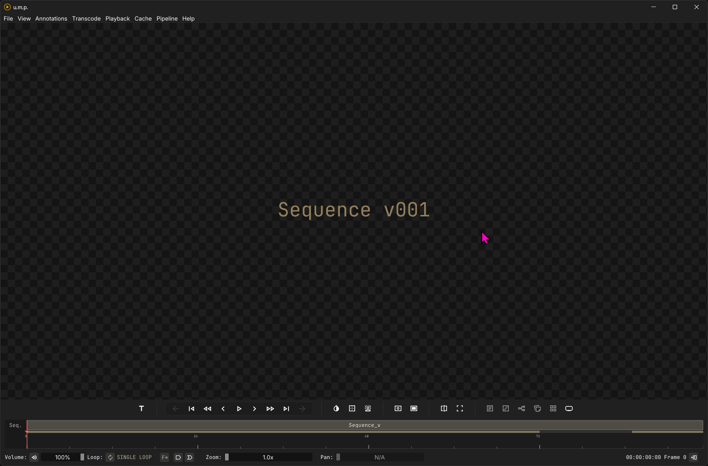
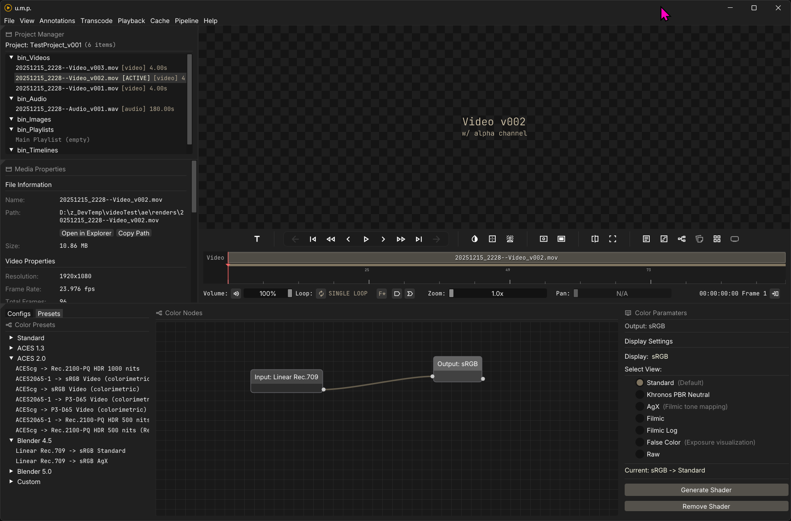

# u.m.p.

 

**u.m.p.** is a [Dear ImGui](https://github.com/ocornut/imgui) C++ [libmpv-based](https://mpv.io/) OpenGL video player with memory-mapped playback for EXR, PNG, TIFF, and JPEG image sequences for Windows. Basic features include:

 - RAM cache for scrubbing/seeking in videos, image sequence playback, and timelines
 - [OTIO](https://github.com/OpenTimelineIO) timelines for image sequences and timelines 
 - a custom playlist manager for mpv's playlist system
 - a [Thumbfast](https://github.com/po5/thumbfast)-inspired thumbnail preview panel
 - frame-stepping and cache-enhanced RW/FF
 - live [OCIO-based](https://opencolorio.org/) color correction switching with a node-based interface
 - live background switching for alpha-channel media review
 - an annotation/notes system with PDF/Markdown/HTML export + [Frame.io](https://frame.io/home) import
 - extracts embedded timecode in supported media 
 - title-safety guides for standard broadcast and social-media deliverables
 - screenshots from all media

## Manual and documentation

Feature walk-through and usage guide: [https://cbkow.github.io/ump/](https://cbkow.github.io/ump/).