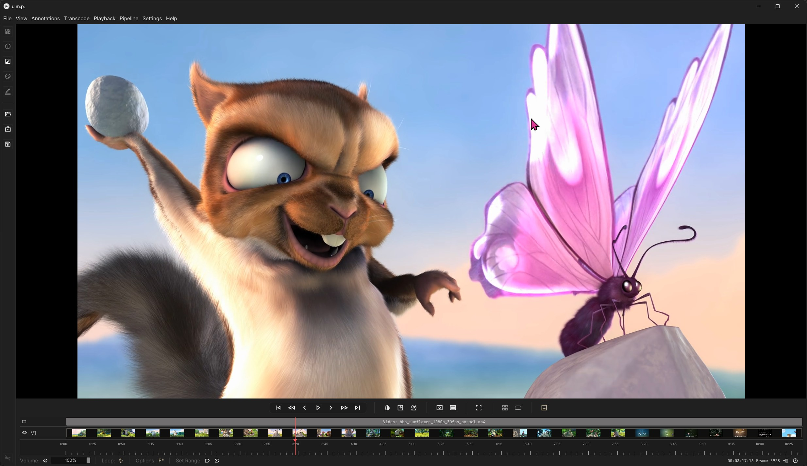
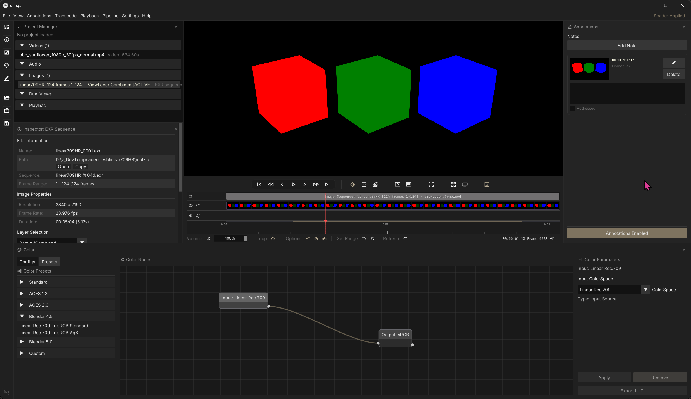

# u.m.p.

**u.m.p.** is a [Dear ImGui](https://github.com/ocornut/imgui) C++ OpenGL playback tool with D3D11VA hardware-accelerated video decoding and support for most video codecs, EXR, PNG, TIFF, and JPEG image sequences for Windows.

#### Basic features include:

 - D3D11VA hardware video decoding (FFmpeg software fallback)
 - HDR10 output support via D3D11 swapchain
 - [OpenEXR](https://openexr.com/en/latest/) decoding with multichannel and multipart support
 - playlists
 - hover thumbnails with a filmstrip view
 - frame-stepping press-and-hold RW/FF with speed up
 - live [OCIO-based](https://opencolorio.org/) color correction switching with a node-based interface
 - live background switching for alpha-channel media review
 - an annotation/notes system with basic drawing and line smoothing
 - embedded timecode support
 - title-safety guides for standard broadcast and social-media deliverables
 - screenshots from all media with [OCIO](https://opencolorio.org/) transforms applied
 - dual view comparison mode
 - support for Adobe project metadata

## Manual and documentation

- Feature walk-through and usage guide: [https://cbkow.github.io/ump/](https://cbkow.github.io/ump/)
- Inspiration: [https://github.com/cbkow/ump/blob/main/Acknowledgments.md](https://github.com/cbkow/ump/blob/main/Acknowledgments.md)
- Credits: [https://github.com/cbkow/ump/blob/main/LICENSES/THIRD_PARTY_NOTICES.txt](https://github.com/cbkow/ump/blob/main/LICENSES/THIRD_PARTY_NOTICES.txt)