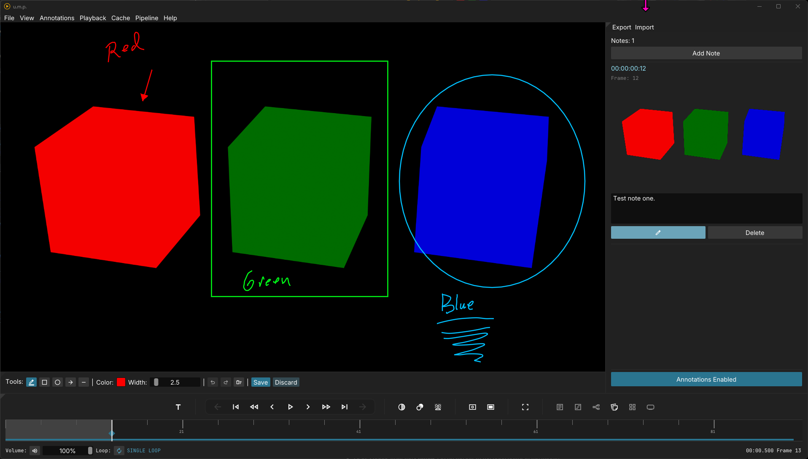
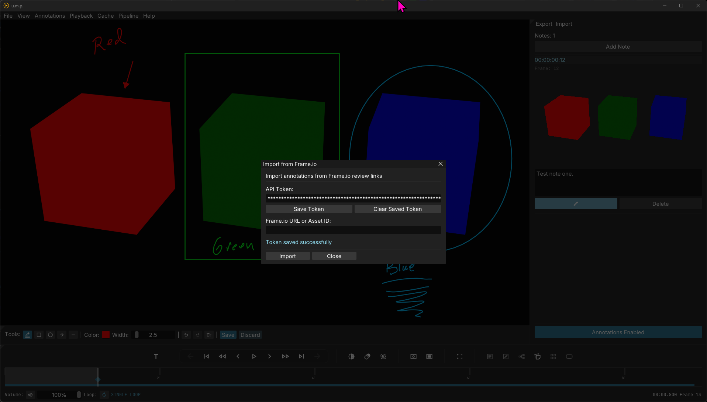

# Notes & Annotations

## The Annotation Panel

u.m.p.'s annotation panel curates a list of all notes and illustrated annotations for loaded media. Notes and screenshots are saved in a `.ump` folder next to the loaded media, making them accessible to coworkers as well. They will load with the media, if available.

## Notes

- To create a new note, click on the `Add Note` button at the top of the panel. This will create a note at the playhead's current location in the timeline and create a diamond-shaped marker for visual reference. To edit the note copy, type the message into the box underneath the generated thumbnail image.
- To draw annotations on the frame, click on the `Edit` button, with the pencil icon, underneath the text box. When in annotation mode, a toolbar with color and shape options will appear under the viewport.
- Don't forget to save your drawing when you are done annotating. `Ctrl + Z` works for undo, and `Ctrl + Y` works for redo. 
- If you don't want annotations to appear over the video, toggle the `Annotations` button at the bottom of the panel to make them invisible.

## Exporting Notes

Under `Export`, in the menu above the annotations window, are a few options for exporting notes, including:
- Markdown
- HTML
- PDF

*Markdown will create a folder structure with the note and exported images. HTML and PDF options embed the images in the document.*

## Importing from Frame.io

To import from Frame.io, you will need a Developer API token. These are available to any Frame.io user--go to [https://developer.frame.io/app/tokens](https://developer.frame.io/app/tokens) to make one.

- In the top menu, go to `Import` -> `Frame.io`.
- Add, and optionally save, your API token. (Note: These are not saved securely, so don't do this on a public computer.)
- Add the URL for the webpage of the video you want to import. Note: This is the actual URL of the video, and not Frame.io's shortened client URL.
- Press `Import`.