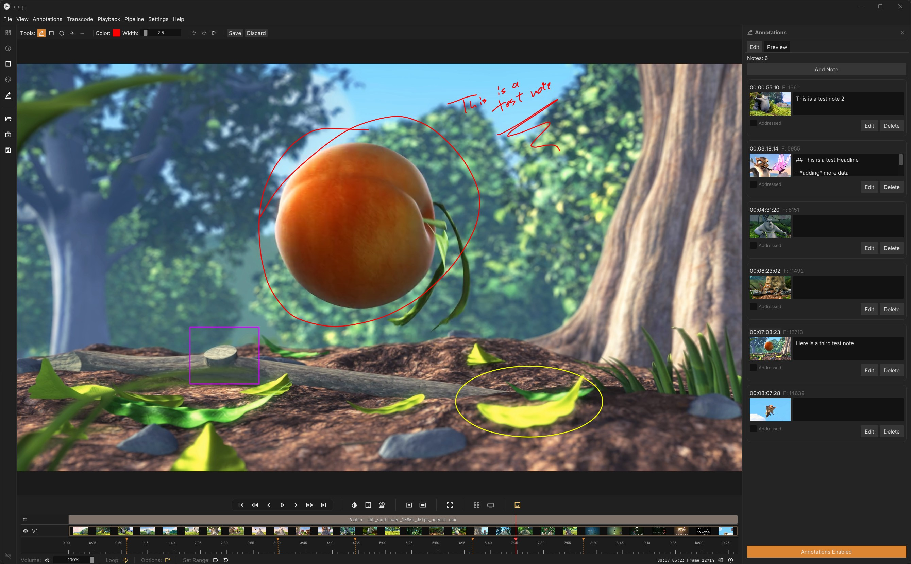
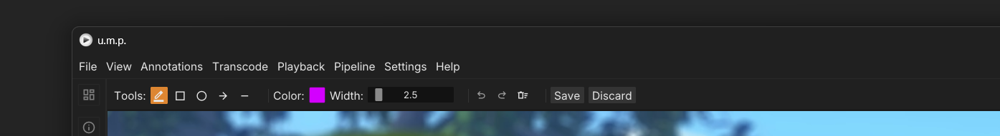
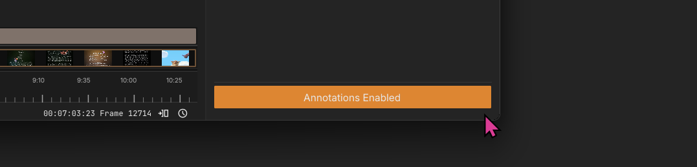
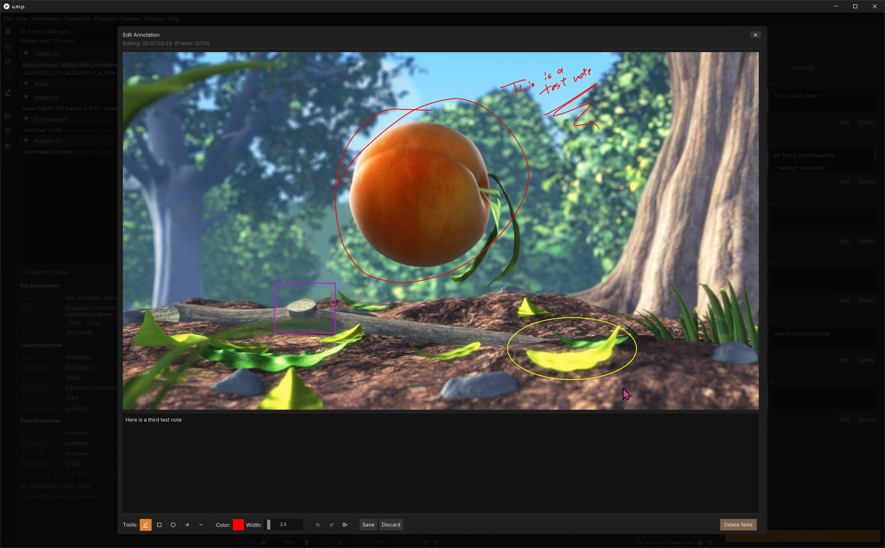
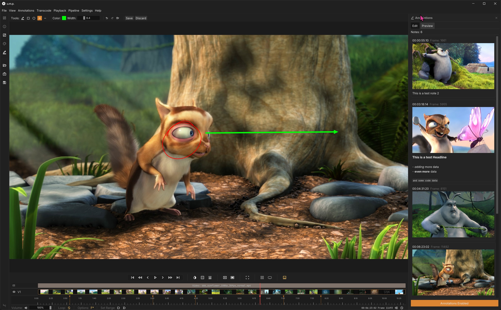
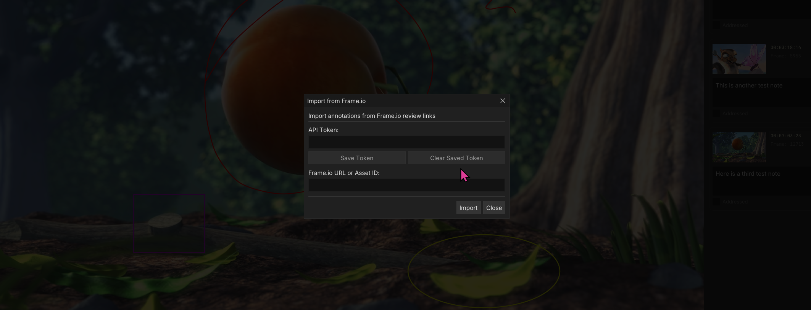

# Annotations

The Annotations panel manages notes and drawn annotations for loaded media. Annotations are saved in a `.qcview` folder alongside the media file, so they're accessible to anyone on the same file system and load automatically with the media.

---

## Creating Notes

Click **Add Note** to create a note at the current playhead position. A diamond marker appears on the timeline for reference. Type in the text field to edit — basic Markdown (headings, lists, bold, italics, code) is supported in preview and exports.

### Drawing Tools

The annotation toolbar provides shapes (box, circle, arrow), a line-width slider, and color selection for drawing directly on the Viewer.

| Shortcut | Action |
|---|---|
| `Ctrl + Z` | Undo |
| `Ctrl + Y` | Redo |

Save your drawing when finished.

### Hiding Annotations

Toggle the **Annotations** button at the bottom of the panel to show or hide annotations over the video.

---

## Expanded Edit View

Click the **Edit** button to open a larger annotation interface with more room for detailed notes and drawings.

---

## Previewing Notes

The **Preview** tab renders your notes with Markdown formatting. Right-click a note to toggle its *addressed* state, which mutes it for tracking purposes.

---

## Exporting Notes

Export annotations from **Annotations > Export** in the menu bar:

| Format | Details |
|---|---|
| Markdown | Creates a folder with the note text and exported images |
| HTML | Single file with embedded images |
| PDF | Single file with embedded images |

---

## Importing from Frame.io

Import review comments from [Frame.io](https://frame.io) into QCView's annotation system.

**Setup:** You need a Frame.io Developer API token. Generate one at [developer.frame.io/app/tokens](https://developer.frame.io/app/tokens).

**To import:**
1. Go to **Annotations > Import > From Frame.io**
2. Enter your API token (optionally save it for reuse)
3. Paste the full URL of the Frame.io video page (not a shortened link)
4. Click **Import**

> **Note:** This uses the Frame.io v2 API. Functionality may change as Frame.io transitions to Adobe's API.