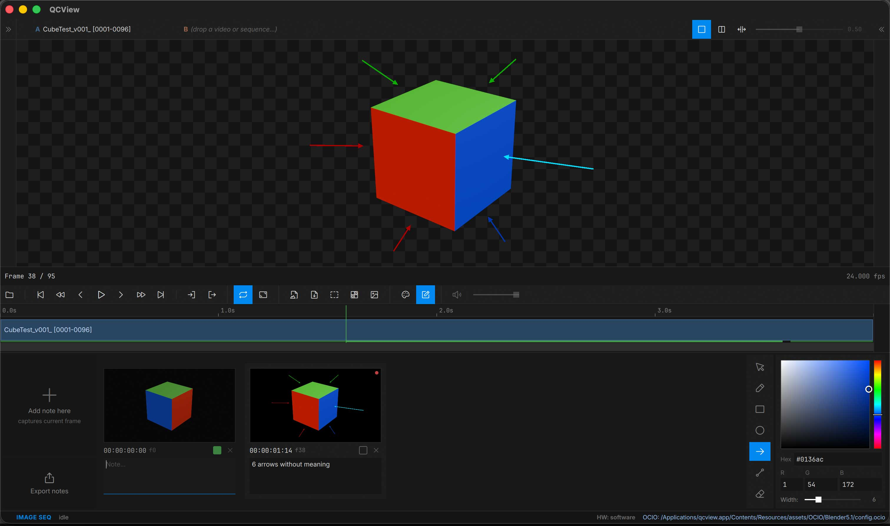

# Annotations

The Notes panel manages text notes and drawn annotations for loaded media. Annotations are saved in a `.qcview` folder alongside the media file, so they're accessible to anyone with file-system access and load automatically with the media.

Open the Notes panel with `Ctrl + 4`.

---

## Creating Notes

Click **Add Note** to create a note at the current playhead position. A diamond marker appears on the timeline. Type in the text field — basic Markdown (headings, lists, bold, italics, code) renders in preview and exports.

### Drawing Tools

The annotation toolbar provides shapes (freehand, box, circle, arrow), a line-width slider, and color selection for drawing directly on the viewport.

| Shortcut | Action |
|---|---|
| `Ctrl + Z` | Undo |
| `Ctrl + Y` | Redo |

Save your drawing when finished. Screenshots captured with annotations are saved as illustration thumbnails alongside the clean frame, so notes include a visual reference of what was marked up.

---

## Exporting Notes

Export annotations from the Notes panel's Export menu:

| Format | Details |
|---|---|
| Markdown | Creates a folder with the note text + exported images |
| HTML | Single file with embedded images |
| PDF | Single file with embedded images |
| DOCX | Single file with embedded images--combatible with Google docs |

PDFs and DOCX exports will split the content into pages.
