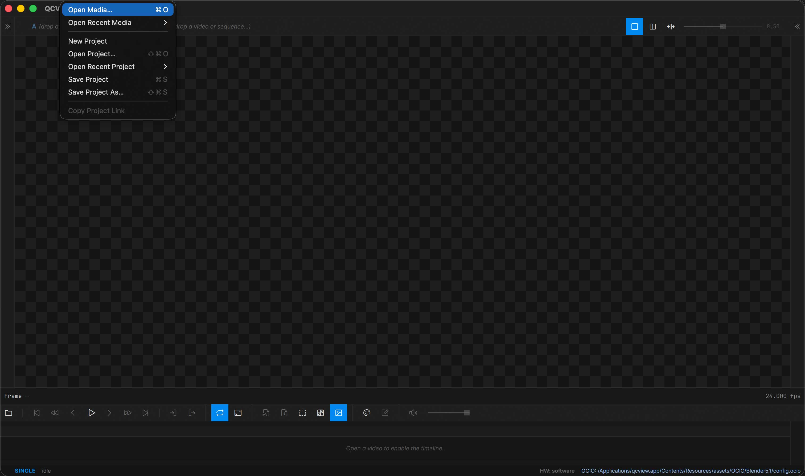
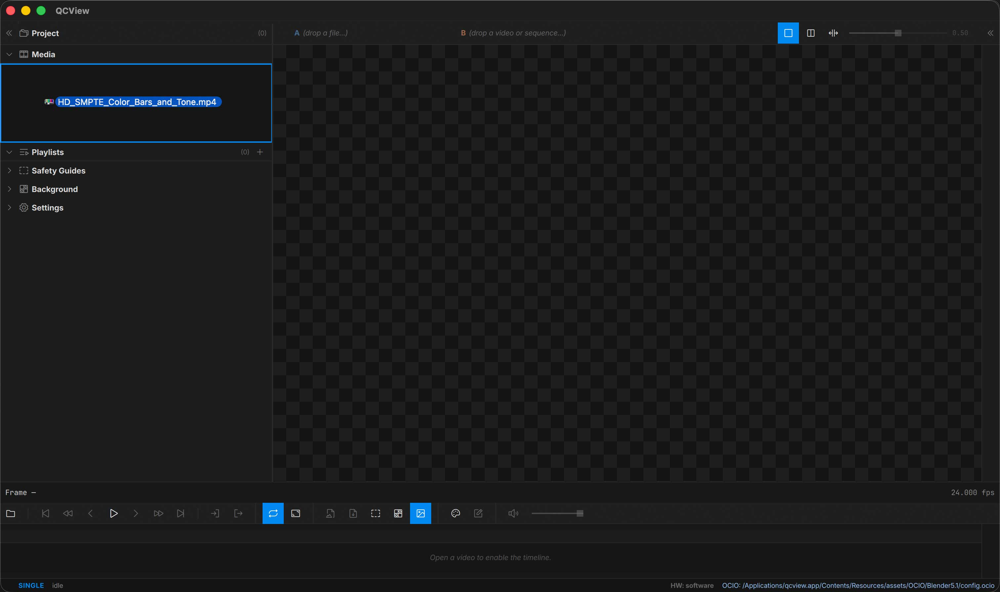
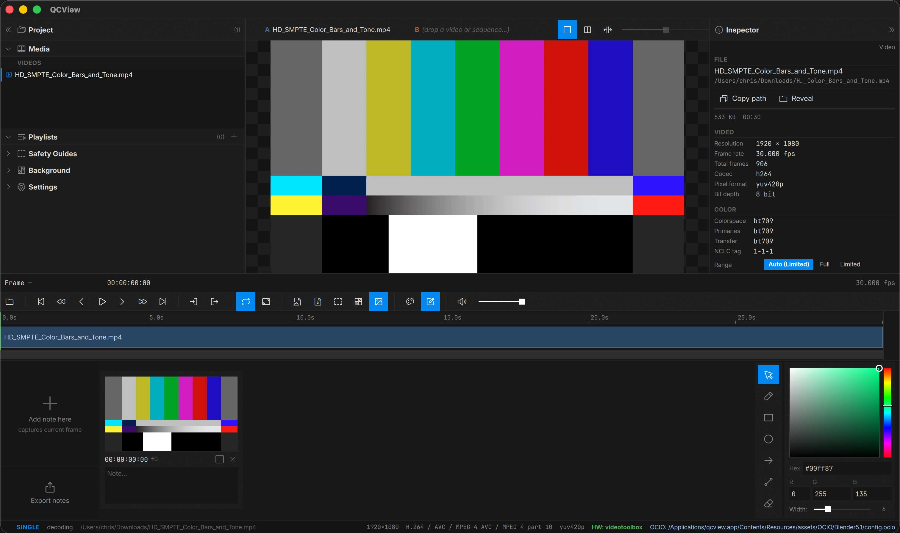
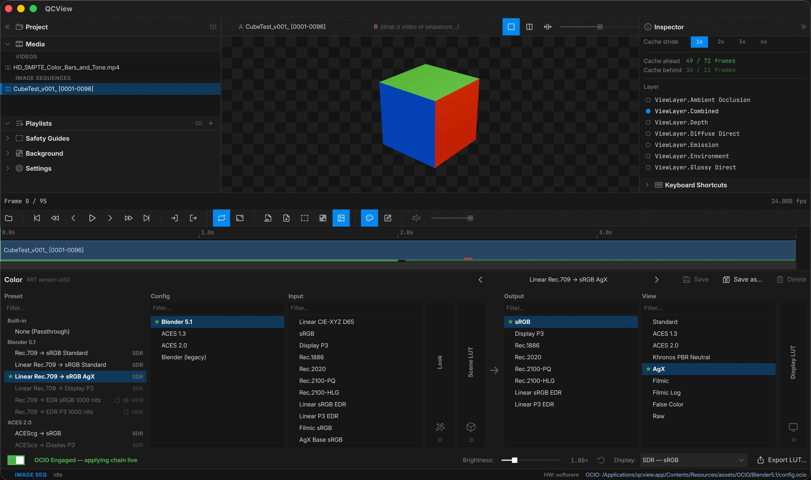
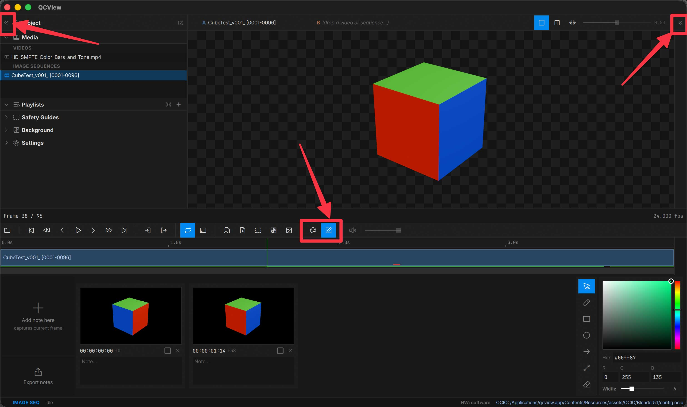
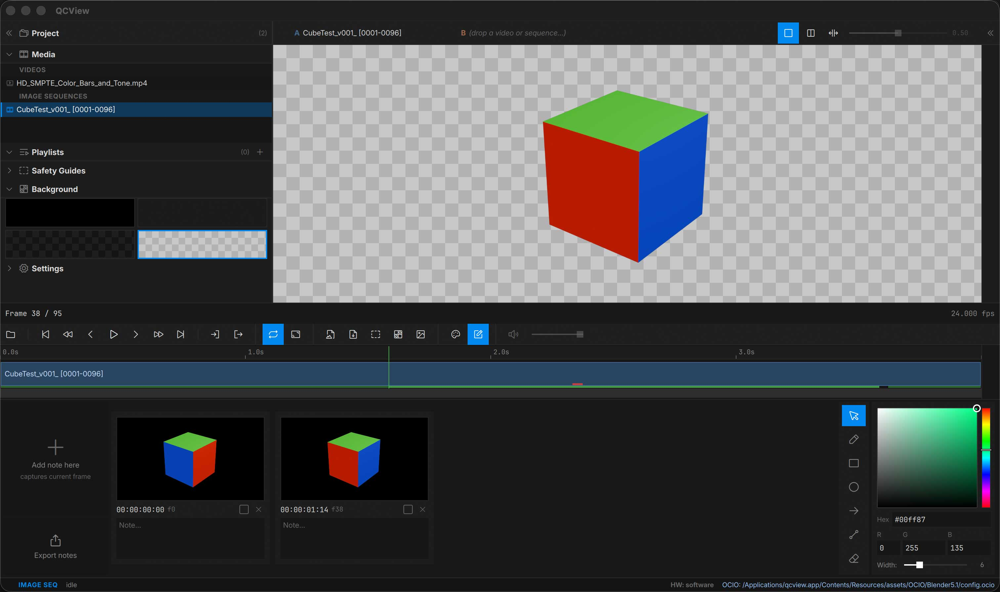
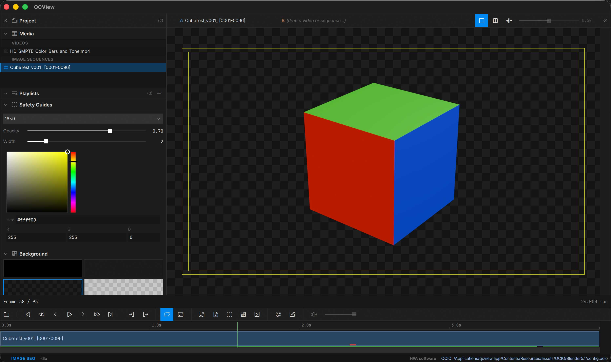
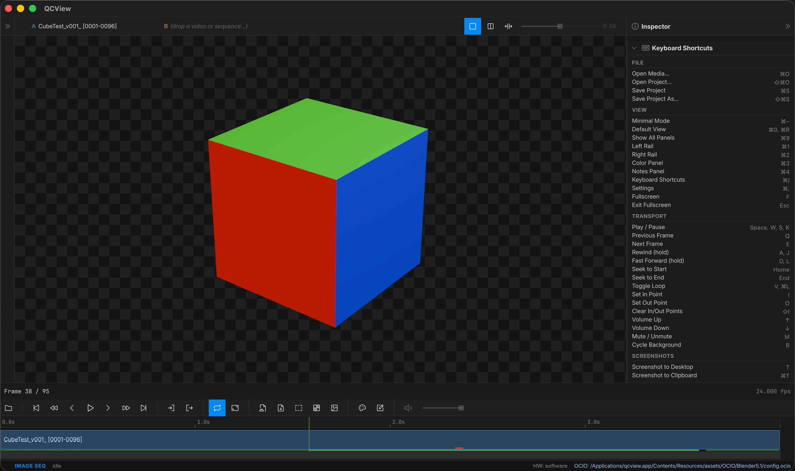
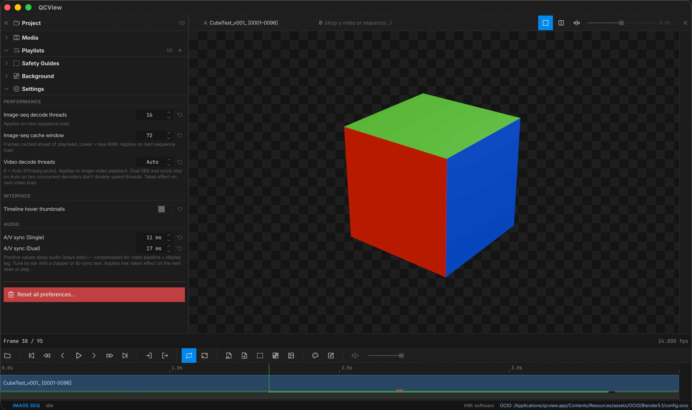

# App Basics

## Opening Files

### File Menu

Use the **File** menu to load media into QCView:

| Action | Shortcut |
|---|---|
| Open Media | `Ctrl + O` |
| Open Project | `Ctrl + Shift + O` |
| Save Project | `Ctrl + S` |
| Save Project As | `Ctrl + Shift + S` |
| New Project | Clears the current project |

Recent media and recent projects are also reachable from the **Open Recent** submenus.

### Drag and Drop

You can drag files directly into the app. The viewport border highlights when a drop target is detected. Drag one or more files to the viewport to load immediately or the media panel to add to a collection.

To load files already in your project, double-click them in the media panel or drag them into the viewport.

---

## Layout

### Panels

Toggle panels from the **View** menu or with keyboard shortcuts:

| Panel | Shortcut |
|---|---|
| Left Rail (Project, Settings, Background, Safety) | `Ctrl + 1` |
| Right Rail (Inspector, Shortcuts) | `Ctrl + 2` |
| Color Panel | `Ctrl + 3` |
| Notes | `Ctrl + 4` |

You can also use the mouse to toggle panels. Rails can be opened and closed by clicking the caret buttons in their headers. The color and notes panels can be opened via buttons on the transport row.

### Layout Presets

| Preset | Shortcut | Description |
|---|---|---|
| Minimal Mode | `Ctrl + -` | Viewport + transport only |
| Fullscreen | `F` | Viewport only, no UI. Press `F` or `Esc` to exit |

## Backgrounds and Overlays

### Backgrounds

QCView provides background options for reviewing alpha-channel media: grey, black, light checkerboard, dark checkerboard. Alpha channels in any media pass through to the selected background. Open the Background section from the Left Rail (Tools menu → Background, or `Ctrl + 1` then expand).

### Title Safety Guides

Open the **Safety Guides** section in the Left Rail (Tools menu → Safety Guides) to overlay broadcast and social-media safety guides on the viewport.

---

## Keyboard Shortcuts

The full keyboard shortcut reference lives in the Inspector under **Shortcuts** (`Ctrl + /`).

## Settings

The Settings panel opens in the Left Rail (`Ctrl + ,` or Tools menu → Settings…).

