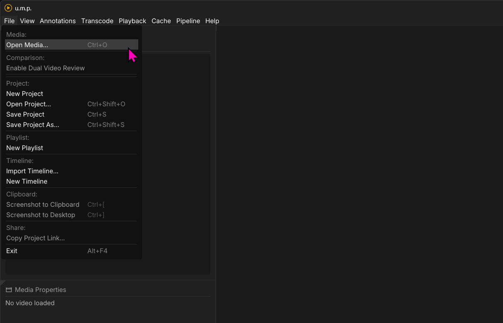
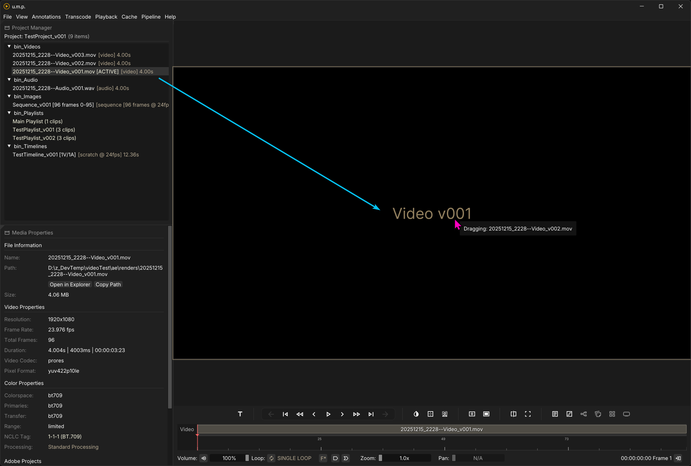
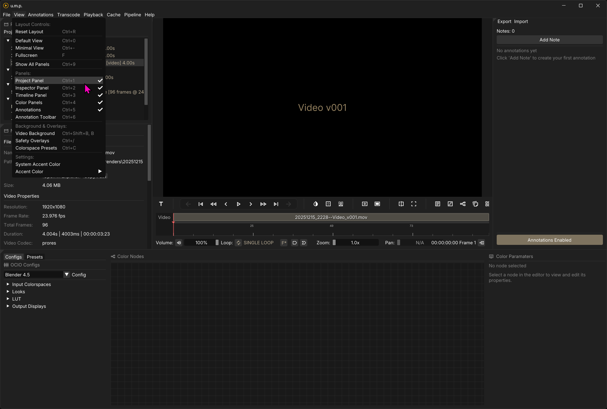
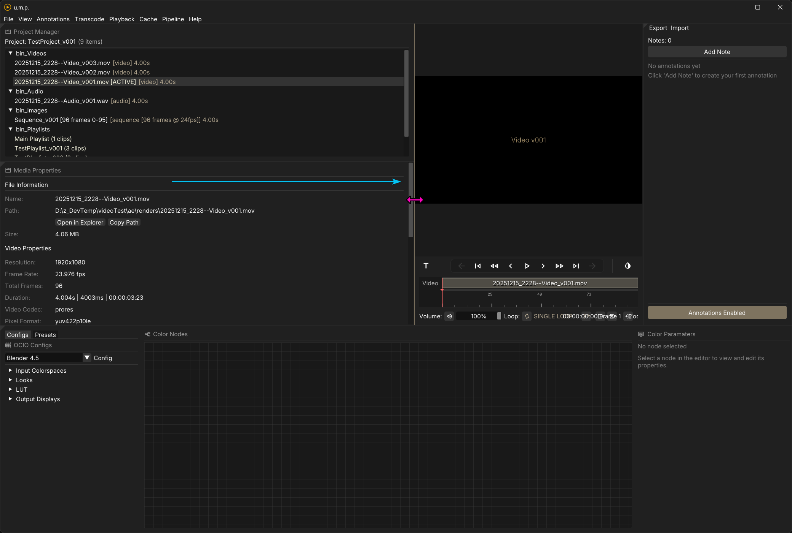
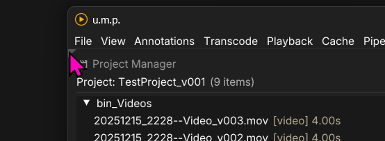
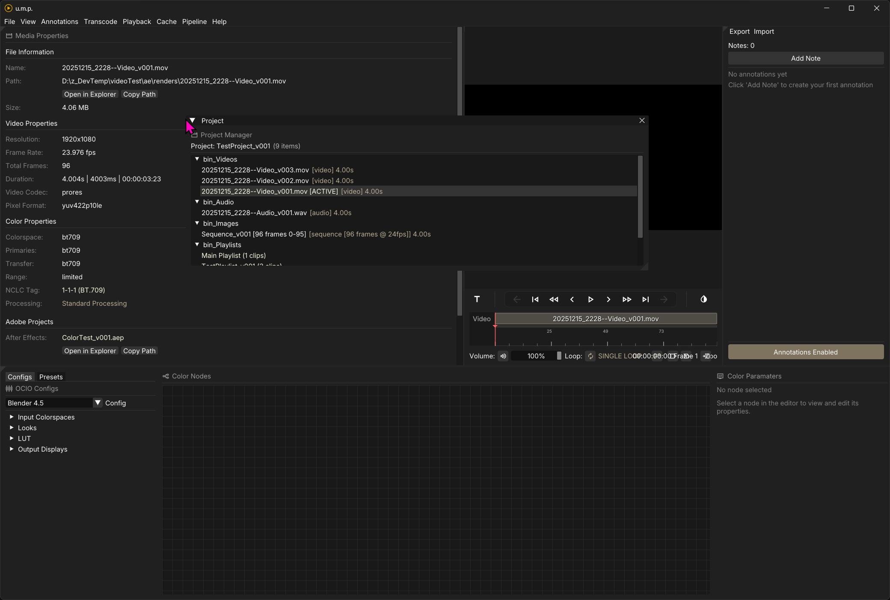
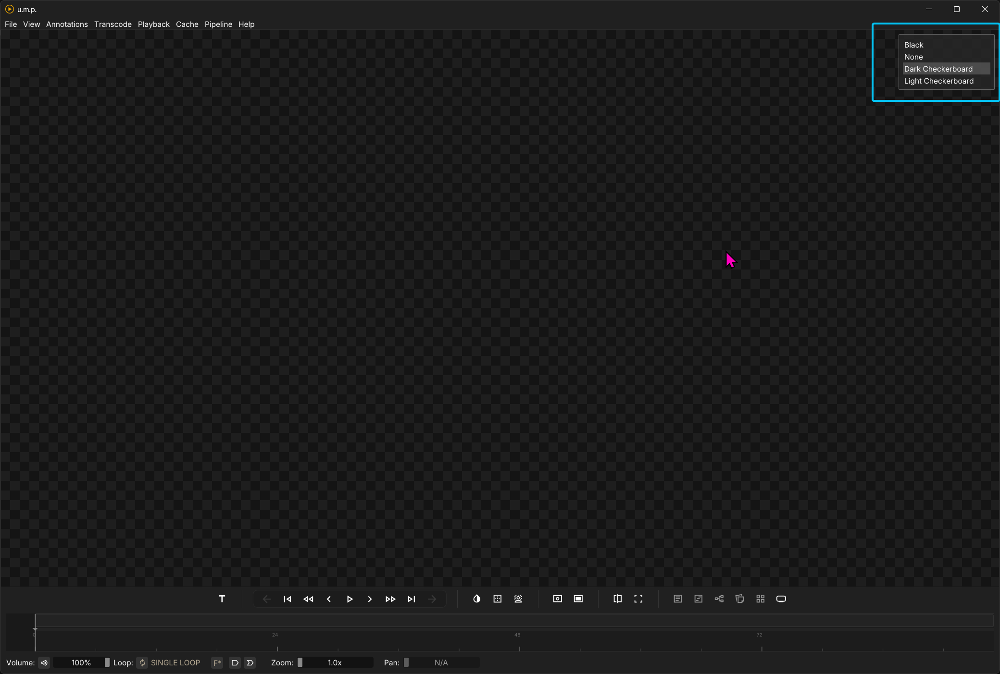
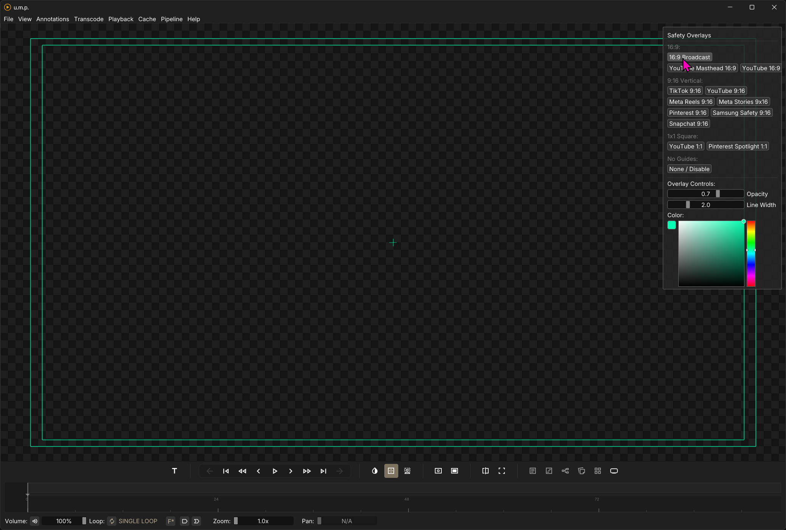
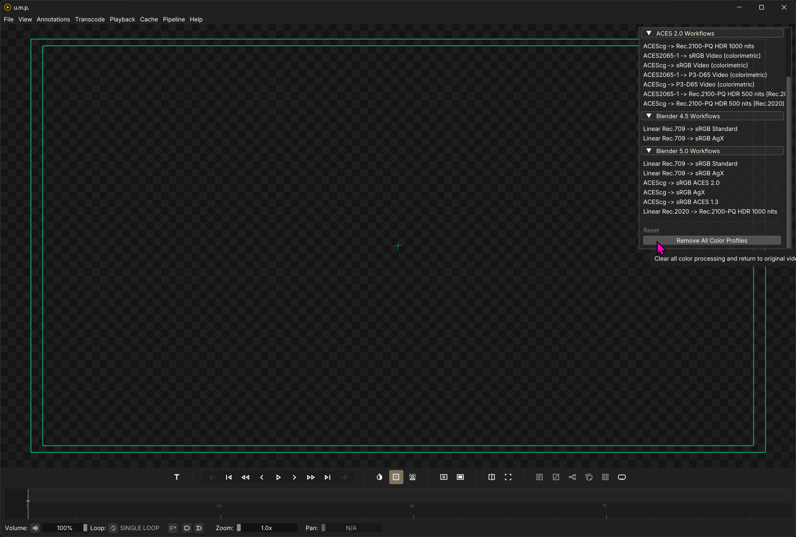
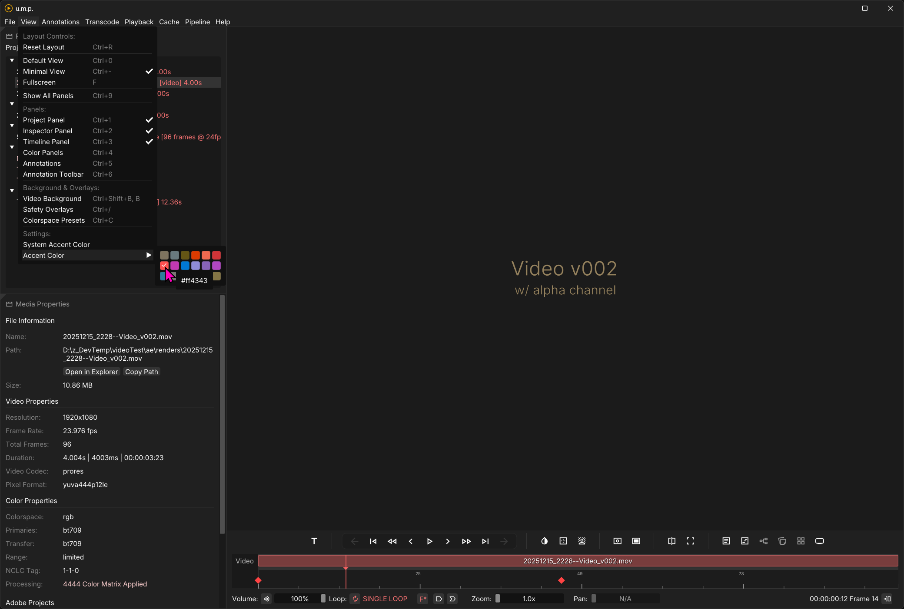

# App Basics

## Opening files

### The Menu

There are a few ways to load files. You can simply drag one more file into the app. Or you can use the File menu to **Open Media** `Ctrl + O`,  **Open Project** `Ctrl + Shift + O`, or **Import a Timeline**. In this menu, you can also create a **New Project** (this will wipe out your current project), a **New Playlist**, or a **New Timeline**.

### Drag and Drop

To load files you have already opened, you can double-click on them in the Project Manager or drag them into the Viewer. The Viewer's border will be highlighted with your theme’s accent color if a drop is detected.

---

## The Layout

### Panels

In the View menu, you can toggle the different app panels:

* **The Project Panel** `Ctrl + 1`
* **The Inspector Panel** `Ctrl + 2`
* **The Timeline Panel** `Ctrl + 3`
* **The Color Panels** `Ctrl + 4`
* **Annotations** `Ctrl + 5`

You also have a few helpful shortcuts for layout management:

* **Default View** `Ctrl + 0` reverts the app to a three-panel layout: Viewer with Timeline, Project Panel, and Inspector Panel. It will also proportion them to the default settings.
* **Minimal View** `Ctrl + -` simplifies the layout to just the Viewport and timeline—-the more traditional video player layout. This is a toggle state. You can click it again to return to your previous layout. 
* **Full Screen** `F` will present the Viewer in full-screen mode without the timeline. You can escape by pressing `F` again or by clicking the close button in the top right of the screen.

### Resizing the Layout

You can resize panels by simply dragging the borders.

If you click the tiny triangle in the top-left corner, you can reveal the panel as a movable object. You can then drag and drop the panel elsewhere. This arrangement will be saved in your personal settings and remembered the next time you open the app. Reset Layiout `Ctrl + R` will reset the panels if you change your mind.

---

## Backgrounds and Overlays

### Backgrounds

`Ctrl + Shift + B` opens the **Video Background** panel and lets you select one of four background colors. Alpha channels in any media will pass through to the background, so you can use them for alpha review. Pressing `B` will cycle through the options without using the panel for selection.

### Safety Guides

`Ctrl + /` opens the **Title Safety** panel, where you can select various title safety options to overlay your Viewer with. You can select a color with the color picker, and this color will be saved in your personal settings. 

### OCIO Presets

`Ctrl + C` opens the **OCIO Color Preset** panel. Enabling one of these options applies an OCIO node-tree preset to your **Viewer**, and everything in the **Viewer** will have this color correction applied. See the **OCIO Nodes** page for more details on how these presets work.

---

## Themes

### Color Theme Options

Toggleing **System Accent Color** will use your Windows Accent Color.
You can also select a color theme from one of these options.

