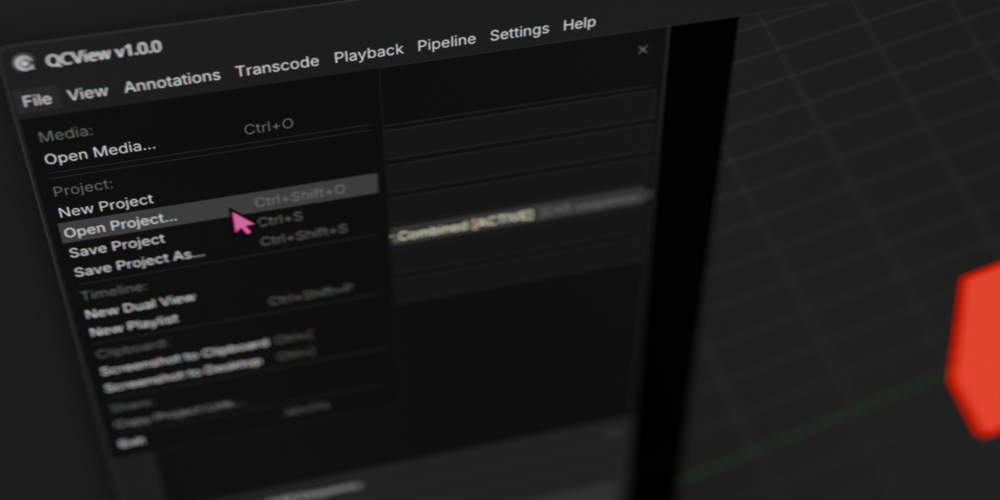
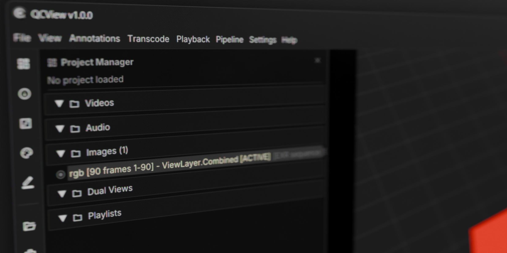
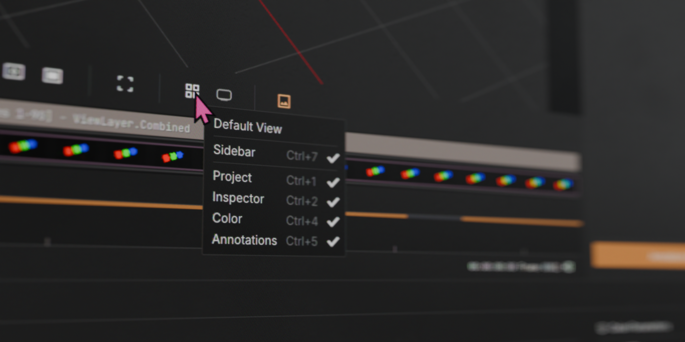
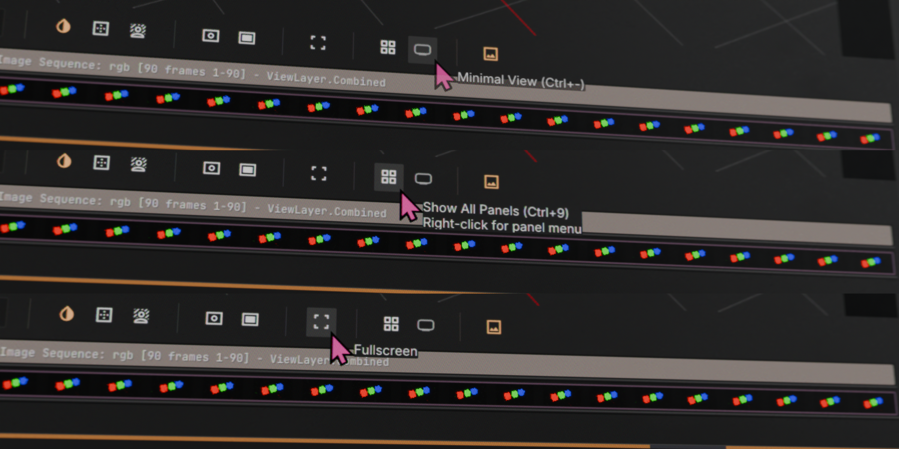
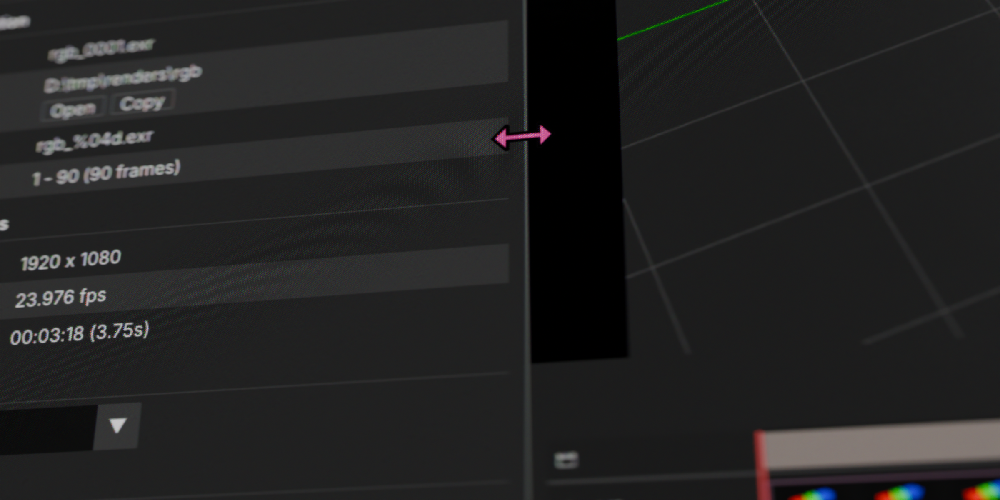

# App Basics

## Opening Files

### File Menu

Use the **File** menu to load media into QCView:

| Action | Shortcut |
|---|---|
| Open Media | `Ctrl + O` |
| Open Project | `Ctrl + Shift + O` |
| New Project | Clears the current project |
| New Playlist | Creates an empty playlist |
| New Dual View | Opens side-by-side comparison |

### Drag and Drop

You can also drag files directly into the app. The Viewer border highlights when a drop target is detected.

To load files already in your project, double-click them in the Project Manager or drag them into the Viewer.

---

## Layout

### Panels

Toggle panels from the **View** menu or with keyboard shortcuts:

| Panel | Shortcut |
|---|---|
| Project | `Ctrl + 1` |
| Inspector | `Ctrl + 2` |
| Timeline | `Ctrl + 3` |
| Color | `Ctrl + 4` |
| Annotations | `Ctrl + 5` |
| Sidebar | `Ctrl + 7` |

Right-clicking the Viewer also reveals panel toggles.

### Layout Presets

| Preset | Shortcut | Description |
|---|---|---|
| Default View | `Ctrl + 0` | Standard layout with key panels |
| Show All Panels | `Ctrl + 9` | Opens every panel |
| Minimal View | `Ctrl + -` | Viewport and timeline only (toggle) |
| Full Screen | `F` | Viewer only, no UI. Press `F` or `Esc` to exit |

### Resizing and Closing Panels

Drag the dividers between panels to resize them. Click the **X** in a panel's top-right corner to close it.

Use `Ctrl + R` or **View > Reset Layout** to restore default proportions.

---

## Backgrounds and Overlays

### Backgrounds

QCView provides four background options for reviewing alpha-channel media: grey (default), black, dark checkerboard, and light checkerboard. Alpha channels in any media pass through to the selected background.

| Action | Shortcut |
|---|---|
| Open background panel | `Ctrl + Shift + B` |
| Cycle backgrounds | `B` |

### Title Safety Guides

Open the **Title Safety** panel with `Ctrl + /` to overlay broadcast and social-media safety guides on the Viewer. Choose a guide color with the color picker — your selection is saved in settings. Toggle the button again to remove the overlay.

### OCIO Presets

Open the **OCIO Color Preset** panel with `Ctrl + C` to apply a color correction preset to the Viewer. Presets use OCIO node trees — see the [Color](color) page for details.

---

## Themes

QCView can use your **Windows Accent Color** for UI highlights, or you can choose from several built-in color themes.

