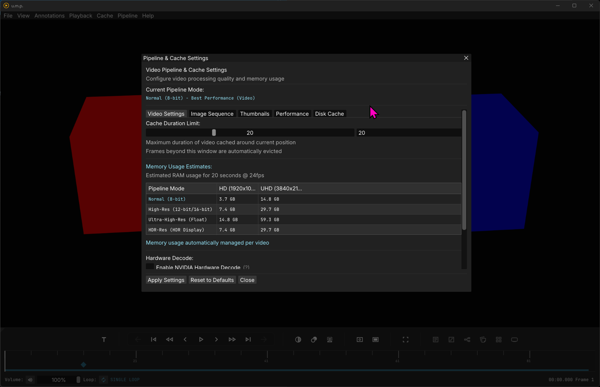
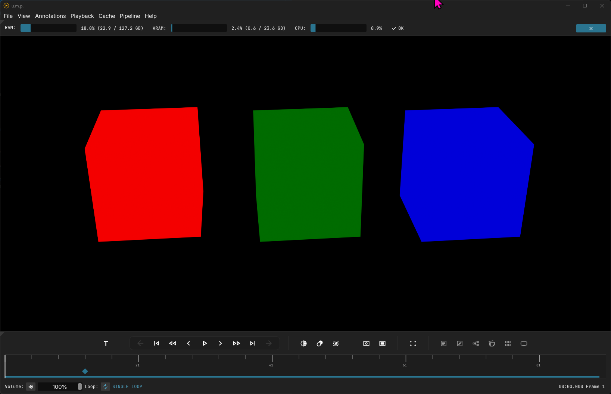

# Cache Settings

## The Cache Panel

In u.m.p.'s cache setting panel, we have various settings that can help boost performance on your system.

There are two settings you should immediately take a look at after installing the app:

- Under the `Disk Cache` tab, change your cache folder to a fast NVME disk with lots of space. If you plan on using the image-sequence transcoding options, this is where those transcodes will be stored. Some eviction settings will help manage how much data accumulates. 
- Under the performance tab, the `Image Sequence Transcode Threading` setting is set to a conservative `8-threads`. You can safely boost this on any modern workstation with a decent CPU.

## System Stats Bar

On the topic of RAM safety, there is also a System-Stats panel that could be helpful to diagnose performance issues. If your system surpasses 92% RAM capacity, this will automatically appear, and all memory options will cease until RAM has safely lowered. This will mean that you will not be able to play image sequences until RAM is free--they are 100% reliant on memory-mapping textures.
