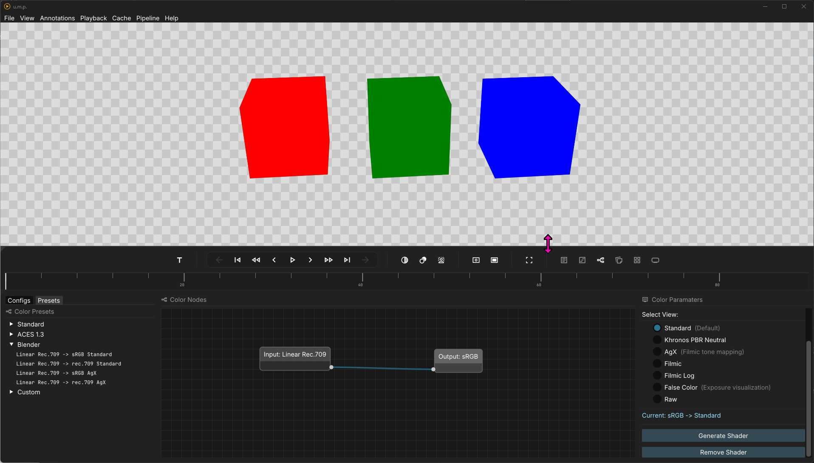

# OCIO

## The Color Panels

The OCIO color panel is a basic node builder for OCIO flows. Currently, u.m.p supports ACES 1.3 and the Blender 4.5 configs. 

The left panel has two tabs: **Configs** and **Presets**. The **Configs** tab has our two supported configs preloaded, and **Presets** contains the presets that are available in the quick-access 'Toggle colorspace presets' button. 
- Additionally, our **Presets** tab has a `Custom` dropdown tree. After building your own custom flow, you can click the `Save Current as Preset` button to save your own presets.

---

## The Flow

The basic flow for OCIO nodes is `Input` -> `(Optional) Look` -> `Output`. At minimum, you need an input and an output.

### Usage

- Drag a nodes from the **Configs** tab on the left to the node editor in the middle.
- Connect your `Input` to the `Output` (`Looks` go in between them if you use them).
- Click on the output node, Select a `View` from the available list in the right panel.
- Click `Generate Shader` in the right panel.