# OCIO Color Nodes

QCView includes a node-based [OpenColorIO](https://opencolorio.org/) pipeline for live color management. Build transform chains visually and see results applied to the Viewer in real time.

**Bundled configs:** ACES 1.3, ACES 2.0, Blender 4.5, Blender 5.0

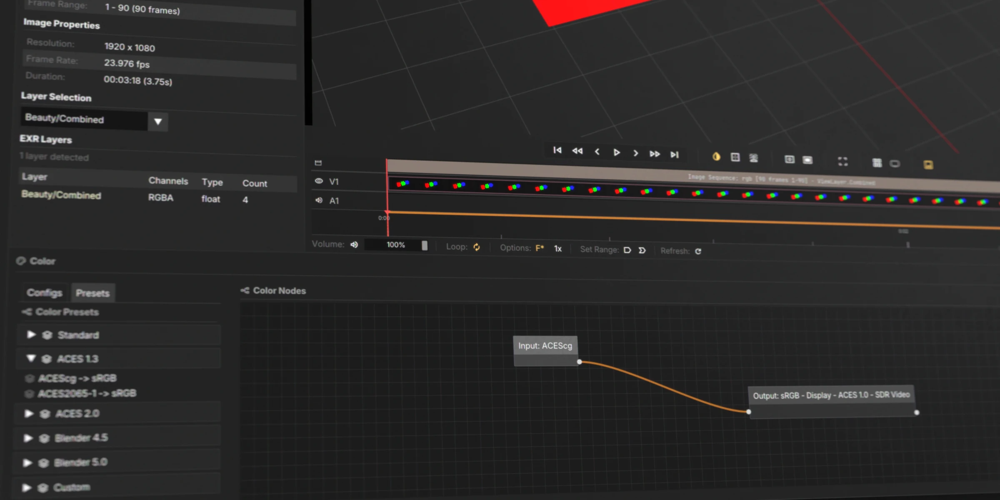

---

## Building a Node Tree

A color transform requires at minimum an **Input** node and an **Output** node. Follow these steps:

### 1. Select a Config

Choose a config that matches your color pipeline.

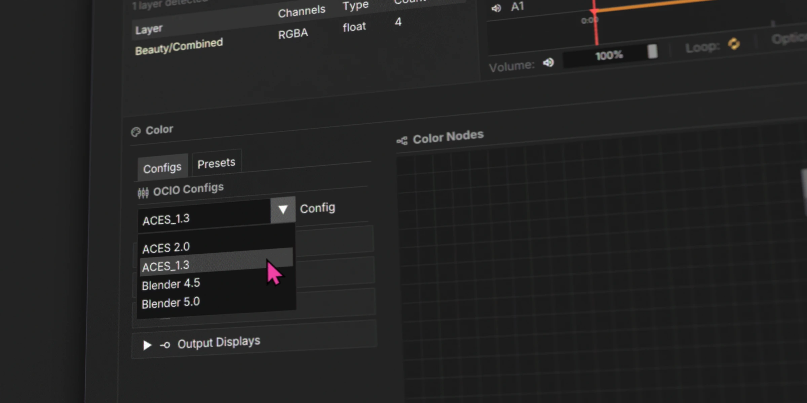

### 2. Add an Input Node

Drag an **Input** node into the Node Graph panel.

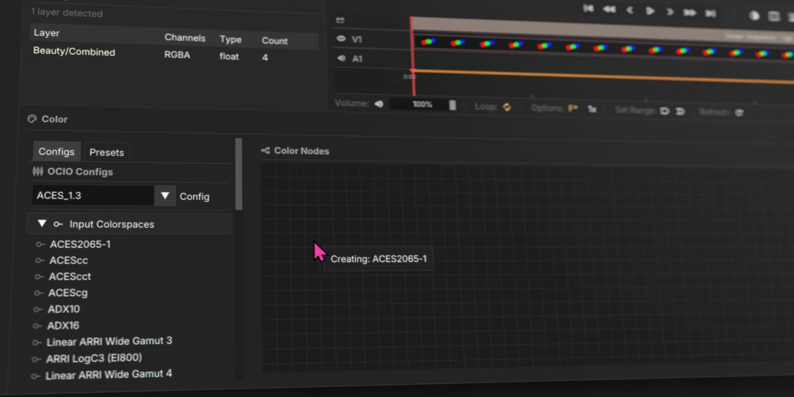

### 3. Add an Output Node

Drag an **Output** node into the graph.

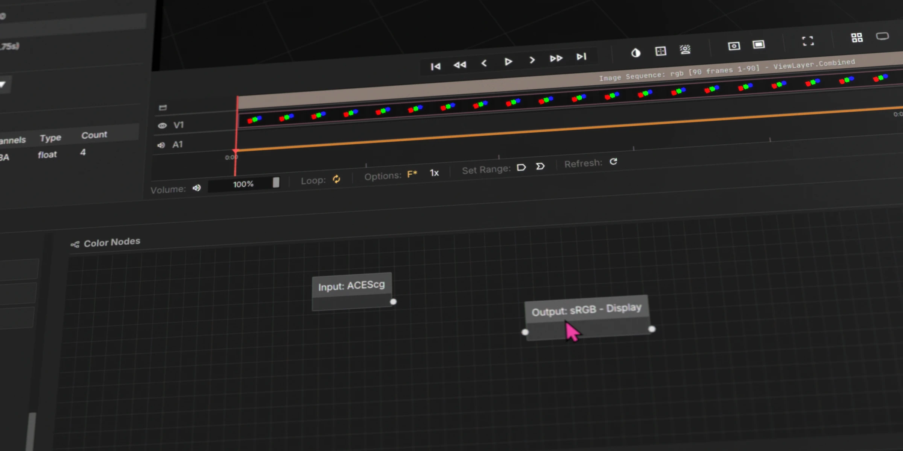

### 4. Connect and Apply

Connect the nodes, then click the Output node to open its settings. Select a **View** if required, then click **Apply** to see the transform in the Viewer. Click **Remove** to clear it.

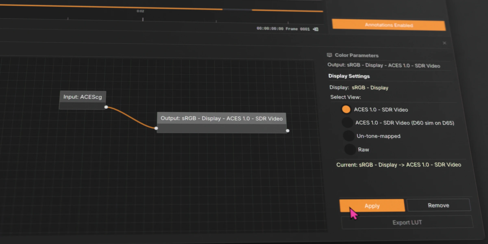

---

## Node Management

Select any node or connection and press `X` or `Delete` to remove it.

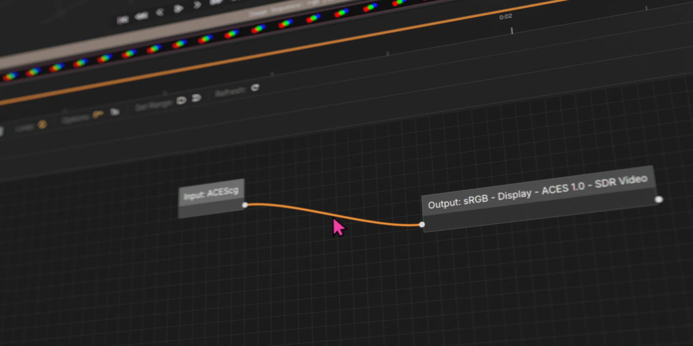

---

## LUTs

Add custom LUT files (.cube) to the transform chain:

| LUT Type | Position in Chain |
|---|---|
| Scene LUT | Before the Output node |
| Display LUT | After the Output node |

Click **Select LUT File** on the node to assign a .cube file.

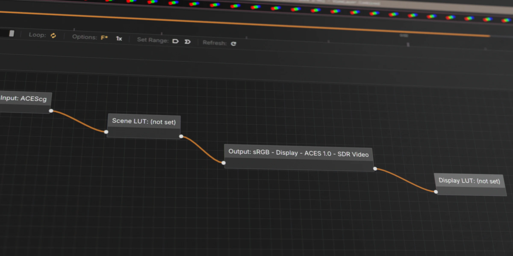

---

## Looks

**Look** nodes go between Input and Output. All Blender looks are supported — Contrast, AgX, Greyscale, Punchy, and more.

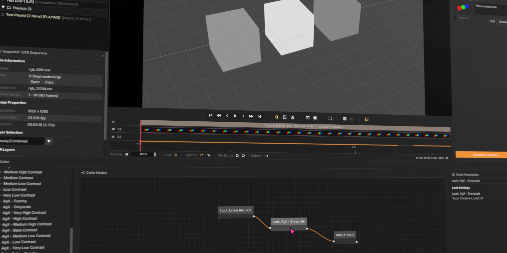

---

## Presets

Each bundled config includes ready-made presets. Click a preset to apply it instantly.

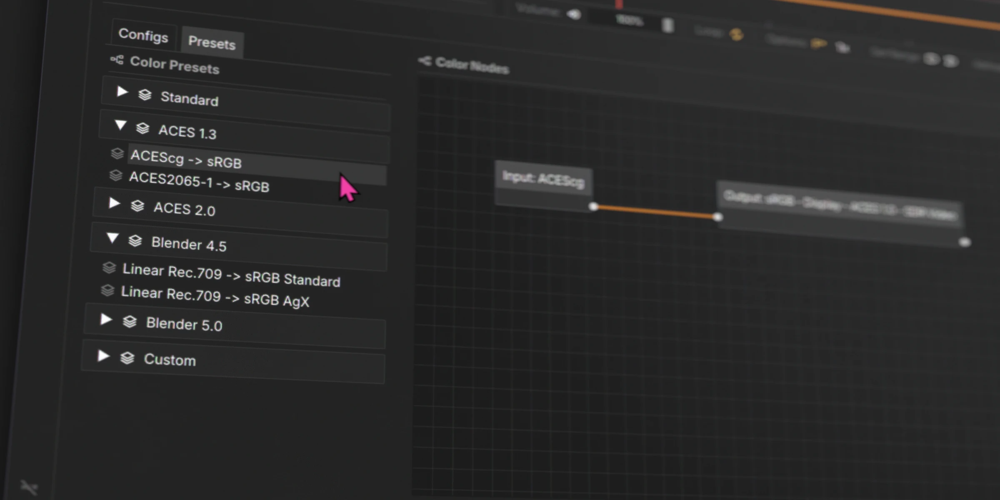

### Custom Presets

Save your own node tree configurations as presets for quick recall.

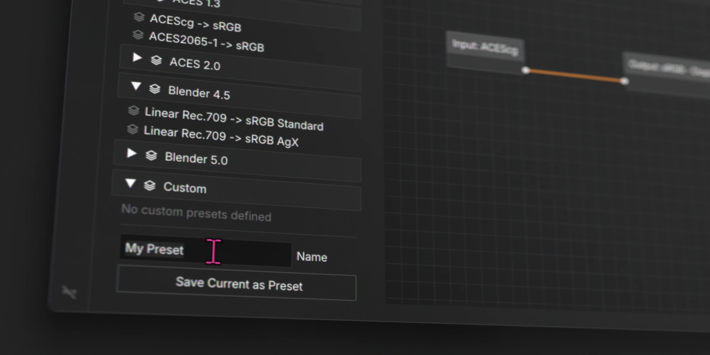

---

## Exporting LUTS

Click here to export a Cube LUT for other software/pipelines.

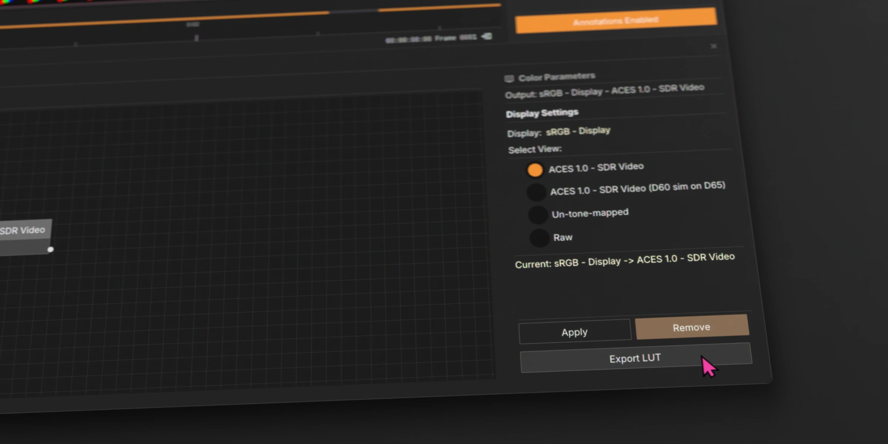
