# OCIO Color Panels

## The Panels

The OCIO color panel is a basic node builder for OCIO flows. Currently, u.m.p supports `ACES 1.3`, `ACES 2.0`, `Blender 4.5`, and the `Blender 5.0` configs. 

---

## The Flow

### Using OCIO Configs

To build an OCIO node tree, you need at least an **Input** node and an **Output** node. 

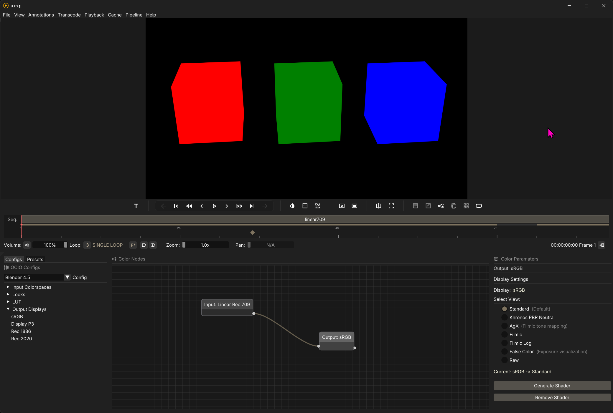

### Select a Config

First, select a config that matches your DLC.

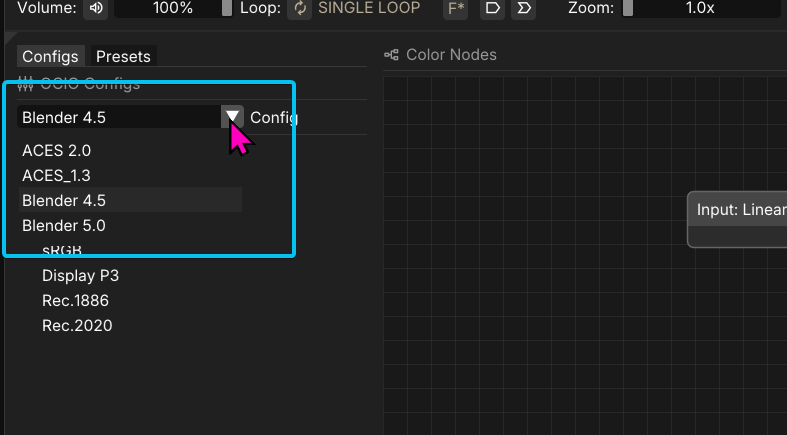

### Select a Input Node

Then, select an **Input** Node and drag it into the **Node Graph** panel.

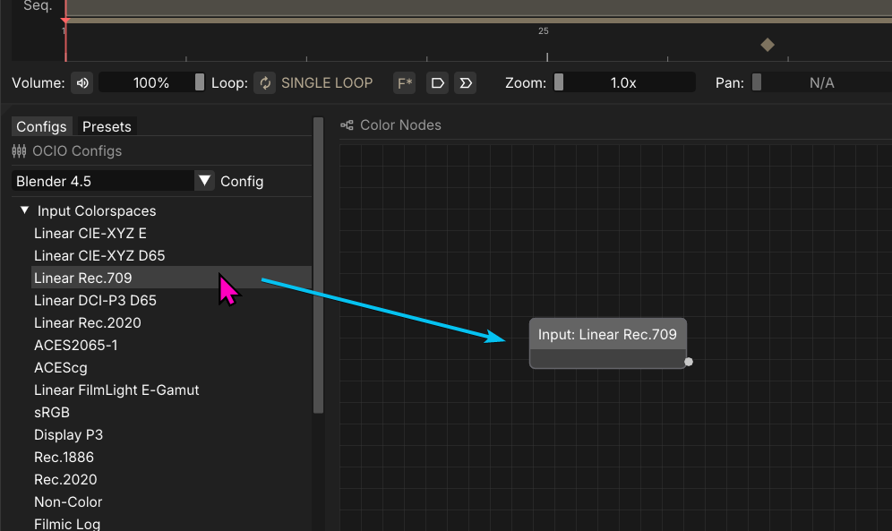

### Select a Output Node

Select and output node, drag it into the graph, and hook them up.

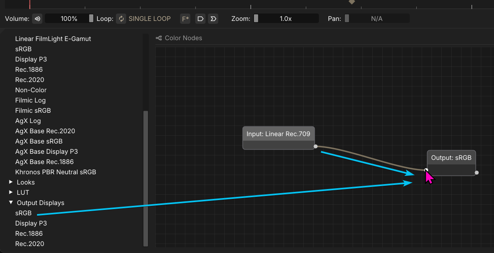

### Generate a Shader

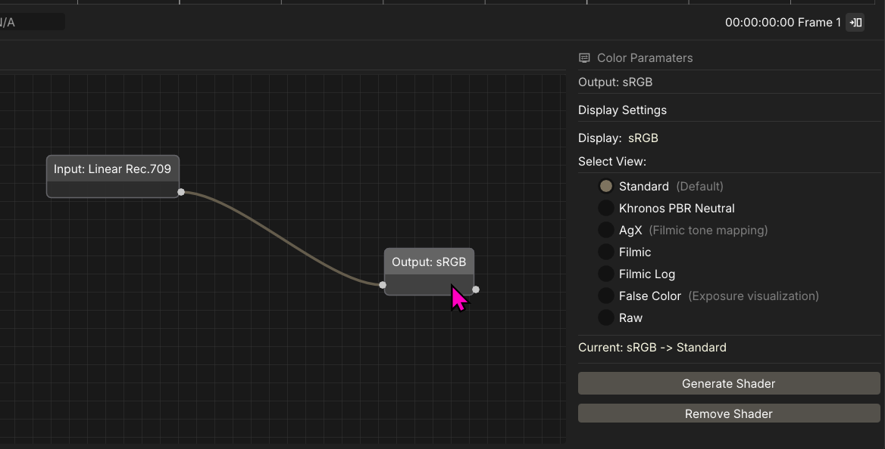

Click on the output node to load a settings panel on the right side of the color panel layout. Select a View if the **Output** node requires one. Then click the `Generate Shader` button. You will see the shader applied in your Viewer. Click `Remove Shader` to undo. 

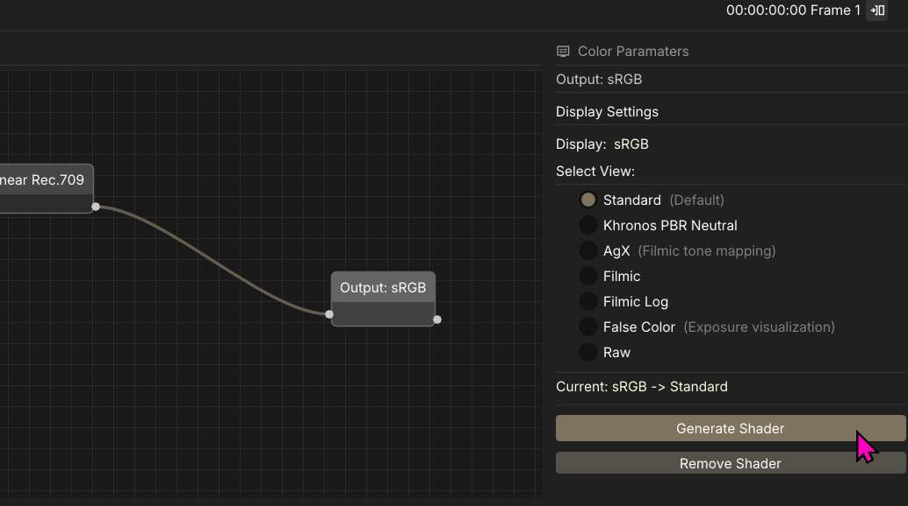

---

## Node Management

You can click on any node or branch and use the keyboard's `X` or `Delete` to remove it.

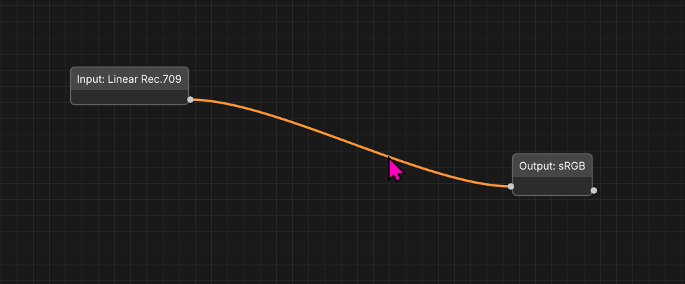

---

## LUTS

You can add custom LUTs to the chain. **Scene LUTs** go before the **Output** node, and **Display LUTs** go after. Click on the `Select LUT File` button to assign a .cube file. 

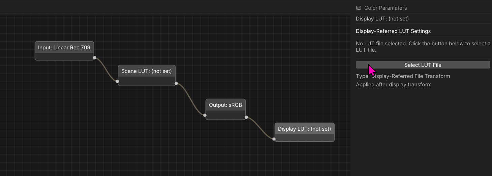

---

## Looks

**Looks** belong in the chain between **Input** and **Output**. All Blender looks are supported (Contrast looks, AGX looks, Greyscale looks, Punchy, etc...)

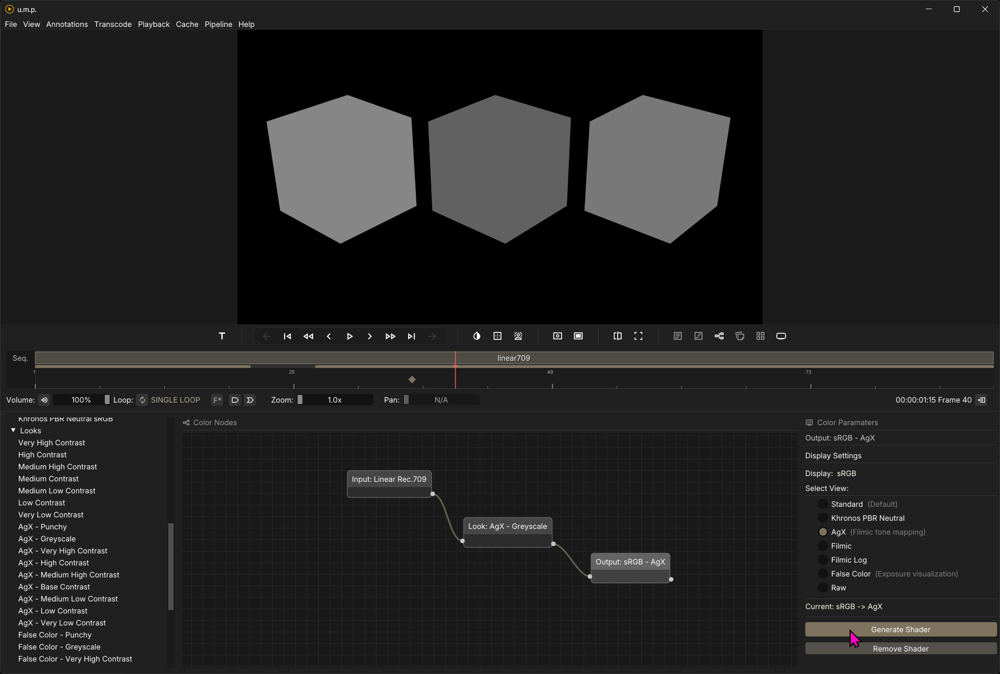

---

## Presets

Presets are provided for each included config. Click on the preset to apply.

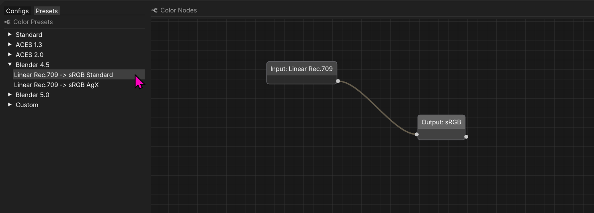

### Custom Presets

Save your own if you would like.

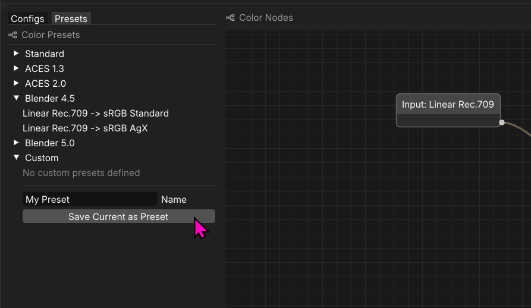

