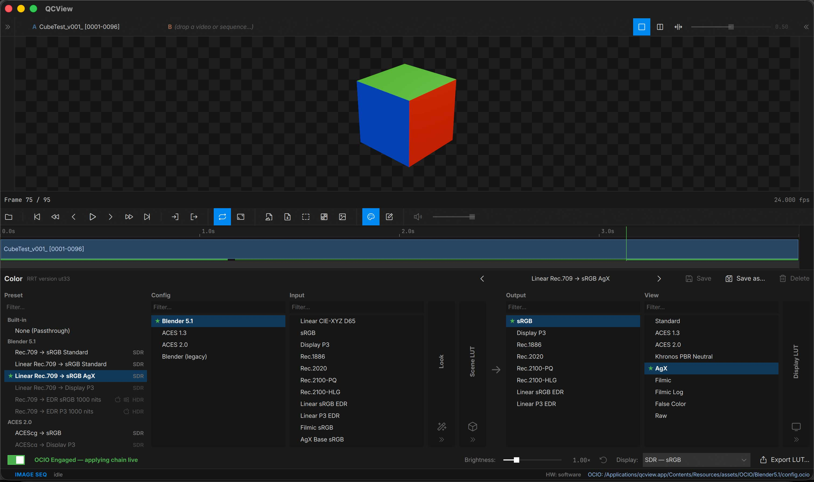

# OCIO Color

QCView includes a live [OpenColorIO](https://opencolorio.org/) pipeline. Build transform chains in the **Color** panel (`Ctrl + 3`) and see results applied to the viewport in real time.

**Bundled configs:** ACES 2.0, ACES 1.3, Blender 5.1

Both ACES 2.0 and Blender 5.1 are appended with **Linear sRGB EDR** and **Linear P3 EDR** display outputs for macOS Extended Dynamic Range workflows.

---

## Layout

The Color panel is a **reel grid** — each step in the OCIO chain is a horizontal reel you scroll through to pick the value.

Left side (input build-up):

- **Preset** — recall a saved chain
- **Config** — pick an OCIO config (ACES 2.0 / ACES 1.3 / Blender 5.1)
- **Input** — source colorspace
- **Look** — optional creative look (Blender's AgX, Contrast, Punchy, etc.)
- **Scene LUT** — optional `.cube` LUT applied in the scene-linear stage

Then the chain flows to the right side (output):

- **Output** — display colorspace
- **View** — display view (e.g. an HDR view for an EDR output)
- **Display LUT** — optional `.cube` LUT applied at the display stage

### Save your own

Configure a chain you like, then click **Save as…** to capture it as a named preset.

### Export LUT

The **Export LUT** action serializes the current chain to a `.cube` file for use in other software.

### Brightness

If a render needs a lift for review, a brightness slider is provided at the bottom of the panel. The reset button will restore the baseline without exposure adjustments.

