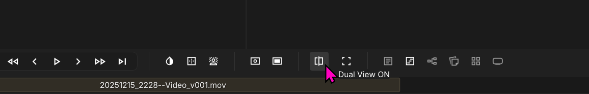
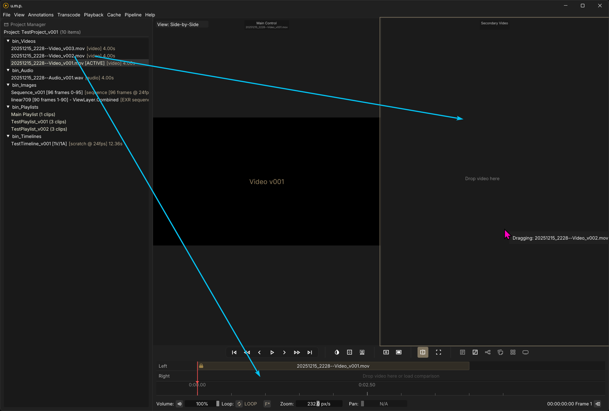
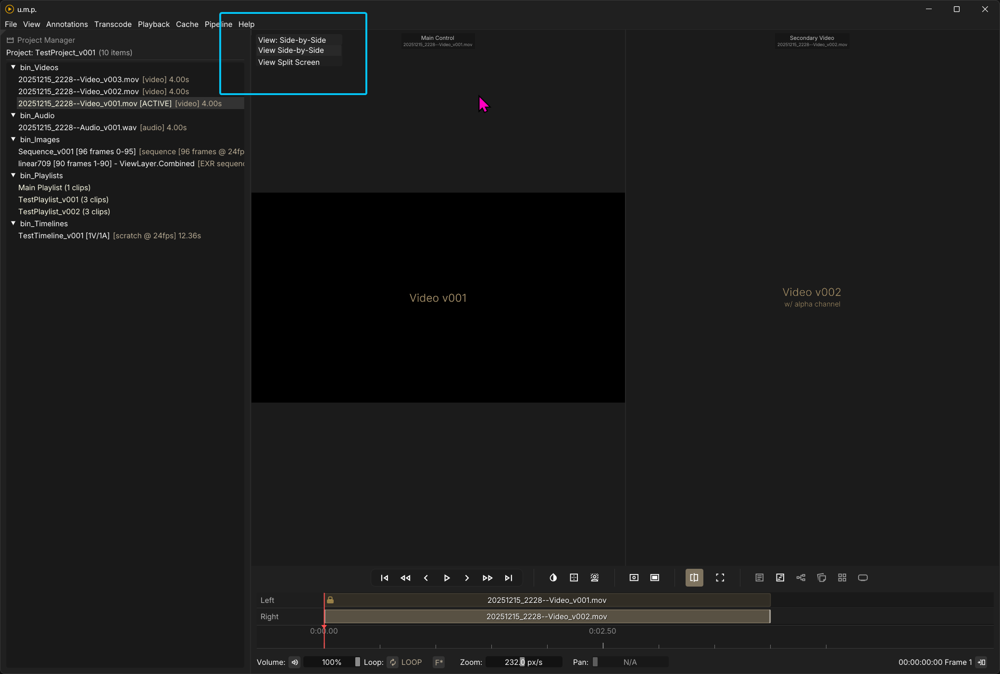
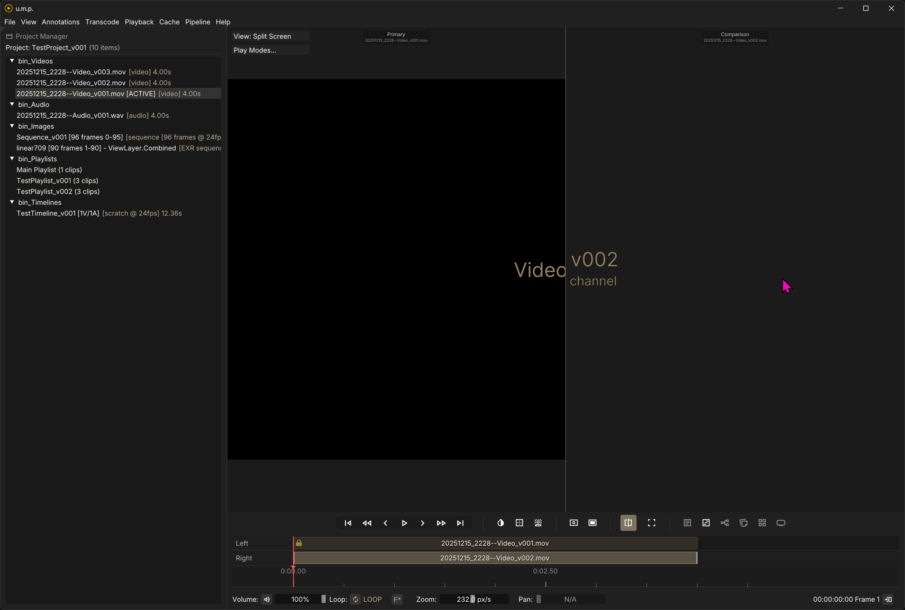
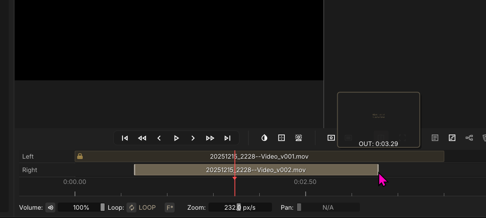
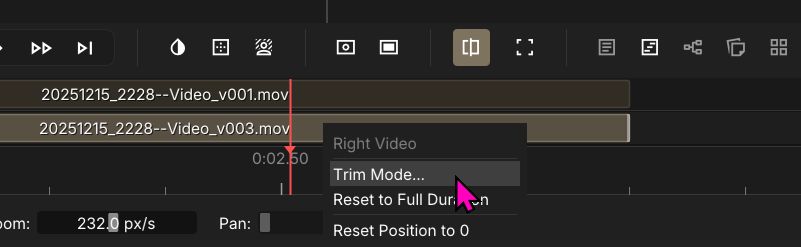
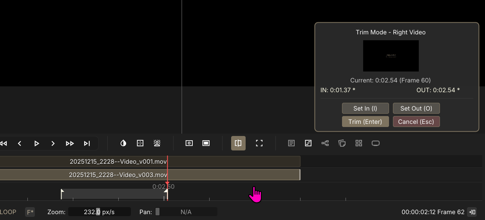
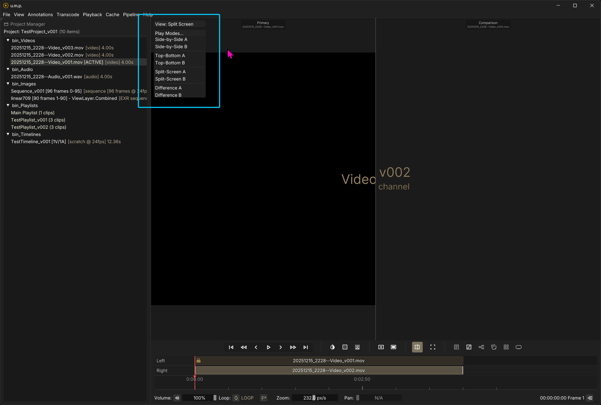
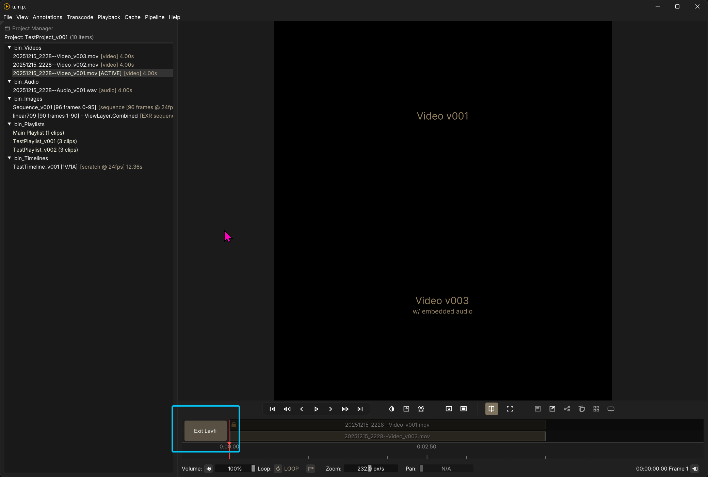

# Dual View

## Comparsion modes for two video sources

To compare two videos at once, click on the dual view button. Once in this mode, the primary (left and control) video is locked and the right video can be trimmed and slipped to align better.

Then drag a second video from the *Project Manager* into the second timeline or the second window.

---

## Dual View Modes

### Side-by-Side

There are two views you can pick from for editing and basic review. The default view is a left-to-right side-by-side.

### Split Screen

The second option is a split-screen view. You can drag the center line and adjust the split in this mode.

---

## Lineing Up Both Videos

### Drag & Trim

Like the **Timeline** view, you can drag clips on the timeline or trim their ends.

### Enter Trim Mode

Additionally, there is a dedicated Trim Mode. Right-click on the bottom/right layer and select `Trim Mode...`.

This will bring up a pop-up window where you can set In `I` and Out `O` points and then trim the clip.

---

## Lavfi modes

### Letting mpv do the work

Up until this point, we had been opening two videos in two separate video players and loosely syncing them. For a tighter sync between the two sources, we can load them into a lavfi combo in mpv. This allows for a perfect frame sync between the two. We have a few choices here: **Side-by-Side** Modes, **Top-Bottom** vertical stacks, **50/50 Split Screens**, or a **Difference Mode** view. Select one of these options to load these two videos together.

Press this button to shut down the lavfi combo view and return to and editable dual view. 

