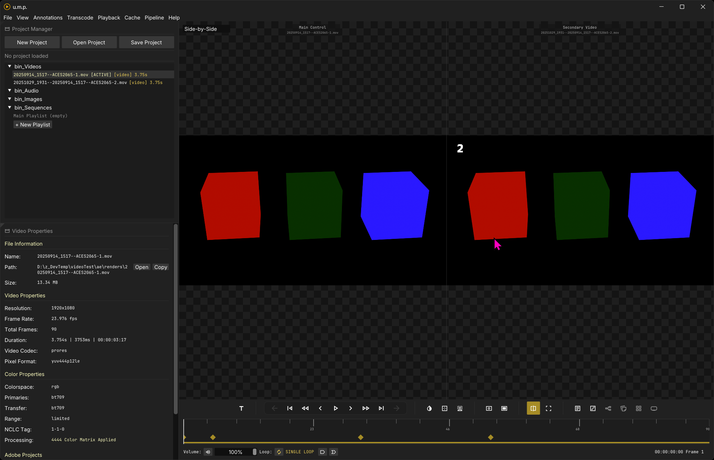
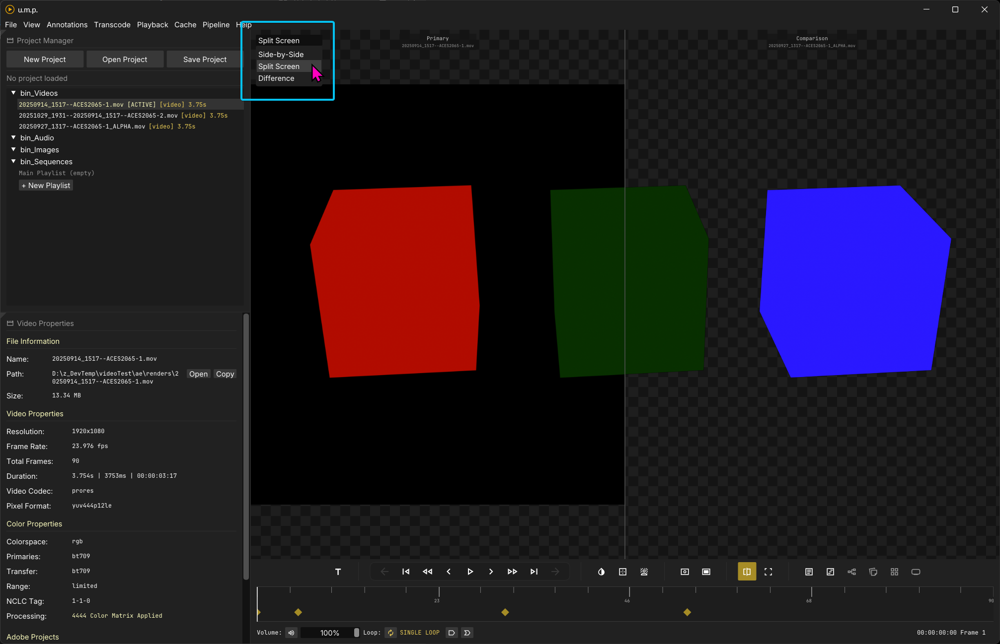
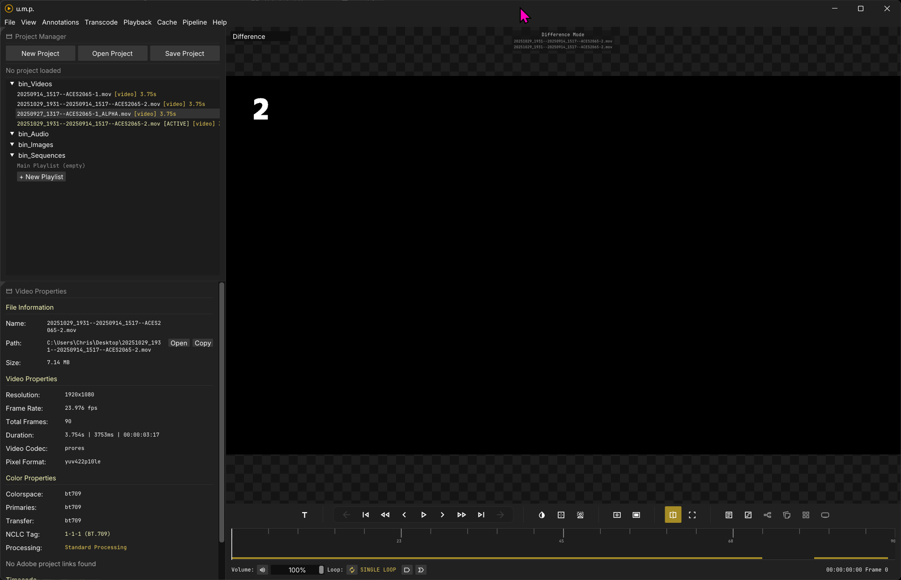

# Dual View

## Comparsion modes for two video sources

To compare two videos (media) side-by-side, follow these steps.

**Note:** *Seek Cache is disabled when in dual view mode, and the timeline doesn't have live scrubbing. This is for performance when two media items are loaded at once. Only videos are currently supported in dual-view mode.*

### Dual View

- Drag Videos into the left and the right side of dual mode. The Right side is your control video and audio source.
- Play them together. Sync is loose in this mode. Play/Pause, Frame stepping, FF and RW, Seeking, and Scrubbing all trigger a resync.

---

### Split View

- The top menu allows toggling different comparison modes.
- Split view, shows the videos split between the two sides. You can drag the divider to adjust the split.

---

### Difference View

- Difference view combines the two with a difference matte.
- This mode requires transcoding for frame accurate seeking.

