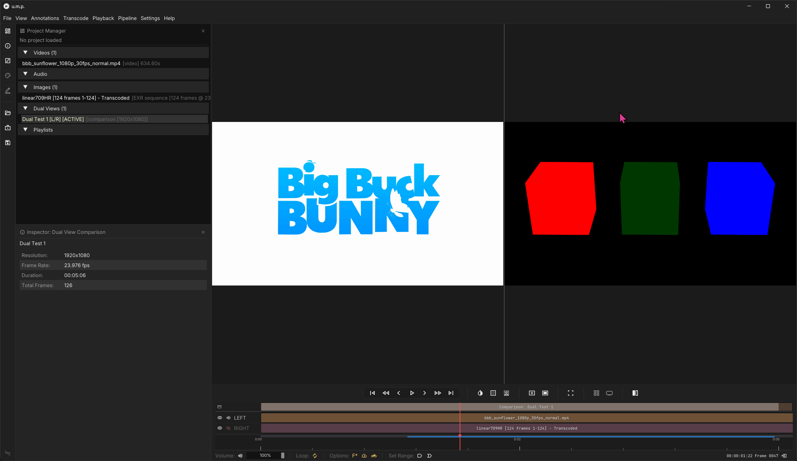
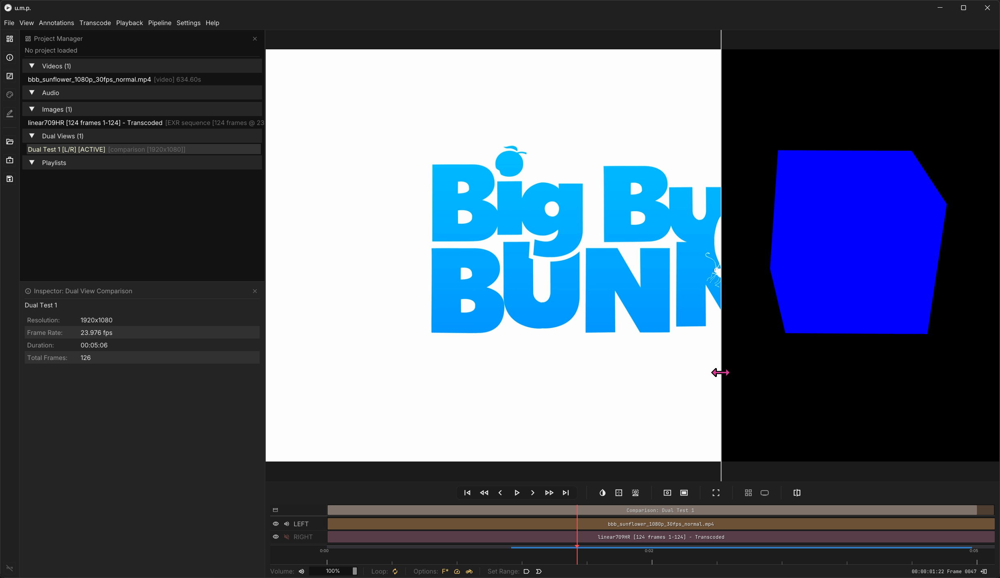
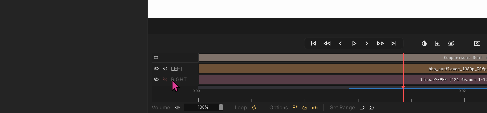
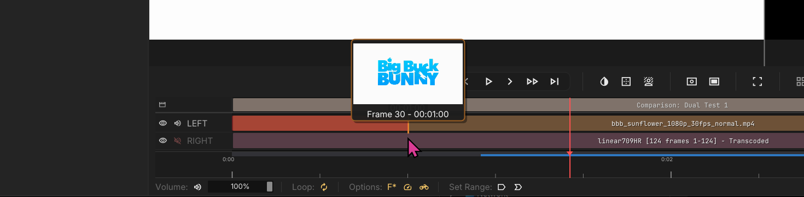

# Dual View

## Comparsion views for two videos or image seqeuences

To compare two media items (videos or image sequences), you first need a `Dual View` setup. Right click on the Dual View bin or navigate to `File > New Dual View` to create one.

The setup is similar to a multi-track timeline, but instead has tracks for `LEFT`, and `RIGHT`. Drag your media into each track or drop into the viewport to load them together. The default option is side-by-side.

This button will change to a split screen view where you can drag the divider as you play.

---

## Audio

You can toggle both sources at once to mix down all audio, or solo only one side for review. By default, the right side is muted.

---

## Lineing Up Both Videos

### Drag & Trim

Like the **Timeline** view, you can drag clips on the timeline or trim their ends to line up them up. You can trim off slates with the same `Cntrl + K` or `Edit` button click.

