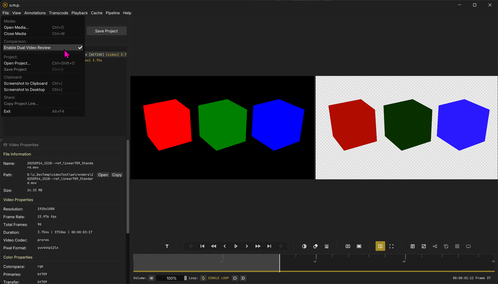

# Dual View

## Reviewing two media side-by-side

Two compare two videos (media) side-by-side, follow these steps.

- Load one video or image seqeunce into the viewport and then toggle dual-view mode in the menu or with the button in the timeline and transport panel. This video is your control and audio source. It will move to the left side of a split-screen.
- Drag a second video, from the project manager, into the right hand side. *Only videos are supported for the right side in dual-view mode.*
- Play them together.

**Note:** *Seek Cache is disabled when in dual view mode, and the timeline doesn't have live scrubbing. This is for performance when two media items are loaded at once.*
