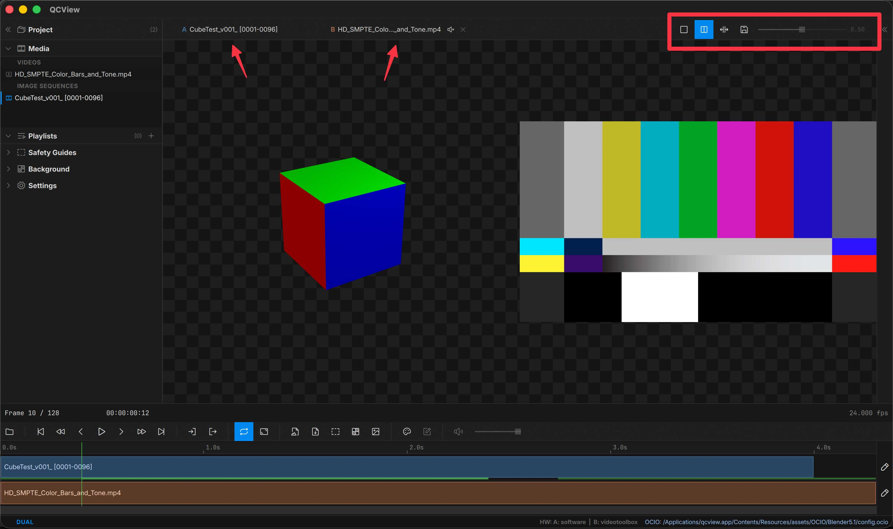
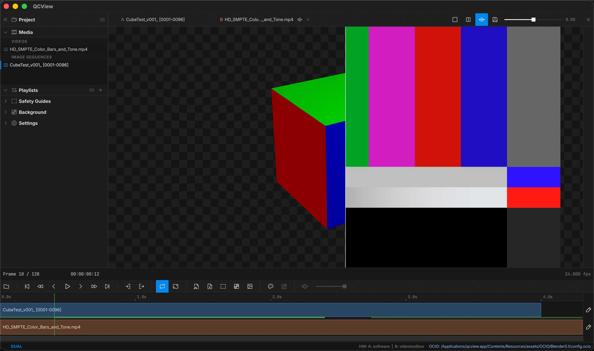
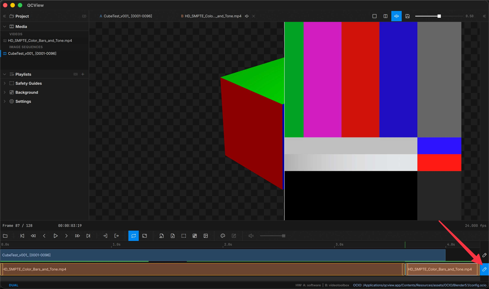

# Dual View

Unlike QCView v1, Dual Views are now a prominent part of the UI and are always available in a session. Above the viewport are an A chip and a B chip. To populate the A chip, drag it from a bin, or double-click on media in a bin like normal. The A chip is the media loaded on the left side of the dual-view comparison modes. To load the right side, you also drag from a media panel bin. Once loaded, use the buttons on the right side of this panel to toggle between side-by-side and split view modes for dual media review.

Dual view is a state that sticks: loading a new A source (from the Open button, File menu, a bin, or a drag into the viewport) **swaps the A side and keeps B** along with its track edits, rather than dropping you back to single view. Dual view exits to single only when you choose Single mode, load a playlist, or start/open a different project.

## View modes

Four viewport compositor modes for the same A / B pair:

| Mode | What you see |
|---|---|
| **Single** | Only the A source — quick toggle to inspect A in isolation |
| **Side-by-Side** | A on the left, B on the right, full-height divider in the middle |
| **Split-Wipe** | Single image with a vertical seam between A (left of seam) and B (right of seam) |
| **Difference** | Per-pixel `abs(A − B)`: areas that match are pure black, and any difference lights up — the classic "blink test" for spotting changes between two versions |

In **Split-Wipe**, the seam is mouse-draggable directly on the viewport — hover the seam line until the resize cursor appears, then click and drag. The slider in the viewport overlay stays in sync with the seam position.

In **Difference**, the same overlay slider becomes a **gain** control. Subtle differences (a light recompression, a small grade shift) are near-black at the default gain of 1.0; raise the gain to amplify them into visibility. Aligned regions stay black at every gain level. The diff is cleanest when A and B share the same resolution and framing.

## Audio

Per-side mute and an A/B level mixer live in the Inspector's Audio routing controls. Multi-stream broadcast deliveries route per channel, same as in single-source mode (see [App Basics](app-basics)). The right side is muted by default.

A separate **A/V Sync Offset** value is stored for dual view (different from the single-view value) — your offset for compositing two sources doesn't get applied to single-source playback and vice versa.

## Aligning Clips

Drag clips on the track or trim their ends to sync them. Use `Ctrl + K` to cut a clip at the playhead (for example to clip off slates or unwanted heads), then **Delete** to remove the unwanted segment.

As you slip, trim, or slide a clip, the viewport updates live so you can see exactly what you're aligning: slip and slide show the frame under the playhead as the content shifts, and trimming an edge shows that edge's frame while the playhead stays put.

In edit mode (the per-track edit toggle), the currently-selected clip brightens noticeably and its border switches to white so it's distinguishable from other edit-mode clips on the same track.

## Save / Recall

Use **Save as Dual View** (the floppy-disk button in the viewport overlay when a dual is loaded) to capture the current A + B + edits as a reusable item in the **Dual Views** bin of the Project panel.
