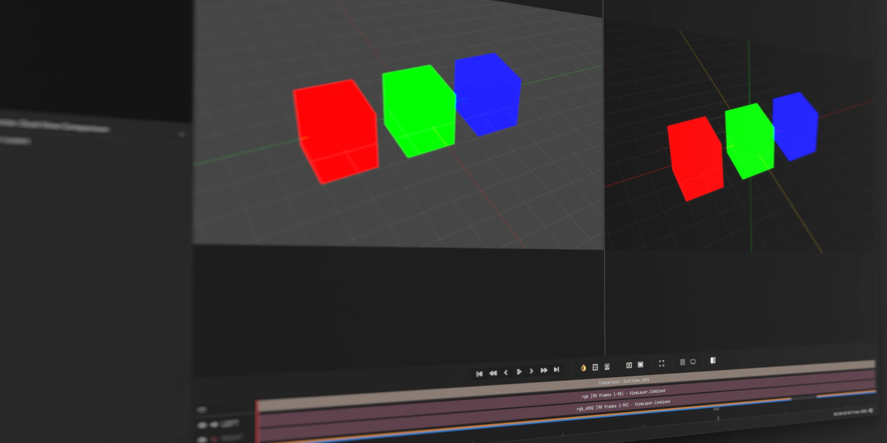
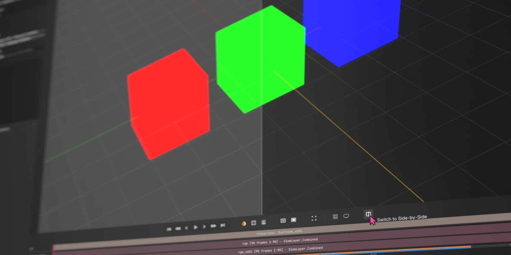
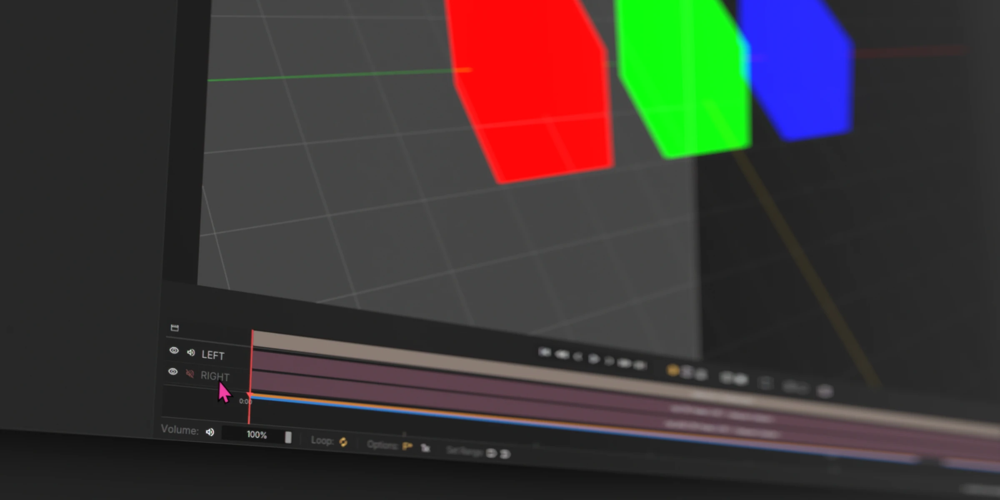
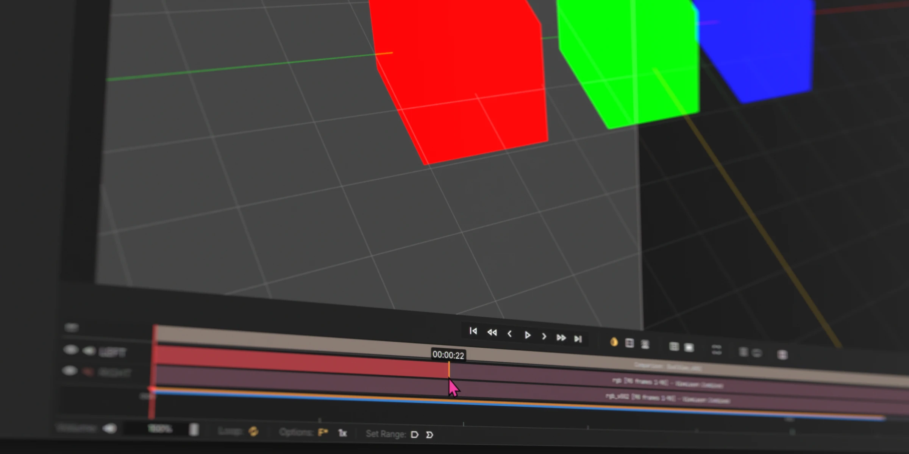

# Dual View

## Comparison views for two videos or image sequences

To compare two media items (videos or image sequences), you first need a `Dual View` setup. Right click on the Dual View bin or navigate to `File > New Dual View` to create one.

The setup has tracks for `LEFT` and `RIGHT`. Drag your media into each track or drop them into the viewport to load them together. The default view is side-by-side. If image sequences are loaded, each will have their own cache progress bar.

> Note: QCView uniquely handles dual view compared to other image viewers. To keep frames in sync, we are decoding media in parallel and applying them to the same extra-large, memory-mapped texture. We then UV-map 1/2 of that texture back to each side of the viewer. By doing this, we ensure accurate frame sync between the two sides. Our mapping between LEFT and RIGHT is time-based, so media with different fps will be mapped by time rather than by frames.

This button will change to a split-screen view where you can drag the divider as you play.

---

## Audio

You can toggle both sources at once to mix down all audio, or solo only one side for review. By default, the right side is muted.

---

## Lineing Up Both Videos

### Drag & Trim

Like the **Timeline** view, you can drag clips on the timeline or trim their ends to line them up. You can trim off slates with the same `Ctrl + K` or `Edit` button click.

