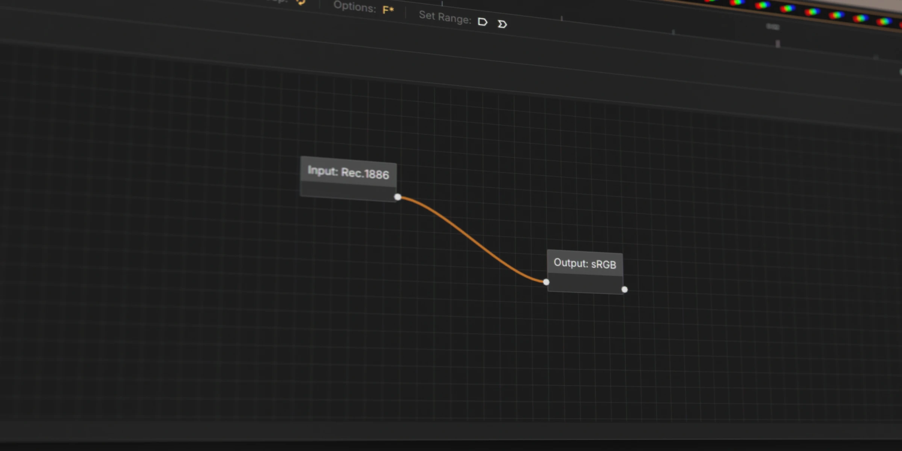
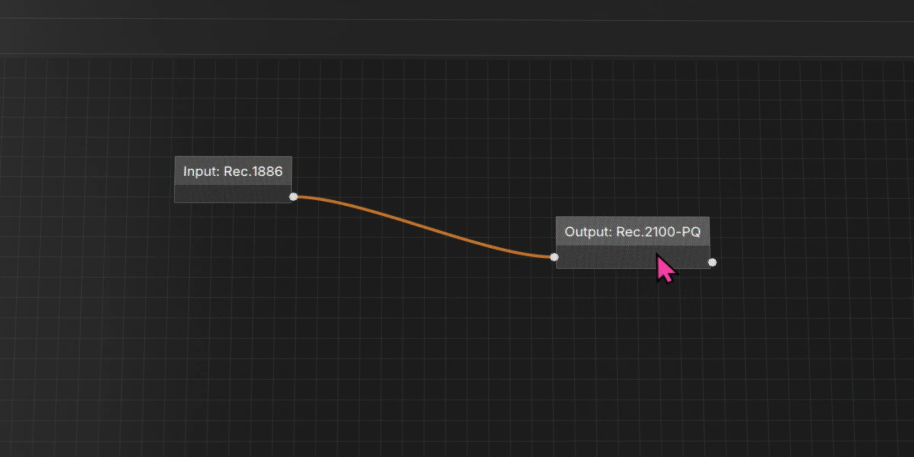

# SDR vs HDR

Unlike most media players, QCView does not tonemap media. Other players make assumptions about color space that are at least partially wrong — or at minimum, inconvenient for a professional review workflow.

As a result, video output is presented in the display's working color space. In SDR mode, this is `sRGB`, so SDR video displays correctly without any adjustment. In HDR mode, the display assumes `Rec.2100 PQ`, so HDR content (such as PQ HEVC) displays correctly — but SDR content will not. In that case, you'll need to use OCIO to convert.

---

## Interface Tonemapping

When HDR is active, the UI elements need to be tonemapped into the HDR color space. QCView provides an adjustable **target nits** setting to control how bright the interface appears relative to the HDR content. This lets you balance UI readability against the HDR video luminance.

---

## Color Output with OCIO

### SDR Mode

In SDR mode, use an `sRGB` output node for a standard display-referred result. If you want to preview how content will look on a typical consumer display — `~Rec.709 / Gamma 2.4` — any `Rec.1886` option will work. (Given the general state of video color management on consumer hardware, this is how most viewers will see your content.)

---

### HDR Mode (Windows)

With Windows HDR mode enabled, you can present video in `Rec.2100 PQ`. To view SDR content in this mode, use the appropriate Display node to transform it into that space.

---

### HDR Mode (Linux)

On Linux, HDR output can be toggled on and off within QCView at runtime. However, **HDR must also be enabled at the display/compositor level** — for example, in KDE Plasma's Display settings — for HDR output to reach the monitor.

When HDR is enabled, the Vulkan swapchain switches to `A2B10G10R10` with `HDR10_ST2084` color space. The ImGui interface is converted to PQ via a GPU shader, with configurable target nits for UI brightness.

> **Note:** Linux HDR support is experimental and has been tested on Kubuntu with KDE Plasma 6 (Wayland).