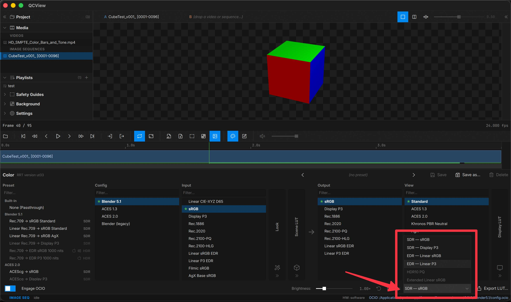

# SDR vs HDR

At the bottom of the color panel, you can toggle between SDR and HDR modes available to the system.

For the most part, you will want `sRGB` for SDR on both MacOS and Windows, `HDR10` for HDR on Windows, and `Linear P3 EDR` for HDR on MacOS. 

The OCIO presets panel reacts to which mode you are in and provides appropriate templates for viewing media.

---

## Color output with OCIO

### SDR mode

In SDR mode, use an `sRGB` or a `bt.1886` output for a standard display-referred result.

---

### HDR mode (Windows)

With Windows `HDR10` mode enabled, you should use `Rec.2100 PQ` or `PQ BT.2021` or something similarly names for the output.

---

### HDR mode (macOS — EDR)

In `Linear P3 EDR` mode you will want to use one the matching output module in ACES 2.0 or Blender 5.1 configs.