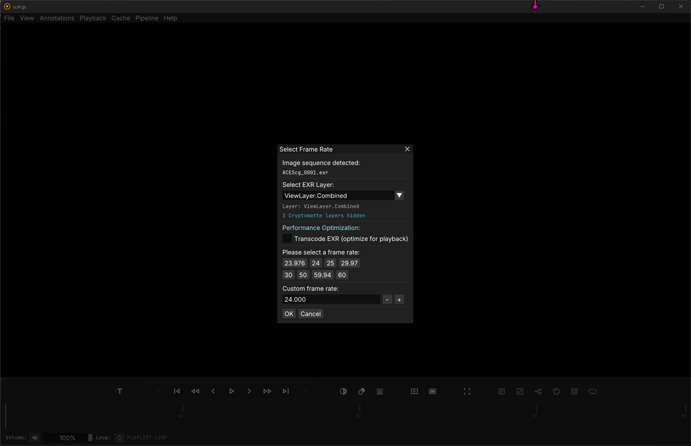
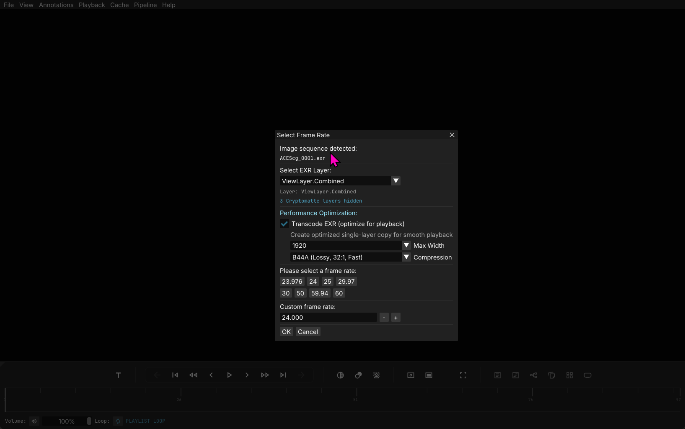

# Image Sequences

## The Flow

Basic image sequence usage is straightforward: Open or drag in a single image from a sequence, and u.m.p. will detect the sequence. Select a framerate, and if a multi-layer EXR, select the layer you want to load.

There are some considerations to smooth playback, though:

- Decompression and i/o on large multi-layer EXRs and TIFF sequences (think 4k+), with specific compression schemes, is too heavy for the CPU-bound Open-EXR or LibTIFF extraction. The math won't add up, no matter how many threads you throw at it (see the Cache Settings page for more info).
- Because of this, u.m.p. provides the option to transcode sequences into a more memory-friendly format.

## Transcoding

With pre-transcoding, you have the option to pick a resolution and compression scheme. I would recommend sticking with `B44A` vs. DWAA/DWAB because it decompresses faster. It has a noticeable hit on quality, but it's fine for a quick review.