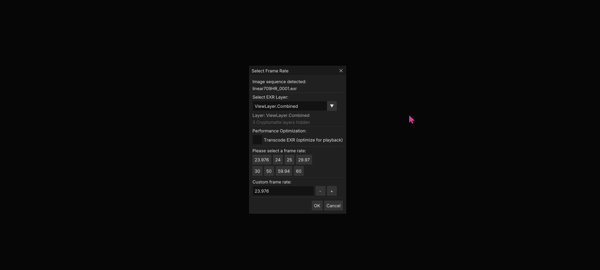
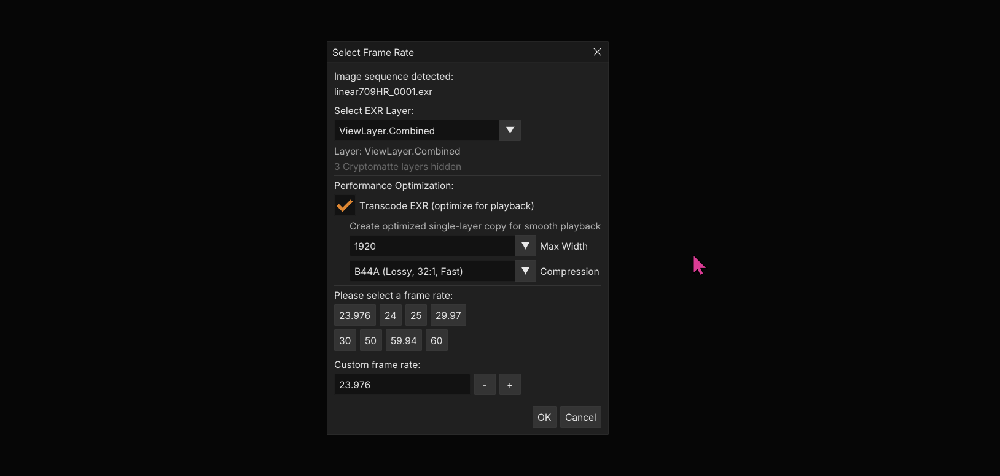
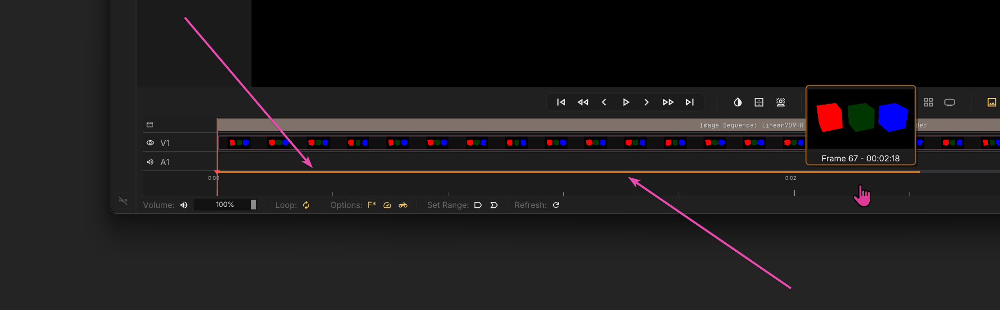

# Image Sequences

## The Flow

Basic image sequence usage is straightforward: Open or drag in a single image from a sequence, and u.m.p. will detect the sequence. Select a framerate, and if a multi-layer EXR, select the layer you want to load.

There are some considerations to smooth playback, though:

- Decompression and i/o on large multi-layer EXRs and TIFF sequences (think 4k+), with specific compression schemes, is too heavy for the CPU-bound Open-EXR or LibTIFF extraction. The math won't add up, no matter how many threads you throw at it (see the Cache Settings page for more info).
- Because of this, u.m.p. provides the option to transcode sequences into a more memory-friendly format.

---

## Transcoding

With pre-transcoding, you have the option to pick a resolution and compression scheme. I would recommend sticking with `B44A` vs. `DWAA/DWAB` because it decompresses faster. It has a noticeable hit on quality, but it's fine for a quick review.

## Playback Cache

Image sequences use a custom OTIO-based timeline to playback. Behind the hood, they are extracting textures to RAM and uploading them to the GPU as you traverse the timeline. This is the cache progress bar, which shows how much read-ahead and read-behind you have cached at any given time.

### Cache Settings

You can adjust these values in the Pipeline & Cache Settings panel.

### Disk Cache for Transcodes

If you choose to transcode a sequence for better playback, this is where the temp cache file will be stored. I would recommend changing this setting to a fast NVME drive, not your system drive. 

*Note: Because the playback cache is RAM-based, it is affected by our Memory Safety system. If the Memory Safety system has detected full system RAM, Images will not play back. See the Memory Safety page for details.*

*Another Note: See the Inspector page to see you can swith EXR layers after loading.*

---

## Flash Frames

u.m.p will detect an incomplete image sequence and fill in the gaps with a transparent texture so that you can review in-progress renders. Additionally, it's sensitive to files under 15 KB and assumes they are busted frames. If it detects a file under 15 KB, it will flash a red frame and won't bother trying to decode it.