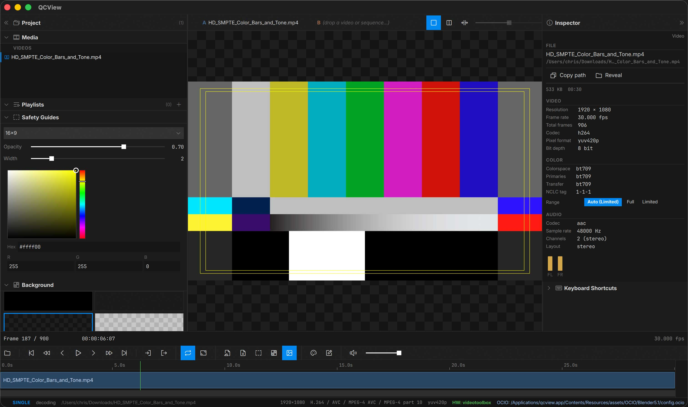

# QCView
---

**QCView** is a professional media player and reviewer for Windows and macOS, built for artists, colorists, and post-production teams who need accurate, color-managed playback of video, EXR, and image sequences.

---

## Key Features

### Playback
- Hardware-accelerated video decoding — Vulkan/D3D11-video on Windows, VideoToolbox on macOS, with FFmpeg software fallback
- HDR10 (PQ / ST.2084) on Windows via DXGI + DirectComposition; Extended Dynamic Range (EDR) on macOS
- Frame-accurate stepping with press-and-hold fast forward / rewind
- Playlists with cross-clip seek, per-clip in/out trims, and hover thumbnail filmstrip
- Embedded timecode (DV / TimeCode / MXF) with selectable origin
- Audio playback (WASAPI / CoreAudio) with per-channel routing for multi-stream broadcast deliveries
- A/V sync offset trim, separate dual-view value

### Image Sequences
- [OpenEXR](https://openexr.com/) with multichannel and multipart support
- TIFF, PNG, JPEG sequence playback

### Color
- Live [OCIO](https://opencolorio.org/) color correction with a node-based interface
- Bundled OCIO configs: ACES 2.0, ACES 1.3, Blender 5.1
- Screenshots and notes exports apply the OCIO transform

### Review Tools
- Annotations + notes with brush, line smoothing, screenshot illustrations, and Markdown / HTML / PDF / DOCX export
- Dual-view comparison: side-by-side, split-wipe with mouse-drag seam, independent A / B controls
- Title-safety guides for broadcast and social-media deliverables
- Live background switching for alpha-channel review

### Project Support
- Adobe project metadata import (Premiere / After Effects timecode + project links via ExifTool)
- Custom project files (`.qcvproj`)
- `qcview://` URI scheme for sharing file paths

---

## Documentation

Use the sidebar to browse the full manual, including [installation](installation), [playback basics](app-basics), [color management](color), [annotations](annotations), and more.

---

## Links

- [Source Code](https://github.com/cbkow/QCView-Player)
- [Acknowledgments](https://github.com/cbkow/QCView-Player/blob/main/Acknowledgments.md)
- [Third-Party Notices](https://github.com/cbkow/QCView-Player/blob/main/LICENSES/THIRD_PARTY_NOTICES.txt)
- [Privacy Policy](privacy)

QCView is free software released under the GNU General Public License version 3.
