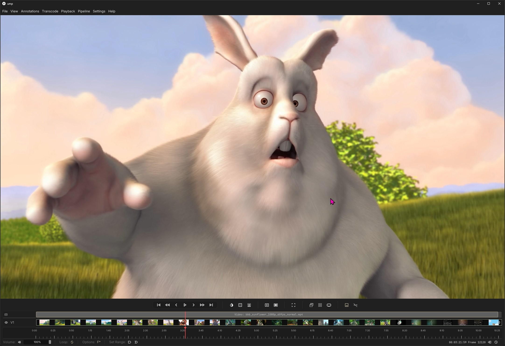
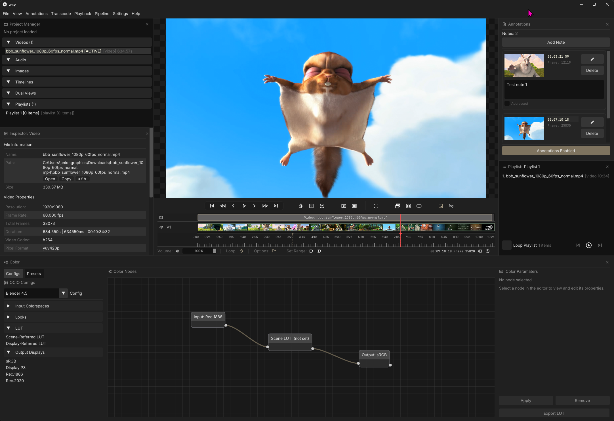

# u.m.p.

**u.m.p.** is a [Dear ImGui](https://github.com/ocornut/imgui) C++ [libmpv-based](https://mpv.io/) OpenGL playback tool with support for most video codecs, EXR, PNG, TIFF, and JPEG image sequences for Windows. 

#### Basic features include:

 - [OTIO](https://github.com/OpenTimelineIO) timelines
 - [mpv](https://mpv.io/) video decoding
 - [Open EXR](https://openexr.com/en/latest/) decoding with multichannel, and multipart support
 - playlists
 - a [Thumbfast](https://github.com/po5/thumbfast)-inspired hover thumbnails with a [DJV](https://github.com/grizzlypeak3d/DJV) inspired filmstrip 
 - frame-stepping press-and-hold RW/FF with speed up
 - live [OCIO-based](https://opencolorio.org/) color correction switching with a node-based interface
 - live background switching for alpha-channel media review
 - an annotation/notes system with basic drawing and line smoothing
 - embedded timecode support
 - title-safety guides for standard broadcast and social-media deliverables
 - screenshots from all media with [OCIO](https://opencolorio.org/) transforms applied.
 - support for Adobe project metadata (ie "which project created this render?")

## Manual and documentation

u.m.p. is open source. It's a personal, in-house tool, but free to use and alter.  GPL is due to dependencies such as FFMPEG and Exiftool.

[https://github.com/cbkow/ump](https://github.com/cbkow/ump)