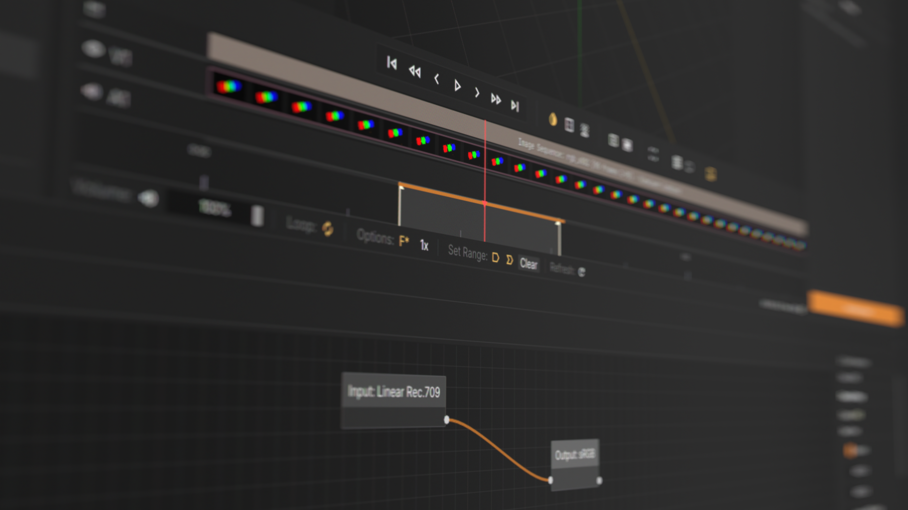

# QCView
---

**QCView** is a professional media player and reviewer for Windows, macOS, and Linux, built for artists, colorists, and post-production teams who need accurate, color-managed playback of video, EXR, and image sequences.

---

## Key Features

### Playback
- Hardware-accelerated video decoding — D3D11VA on Windows, VideoToolbox on macOS, VA-API on Linux
- HDR output: HDR10 (PQ/ST.2084) on Windows/Linux, Extended Dynamic Range (EDR) on macOS
- Frame-accurate stepping with press-and-hold fast forward/rewind
- Playlists and hover thumbnails with filmstrip view
- Embedded timecode support
- Audio playback with tempo-preserving time stretch

### Image Sequences
- [OpenEXR](https://openexr.com/en/latest/) with multichannel and multipart support
- TIFF, PNG, and JPEG sequence playback
- Automatic pipeline mode selection based on bit depth

### Color
- Live [OCIO](https://opencolorio.org/) color correction with a node-based interface
- Bundled OCIO configs: ACES 2.0, Blender 5.1, ACES 1.3
- Linear EDR display outputs for macOS HDR workflows
- Multiple pipeline modes: 8-bit, 12-bit, 16-bit float
- Screenshots with OCIO transforms applied

### Review Tools
- Annotation and notes system with drawing, line smoothing, and screenshot illustrations
- Dual-view comparison mode
- Title-safety guides for broadcast and social-media deliverables
- Live background switching for alpha-channel review
- [Frame.io](https://frame.io) comment integration

### Project Support
- Adobe project metadata import
- Custom project files (.qcv, .qcvproj, .qcvexr)
- `qcview://` URI scheme for sharing file paths

---

## Documentation

Use the sidebar to browse the full manual, including [installation](installation), [playback basics](app-basics), [color management](ocio-nodes), [annotations](annotations), and more.

---

## Links

- [Source Code](https://github.com/cbkow/QCView-Player)
- [Acknowledgments](https://github.com/cbkow/QCView-Player/blob/main/Acknowledgments.md)
- [Third-Party Notices](https://github.com/cbkow/QCView-Player/blob/main/LICENSES/THIRD_PARTY_NOTICES.txt)
- [Privacy Policy](privacy)

QCView is open source under the GPL v3 license.
