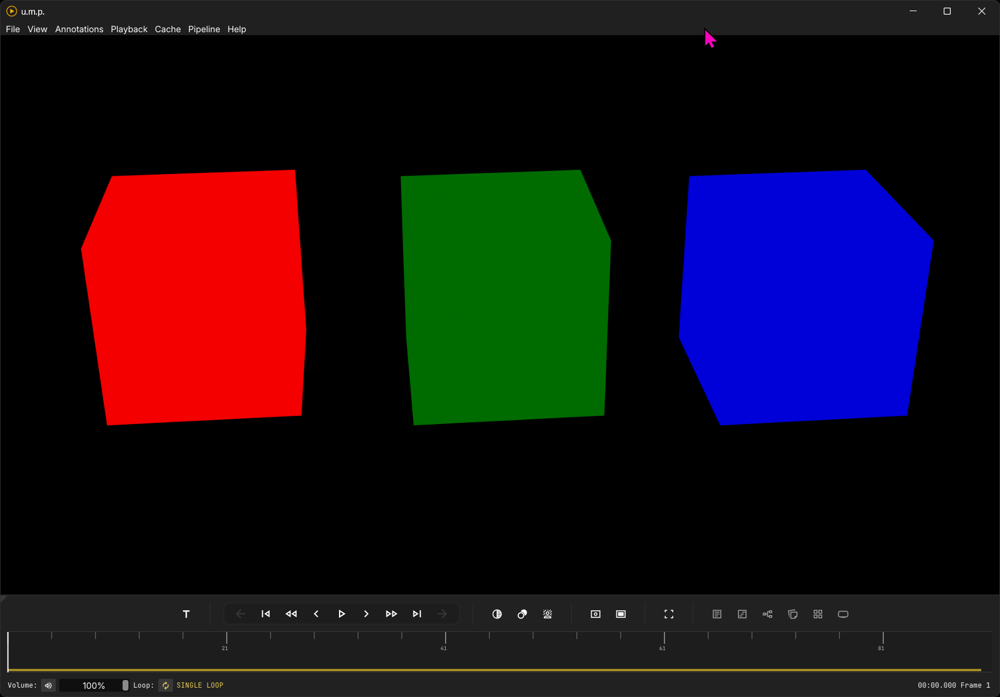

# u.m.p.

## Overview

**u.m.p.** is a [Dear ImGui](https://github.com/ocornut/imgui) C++ [libmpv-based](https://mpv.io/) OpenGL video player with direct memory-mapping playback for EXR, PNG, TIFF, and JPEG image sequences for Windows. Basic features include:

 - a spiraling seek/scrubbing cache for videos
 - a separate live playback memory cache for image sequences 
 - a [Thumbfast-inspired](https://github.com/po5/thumbfast) thumbnail system for all media
 - frame-stepping and cache-enhanced RW/FF
 - live [OCIO-based](https://opencolorio.org/) color correction switching with a node-based interface
 - live background switching for alpha-channel visibility
 - an annotation/notes system with PDF/Markdown/HTML export + [Frame.io](https://frame.io/home) import
 - embedded timecode for supported media
 - title-safety guides for standard broadcast and social-media deliverables

## Opening media

Open a file, click `File > Open Media` or the keyboard command `Ctrl + O`. Additionally, you can drag in one or more media items at a time, right into the app window. If you drag in one, it will open as usual. If you drag in more than one, it will populate the Project Manager Panel with the options. See the **Project Manager** page for more details.