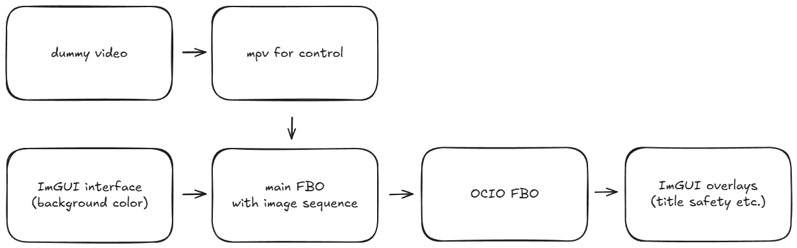
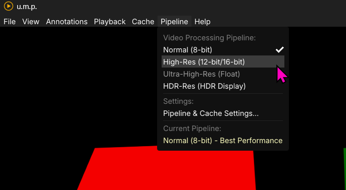

# Overview

**u.m.p.** is a [Dear ImGui](https://github.com/ocornut/imgui) C++ [libmpv-based](https://mpv.io/) OpenGL video player with direct memory-mapping playback for EXR, PNG, TIFF, and JPEG image sequences for Windows. Basic features include:

 - a spiraling seek/scrubbing cache for videos
 - a separate live playback memory cache for image sequences 
 - a [Thumbfast-inspired](https://github.com/po5/thumbfast) thumbnail system for all media
 - frame-stepping and cache-enhanced RW/FF
 - live [OCIO-based](https://opencolorio.org/) color correction switching with a node-based interface
 - live background switching for alpha-channel visibility
 - an annotation/notes system with PDF/Markdown/HTML export + [Frame.io](https://frame.io/home) import
 - embedded timecode for supported media
 - title-safety guides for standard broadcast and social-media deliverables

## How to install

To install, download the latest `.exe` installer from [releases.](https://github.com/cbkow/ump/releases/)

---

## Basic app flow

#### Video

The basic app flow places the mpv and image-sequence FBO between the interface and a separate OCIO FBO. This flow allows for real-time background color/pattern swapping (try toggling `B` on the keyboard) and real-time OCIO shader generation on top of all videos and image sequences. 

#### Image Sequences

Image sequences use mpv for control and playback indirectly. When loading an image sequence, u.m.p. will create a dummy video for mpv to use for control, but instead directly extract images to memory straight to the OpenGL FBO. This process bypasses mpv for playback and provides a faster image sequence flipbook for review. It also allows for layer extraction from multi-layer EXRs. It includes the option to transcode larger (think 4k EXRs at DWAB and uncompressed TIFFs) to lower resolution/compression for smoother playback. See the Images page for more info on best practices and IO/decompression limitations with these formats.

---

## Pipeline Modes

u.m.p. supports several pipeline modes with various media types. What this means in practice: When a particular pipeline mode is selected, mpv itself is configured for the appropriate bitrate in playback, and the cache settings are adjusted appropriately. Here is a breakdown:

- **Normal mode:** This allows for normal 8-bit mpv playback and is appropriate for most video formats and 8-bit TIFF, PNG, and JPEG sequences. Caches are adjusted to the RGBA8 format to match.
- **High-Res mode:** This allows for mpv to playback 12-bit video with full fidelity (think ProRes 4444) and adjusts the cache to RGBA16 (integer). I am keeping this as a user-selectible option for videos, but for the most part, 8-bit is fine for reviewing--even with ProRes. This mode will also be used automatically for 16-bit TIFFs and 16-bit PNGs. 
- **Ultra-High-Res mode:** is exclusively used for floating-point EXR image sequences. When an EXR is loaded, u.m.p will automatically switch to this mode, and the cache will be set to RGBA16F (half-float).
- **HDR-Res:** is also RGBA16F (half-float), and mpv is set to `linear` for HDR video playback on an HDR monitor. I haven't tested this yet--YMMV.

**Note:** *With all image sequences, the pipeline mode is automatically set based on the image format. Pipelines are only user-selectible with videos.* 