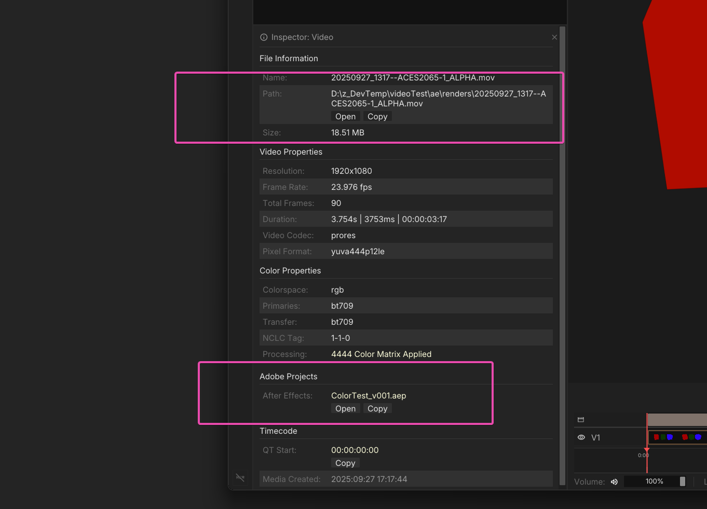
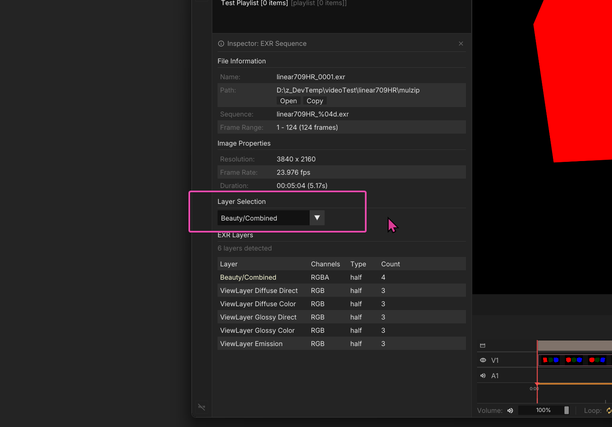

# The Inspector Panel

## Videos

When video and audio files are loaded, we provide a file path to the media up top. Clicking `Open` will open the file's location in Windows Explorer.

In the Adobe Projects tree, we are searching the file's metadata for source projects. If u.m.p. finds the metadata, it will provide the option to open the source project in Windows Explorer. Click `Open` to open the After Effects or Premiere file. 

---

## Image Sequences

If an image sequence is loaded, we provide basic file information. If an EXR is loaded, additional compression, and channel information is available. The layer field is a dropdown that you can use to change the EXR layer loaded in the viewport.

