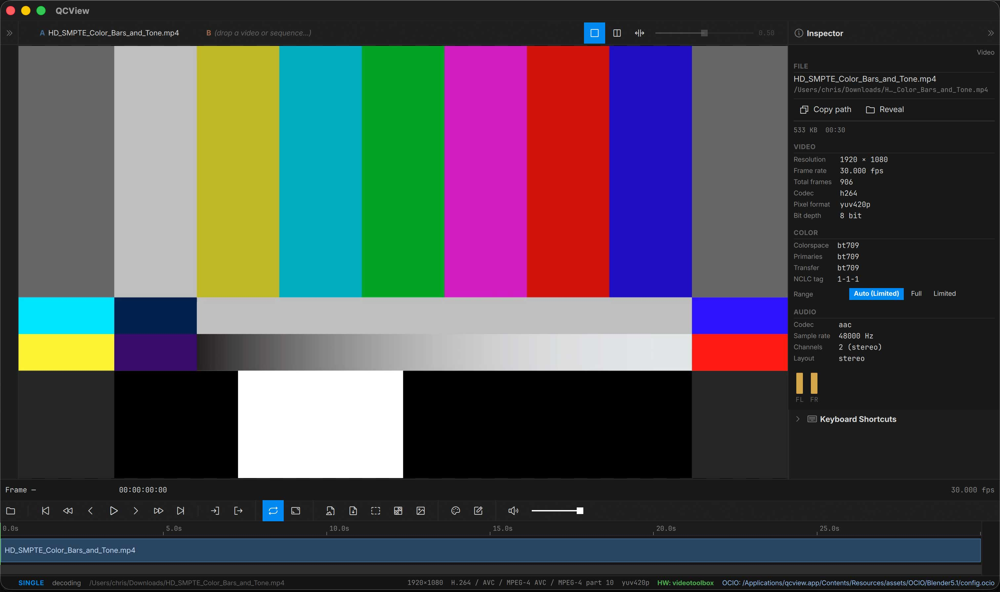
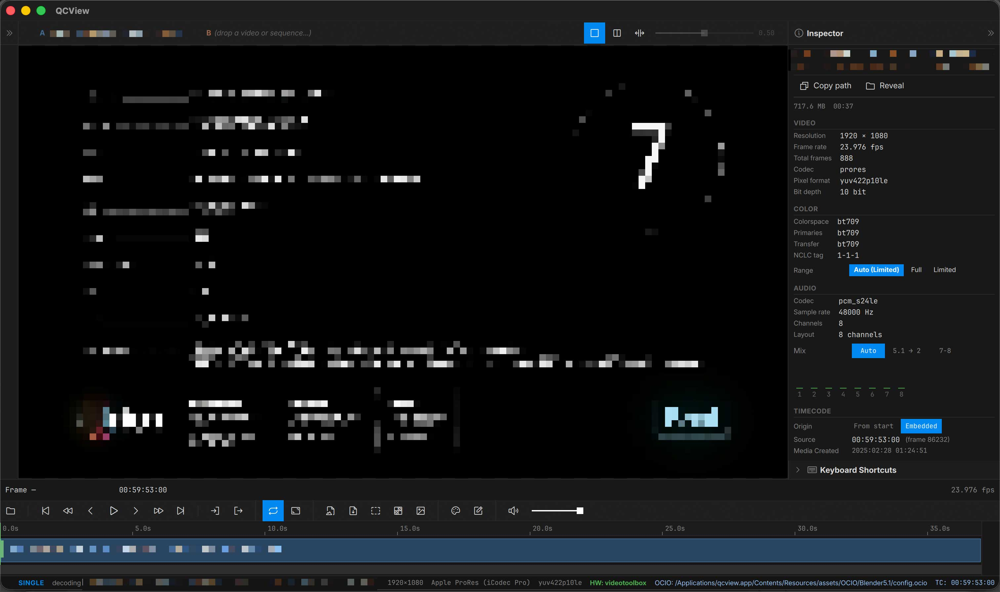
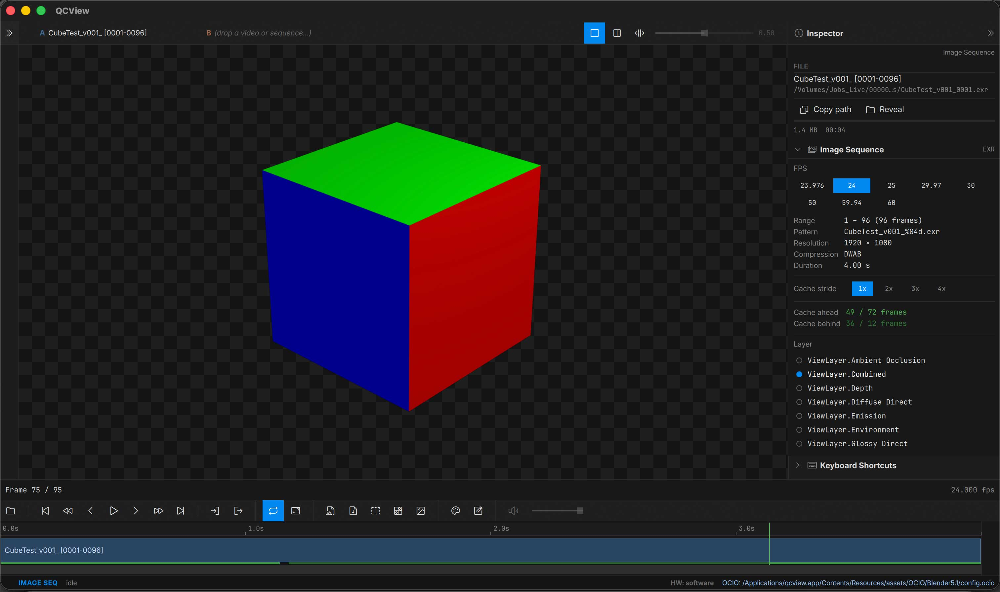

# Inspector

The Inspector lives in the Right Rail (`Ctrl + 2`). It shows per-source properties and provides quick paths to the source files.

## Path actions

The Inspector shows the file path of the currently-loaded media with two path actions:

| Button | Action |
|---|---|
| Copy path | Copies the path to the clipboard (native separators on each OS) |
| Reveal in Explorer / Finder | Opens the containing folder and selects the file |

## File and video details

The **File** card names the container family (QuickTime, MP4, MXF, Matroska…) and, for MXF, the operational pattern — **OP1a** (interleaved, what Adobe Media Encoder / Premiere / Resolve write) versus **OP-Atom** (Avid's one-essence-per-file layout) — plus the authoring tool when the file records one (MXF identification set, QuickTime `©swr`, Matroska writing app).

The **Video** card shows the codec and its flavor in export-menu terms: ProRes 422 / HQ / 4444, and for Avid VC-3 the Compression ID is read from the first frame so you get the actual bandwidth name — **DNxHD 36 / 115 / 145 / 175 / 220…**, the **x** suffix marking the 10-bit variants (175x, 220x), **DNxHD 444**, and the resolution-independent **DNxHR LB / SQ / HQ / HQX / 444** classes. A **Bitrate** row lists the video stream's rate when the container declares it (or DNxHD's fixed nominal), with the whole-file average alongside.

Projects saved before these fields existed are back-filled on open with a header-only re-probe — no full re-scan, and offline volumes are simply retried next launch.

## Per-clip properties (pills)

Several properties are stored per media item and shown as togglable **pills** in the Inspector:

- **Video range override** — force the decoder to interpret the source as limited or full range, overriding container metadata. Useful for sources that are mis-tagged.
- **Timecode Origin** — pick which embedded timecode track drives the playhead readout (DV, TimeCode, MXF), or **From start** to ignore embedded timecode and count from frame 0.
- **Broadcast Master Audio Mix** — pick which mix you want to preview. If QCView detects a broadcaster master with 6 or 8 tracks, it will perform a technical mix of the tracks for preview. If stereo tracks are on tracks 7 and 8, they will be automatically selected. Click on the 5.1 toggle to preview the 5.1 downmixed to stereo.

Pill states persist with the project on save and re-apply on open.

## Adobe Projects

The **Adobe Projects** section scans the file's metadata via ExifTool for linked source projects. If QCView finds After Effects or Premiere project references, it displays them with an **Open** button to jump to the source project.

## Image Sequences

For image sequences, the Inspector displays resolution, frame count, format, and per-format details (EXR compression and channel layout, etc.). You can select which layer set to view, adjust framerate, and select a skip-frame stride for heavy sequences that won't playback without help.

