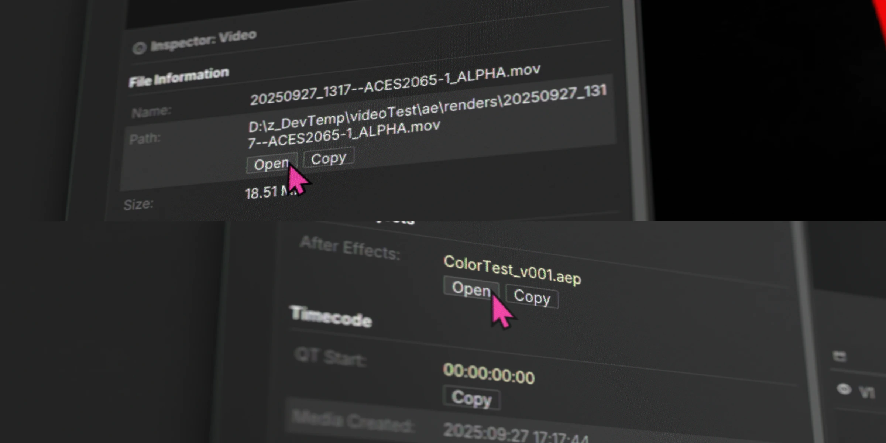
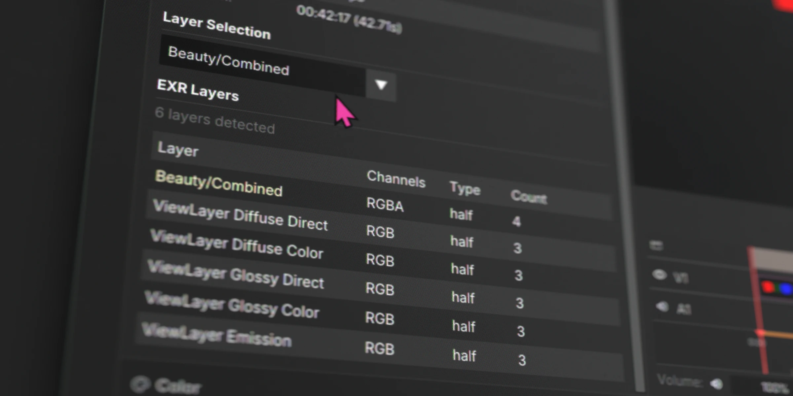

# Inspector

## Video and Audio

The Inspector shows the file path of the currently loaded media. Click **Open** to reveal the file in Explorer.

The **Adobe Projects** section scans the file's metadata for linked source projects. If QCView finds After Effects or Premiere project references, it displays them with an **Open** button to jump directly to the source project.

---

## Image Sequences

For image sequences, the Inspector displays file information such as resolution, frame count, and format. EXR files show additional details including compression type and channel layout. Use the **Layer** dropdown to switch between EXR layers in the Viewer.

