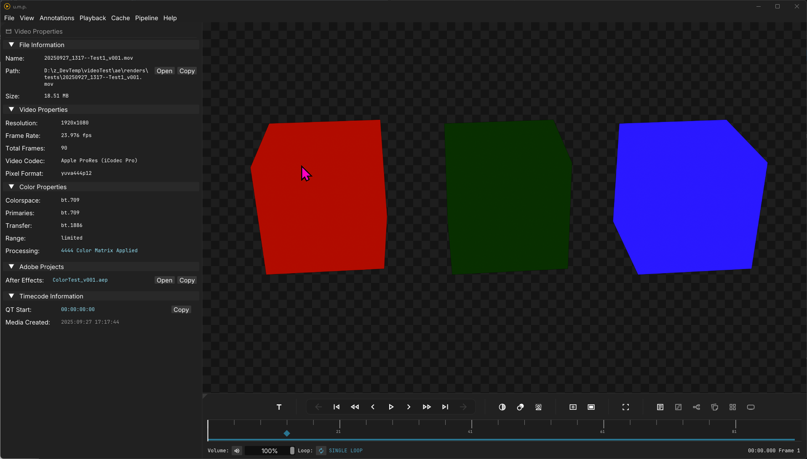

# Inspector

## The Inspector Panel

The Inspector Panel curates useful file information.

- When video and audio files are loaded, we provide a file path to the media up top. Clicking `Open` will open the file's location in Windows Explorer.
- In the Adobe Projects tree, we are searching the file's metadata for source projects. If u.m.p. finds the metadata, it will provide the option to open the source project in Windows Explorer. Click `Open` to open the After Effects or Premiere file. 