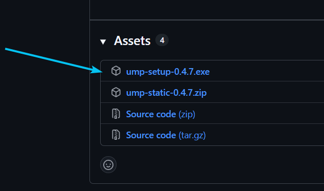
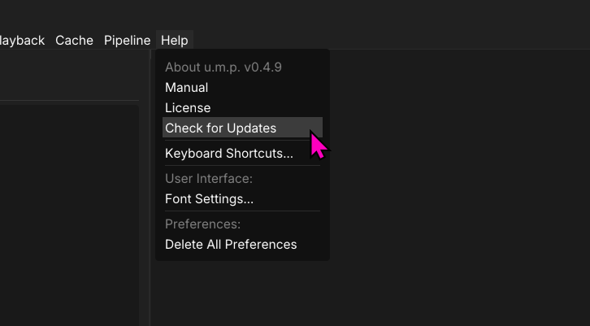
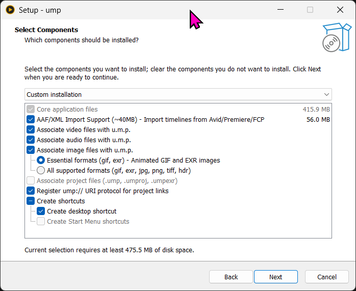
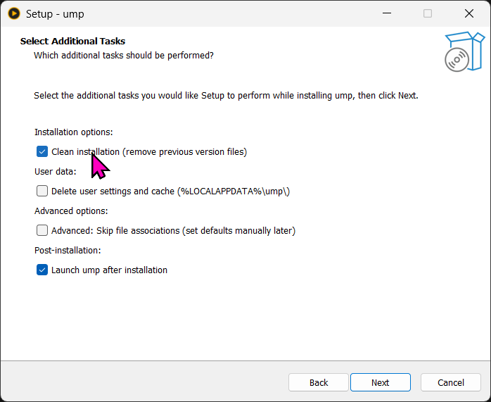

# Installation

## Recommended

To install, download the latest `.exe` installer from [releases.](https://github.com/cbkow/ump/releases/)

*The installer has a few extras:*
 - Registry entries for common media files
 - Adds a `ump:///XXX` custom URI scheme to share file paths with colleagues.
 - Registry entries and icons for `.umproject` files.

---

## Alternative

Download the zip if you would rather not use the installer.

---

## Upgrade and Installer Guide

### Check for Updateas

`Check for Updates` in the `Help` menu will bring you the u.m.p. releases page on GitHub. Here you can find the latest installer. 

### Clean Install

It’s recommended to do a clean install when upgrading. Please close u.m.p and follow these screenshots.

