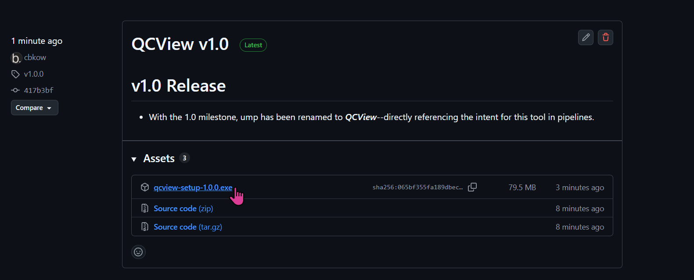

# Installation

To install the unsigned version of this QCView, download the latest `.exe` installer from [releases.](https://github.com/cbkow/QCView-Player/releases)

> Note: The installer has a few extras:
>  - Registry entries for common media files
>  - Adds a `qcview:///XXX` custom URI scheme to share file paths with colleagues.
>  - Registry entries and icons for `.qcvproj` files.
