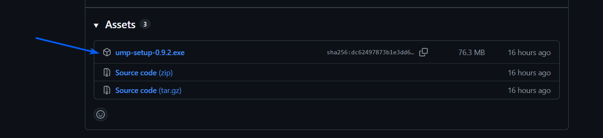
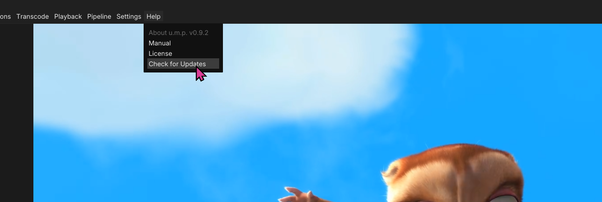

# Installation

To install, download the latest `.exe` installer from [releases.](https://github.com/cbkow/ump/releases/)

> Note: The installer has a few extras:
>  - Registry entries for common media files
>  - Adds a `ump:///XXX` custom URI scheme to share file paths with colleagues.
>  - Registry entries and icons for `.umproject` files.

---

## Upgrade

### Check for Updates

`Check for Updates` in the `Help` menu will bring you the u.m.p. releases page on GitHub. Here you can find the latest installer. 

