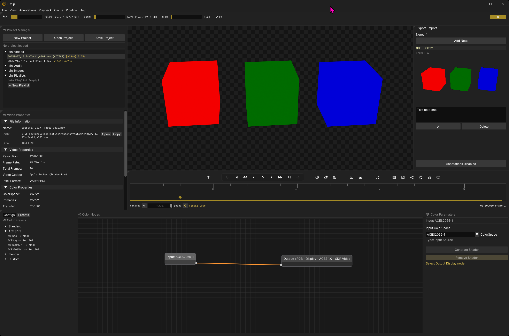
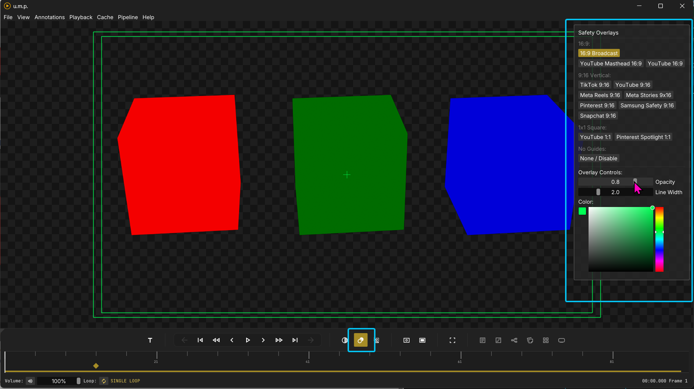
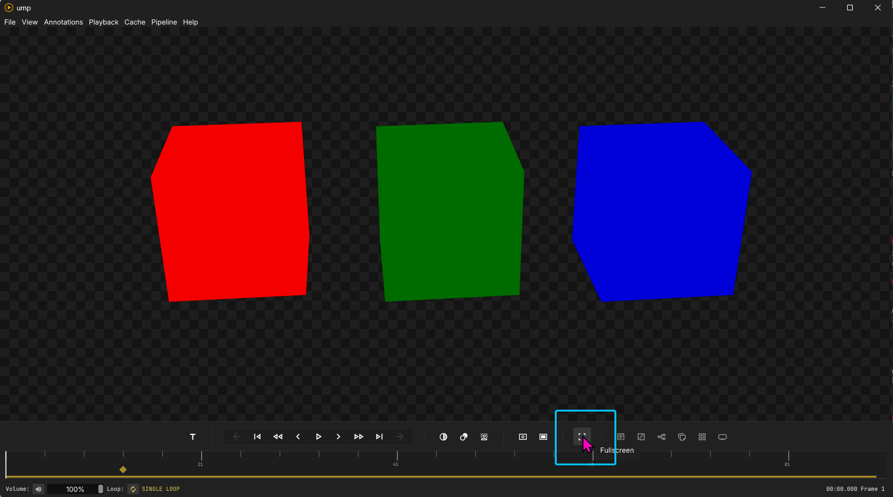

# Interface

## Windows and state management

Panels can be toggled on and off in both the main menu and with buttons in the timeline and transport area. The app has basic state management. After a successful shutdown, it will save your window size, position, and panel arrangement for the next app instance.

This interface is created with ImGui's docking branch, which allows for dynamic resizing of panels. 

You can click on the tiny triangle in the top left corner of any panel and undock it or re-dock it elsewhere.

### System accent colors

Toggle this option if you would like to use your Windows system accent color in u.m.p. This will replace the default yellow color scheme.

---

### Viewport background color/pattern

Background colors for the viewport will also be saved as a user preference and will be remembered on the next app load. To change the viewport background color, press `B` to toggle through the options, or press `Ctrl + Shift + B` to open the background color panel. You can also access the background color panel with a button in the timeline and transport area. Video and Image seqeuences' alpha channels pass through to this background.

---

## OCIO color presets

There are a few common OCIO presets available for quick toggling in the OCIO preset panel--cover basic rec.709-to-sRGB and typical ACES and Blender workflows. See the color panel page for more options.

---

## Title safety guides

Clicking on the title-safety button will open up a panel with different broadcast and social media safety overlays. You can change the color, line-width, and line-opacity in the panel.

---

## Full screen

Clicking on the full-screen button triggers a full-screen mode. This is not a proper full-screen mode; it cheats by filling the screen and turning off most of ImGui's interface. Note: This means that title safety guides are not available in this mode either. You can also toggle this mode with `F`.