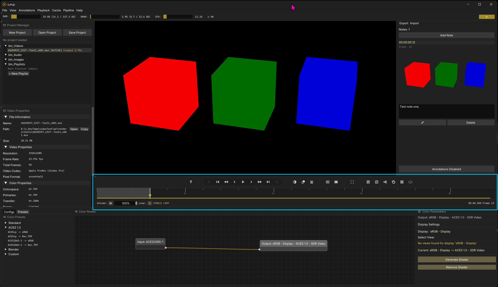
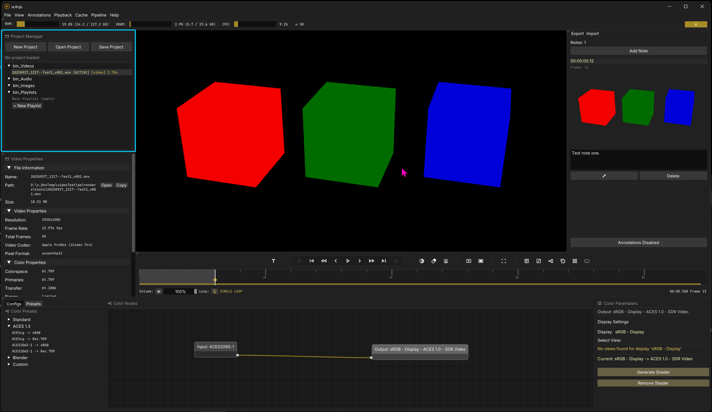
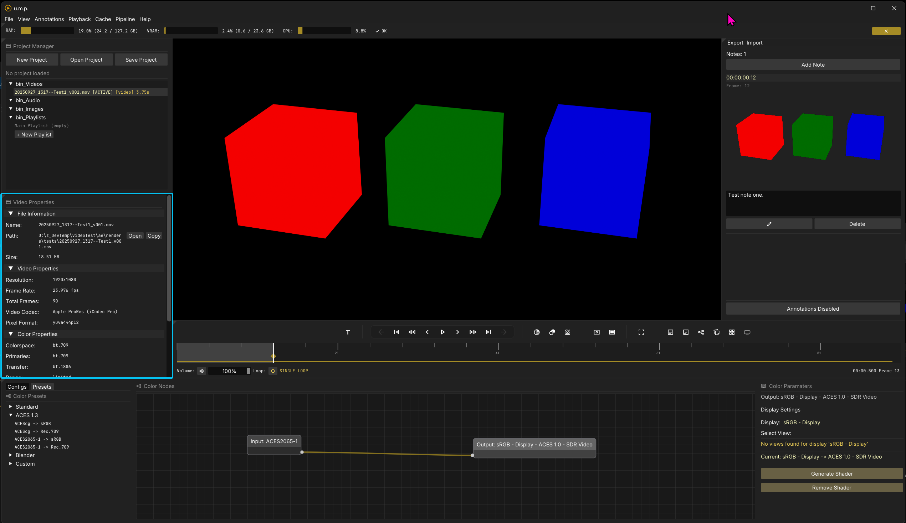
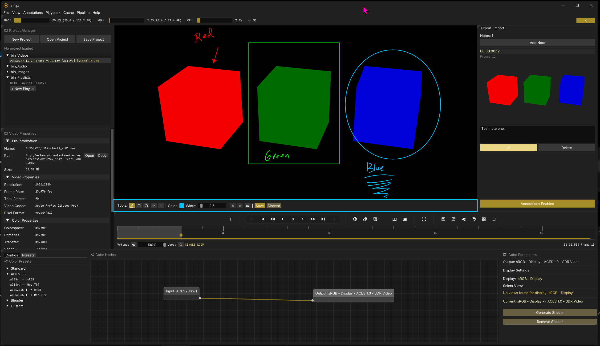
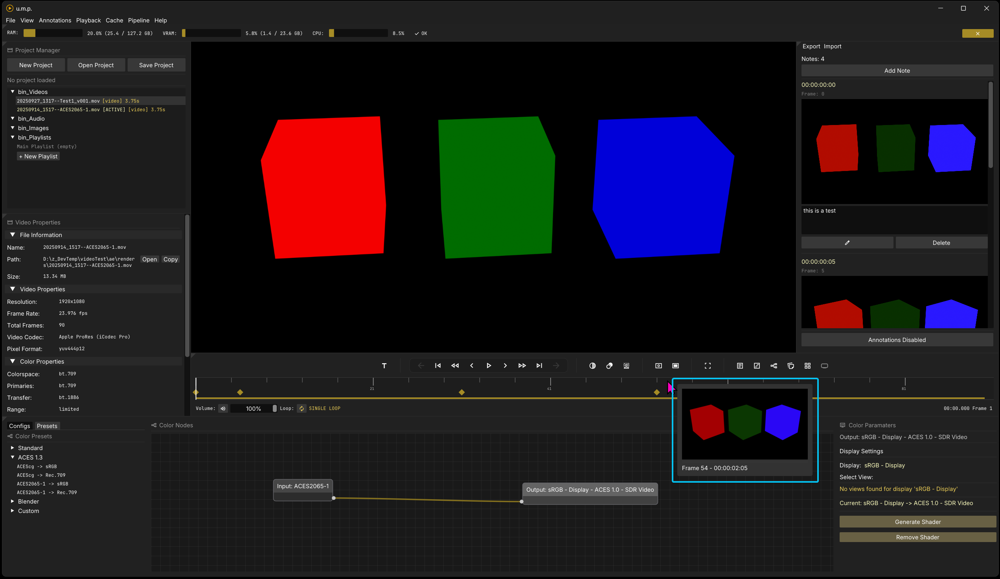
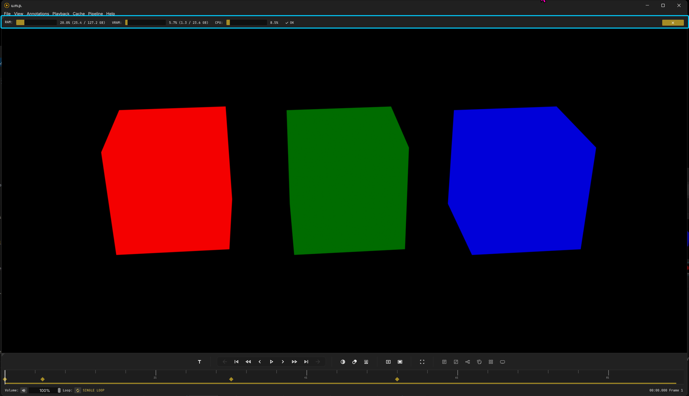

# Interface

## Windows and state management

Panels can be toggled on and off in both the main menu and with buttons in the timeline and transport area. The app has basic state management. After a successful shutdown, it will save your window size, position, and panel arrangement for the next app instance.

### Viewport background color/pattern

Background colors for the viewport will also be saved as a user preference and will be remembered on the next app load. To change the viewport background color, press `B` to toggle through the options, or press `Ctrl + Shift + B` to open the background color panel. You can also access the background color panel with a button in the timeline and transport area.

### System accent colors

Toggle this option if you would like to use your Windows system accent color in u.m.p.

---

## Panel Breakdown

**The Viewport:** Video and image sequence playback

**The Timeline and Transport Panel:** Timeline, transport controls, and various other shorcut and toggle buttons for state management (see below.)

**The Project Manager:** Bins for loaded media and playlists.

**The Inspector Panel:** Media metatdata/information + playlist management

**Color Panels:** OCIO configs, OCIO presets, OCIO node interface.

**The Annotations Panel:** Manages notes and annotations for media.

**The Annotations Toolbar:** Drawing toolbar for annoations. (This only appears when in annotation edit mode.)

**The Thumbnail Panel:** Appears when hovering over the timeline.

**The System Stats Panel:** Basic system-wide stats monitoring. Will appear automatically if system RAM is past 92% capacity.
