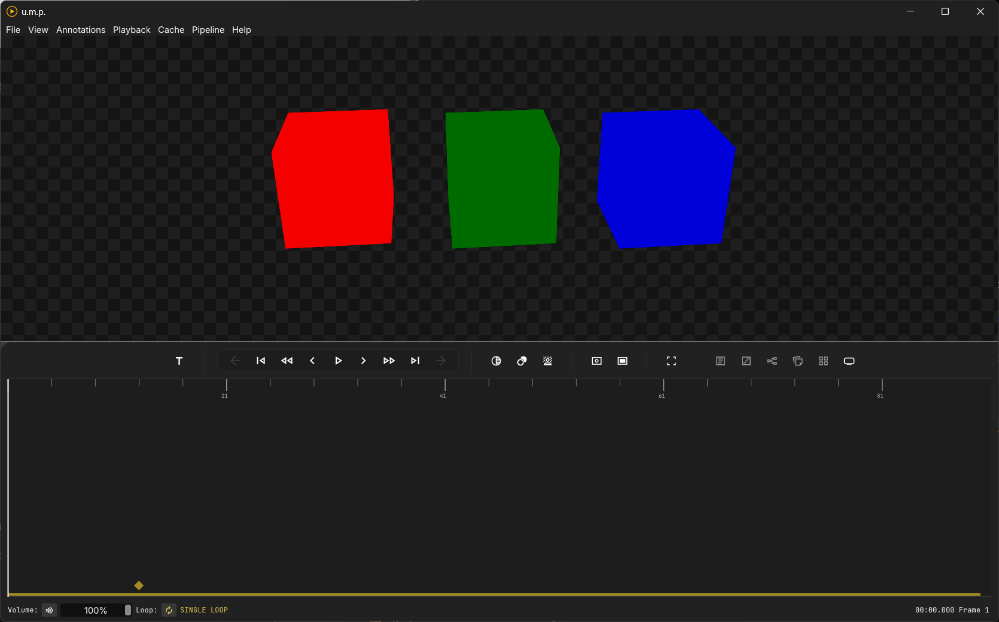
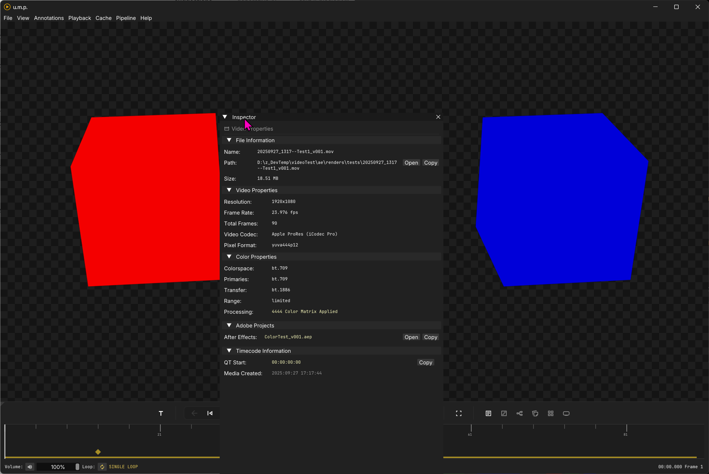
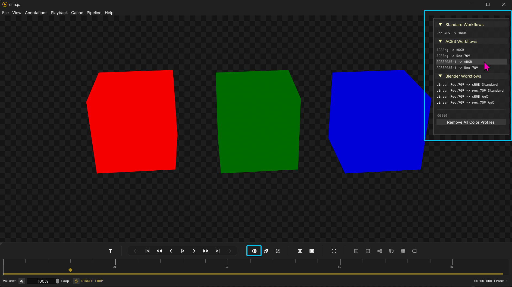

# Interface

## Windows and state management

Panels can be toggled on and off in both the main menu and with buttons in the timeline and transport area. The app has basic state management. After a successful shutdown, it will save your window size, position, and panel arrangement for the next app instance.

This interface is created with ImGui's docking branch, which allows for dynamic resizing of panels. 

You can click on the tiny triangle in the top left corner of any panel and undock it or re-dock it elsewhere.

### System accent colors

Toggle this option if you would like to use your Windows system accent color in u.m.p.

### Viewport background color/pattern

Background colors for the viewport will also be saved as a user preference and will be remembered on the next app load. To change the viewport background color, press `B` to toggle through the options, or press `Ctrl + Shift + B` to open the background color panel. You can also access the background color panel with a button in the timeline and transport area.

### OCIO color presets

