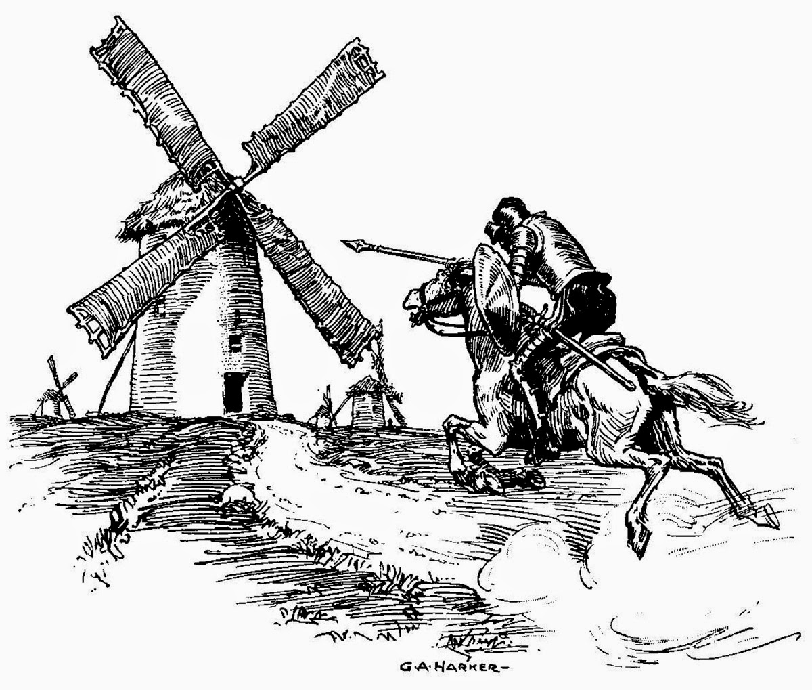

## Full Disclosure:

Simply put: Yes, I use LLM's on QCView. I currently use Claude Code extensively, and I have used others to workshop ideas in the past. Many previous iterations of this app, under various different names like ump and umpv (note that this is not to be confused with mpv's umpv but an coincidentally named QCView predecessor), predate heavy LLM usage, and many of their architectural choices still live in QCView. 

I realize this may be uncomfortable for some, but I can share that this app has been a personal windmill of mine for a very long time, creating a video player/ image sequence flipbook that meets my specific needs — closer to a decade than not. Maybe that makes a difference. 

Image source: [Wikimedia Commons](https://commons.wikimedia.org/wiki/File:Don_Quixote_fighting_windmills.jpg)