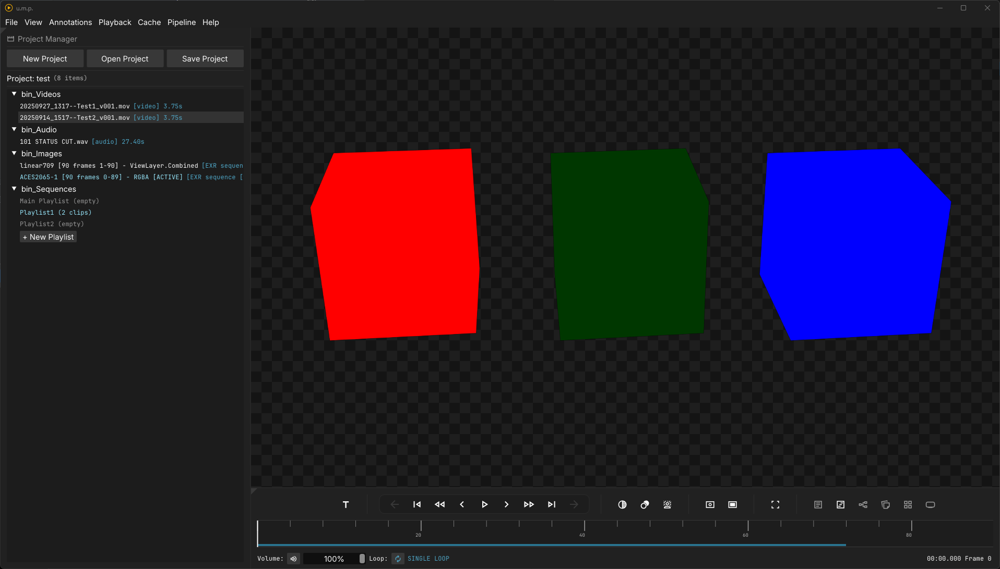
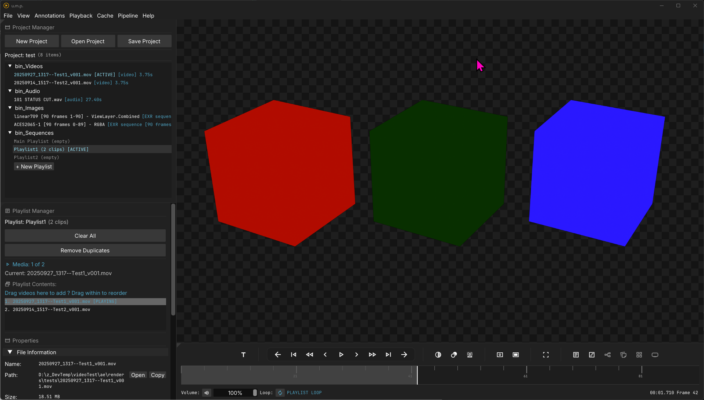

# Project management

## The Project Manager Panel

The Project Manager allows you to curate a collection of files to return to. When you drag multiple files into u.m.p., they will automatically load into bins sorted by media type.

- When you double-click on a file, it will be loaded into the viewport and timeline. Similarly, double-clicking on a playlist will load all the files in that playlist, providing a quick way to access multiple files at once. Right-clicking on the file will provide options to remove the media from the project and show the file in Windows Explorer.
- Buttons at the top of the panel are used to create, save, and load projects.

---

## Playlists

By default, there is one playlist loaded in the Project Manager panel. Underneath it, there is a `New Playlist` button you can use to create new playlists with. 

When you double-click on a playlist, it will open up the Inspector Panel (see the Inspector page for more info) and show the Playlist Manager. 
- The playlist currently only supports Video and Audio files. Image sequences are not supported.
- To add media, select (Ctrl or Shift to select multiples) in the Project Manager and drag them in.
- To rearrange files in the Playlist Manager, you can drag them.
- Right-clicking on files in the Playlist Manager will provide options to remove media and rearrange them.