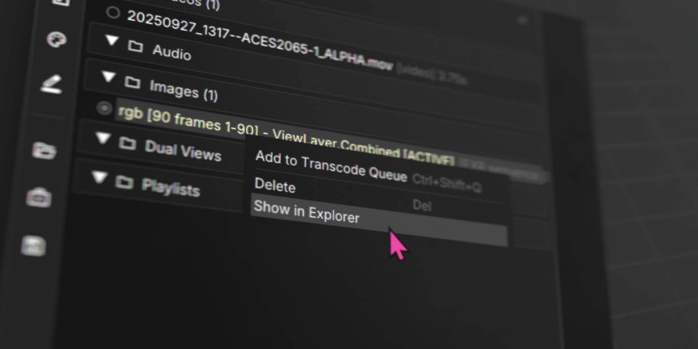
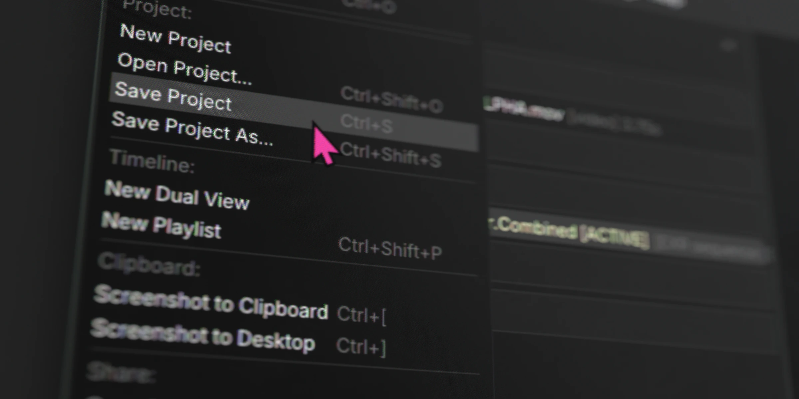
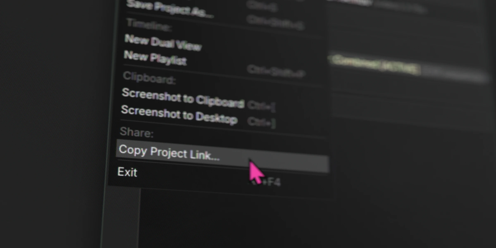

# Project Manager

## Loaded Media

The Project Manager organizes your media into bins sorted by type (video, image, audio). Drag files into QCView and they are added automatically.

| Action | Result |
|---|---|
| Double-click a file | Load it into the Viewer and timeline |
| Double-click a playlist or timeline | Load all of its files at once |
| Right-click a file | Remove from project, or reveal in Explorer |
| Drag a file | Drop onto the Viewer, into a Playlist, or onto Timeline layers |

---

## Save / Load Projects

Save your current session — all media, playlists, and timelines — to a `.qcvproj` file. Reopen it later to pick up where you left off.

---

## Project Links

QCView registers a `qcview://` URI scheme so you can share direct links to saved projects with colleagues. Copy a project link with `Ctrl + Shift + U`, then paste it into Slack, Teams, or email. When the recipient clicks the link, QCView opens the project automatically — as long as they have access to the same file system.

