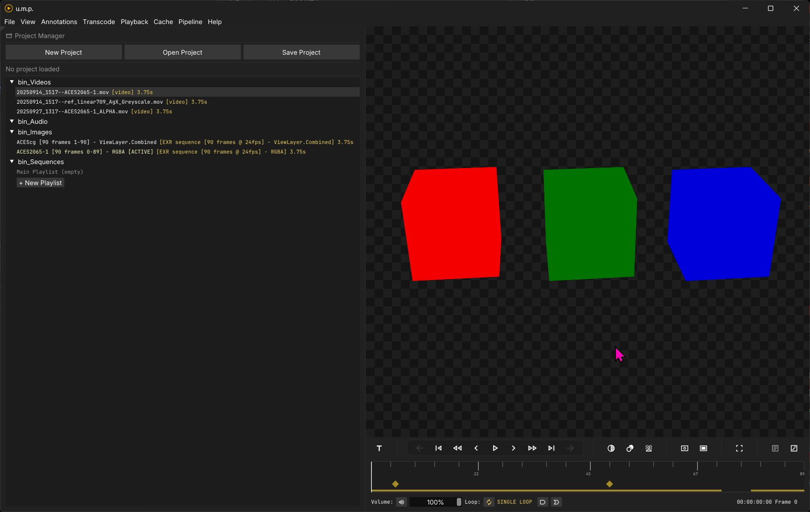

# The Project Manager Panel

## Loaded Media

The Project Manager allows you to curate a collection of files to return to. When you drag multiple files into u.m.p., they will automatically load into bins sorted by media type.

- When you double-click on a file, it will be loaded into the viewport and timeline. Similarly, double-clicking on a playlist will load all the files in that playlist, providing a quick way to access multiple files at once. Right-clicking on the file will provide options to remove the media from the project and show the file in Windows Explorer.
- Buttons at the top of the panel are used to create, save, and load projects.
