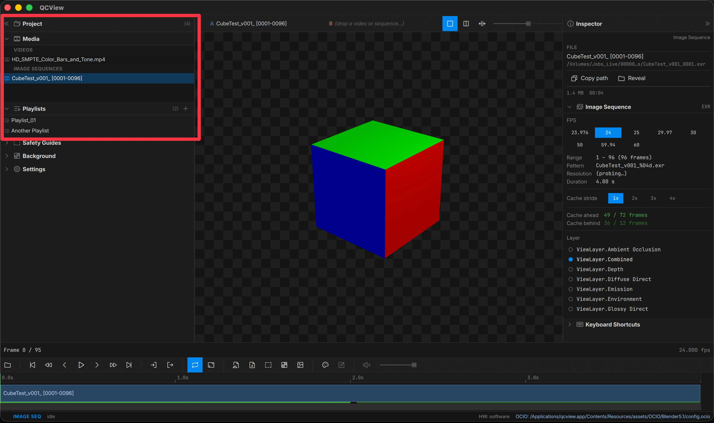
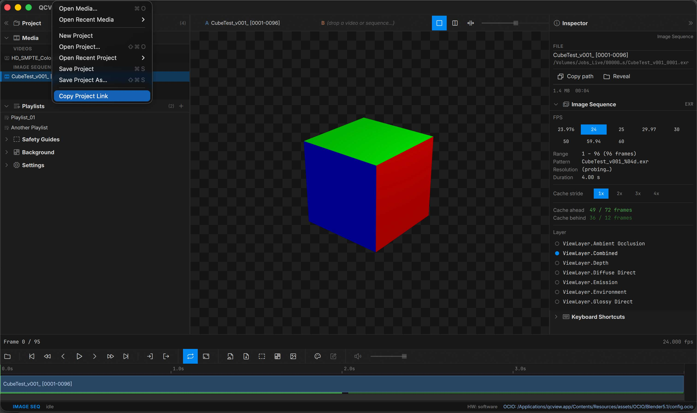

# Project Panel

The **Project** panel lives in the Left Rail (`Ctrl + 1`). It organizes media into bins by type.

## Bins

- **Media** — video, image-sequence, and audio sources
- **Playlists** — saved playlist timelines
- **Dual Views** — saved A/B dual-view setups

| Action | Result |
|---|---|
| Double-click a media item | Load it into the viewport and timeline |
| Double-click a playlist or dual view | Load that timeline / dual setup |
| Drag a media item | Drop onto the viewport, into a playlist's timeline, or onto a dual-view track |

Dragging items past the app's borders is restricted to a link-action drop so the OS doesn't trigger a file move by mistake.

---

## Save / Load Projects

Save your current session — all media, playlists, dual views, and per-item properties — to a `.qcvproj` file. Reopen it to pick up where you left off.

---

## Project Links

QCView registers a `qcview://` URI scheme for sharing direct links to saved projects. Paste a `qcview://` link into Slack, Teams, or email; clicking opens the project — as long as the recipient has access to the same file system. Copy this link to your clipboard from the main menu under `File`.

