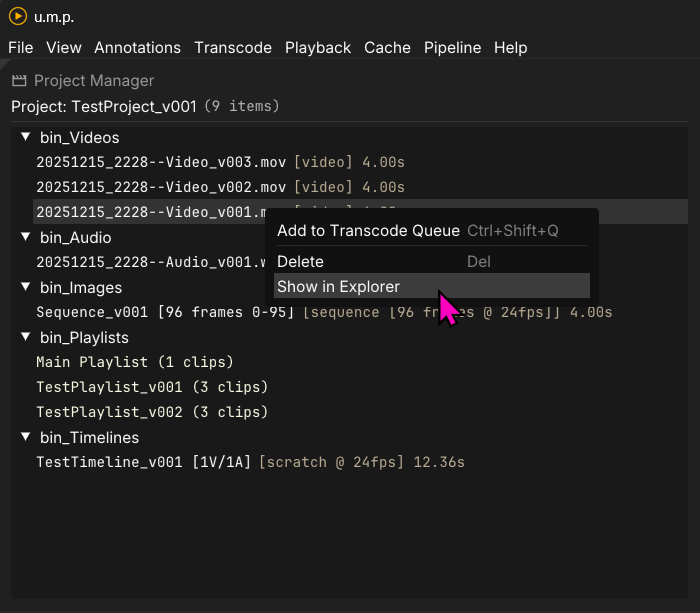

# The Project Manager Panel

## Loaded Media

The **Project Manager** allows you to curate a collection of files to return to. When you drag multiple files into u.m.p., they will automatically load into bins sorted by media type.

When you double-click on a file, it will be loaded into the viewport and timeline. Similarly, double-clicking a playlist or timeline loads all its files, providing a quick way to access multiple files at once. Right-clicking the file provides options to remove the media from the project and to open the file in Windows Explorer.

All media items are draggable. You can drag them to the **Viewer** to load them, or drag them into the **Playlist Manager** or directly into **Timeline** layers.

