# Timelines

## Overview

Timeline mode offers a simple layered timeline layout. The intended use is for quick conform prep review or as a playlist alternative—it's not trying to be a full NLE. That said, basic editing functions are available. There are no transitions (fades, etc.), and audio mixing is straightforward—audio sources are mixed as-is.

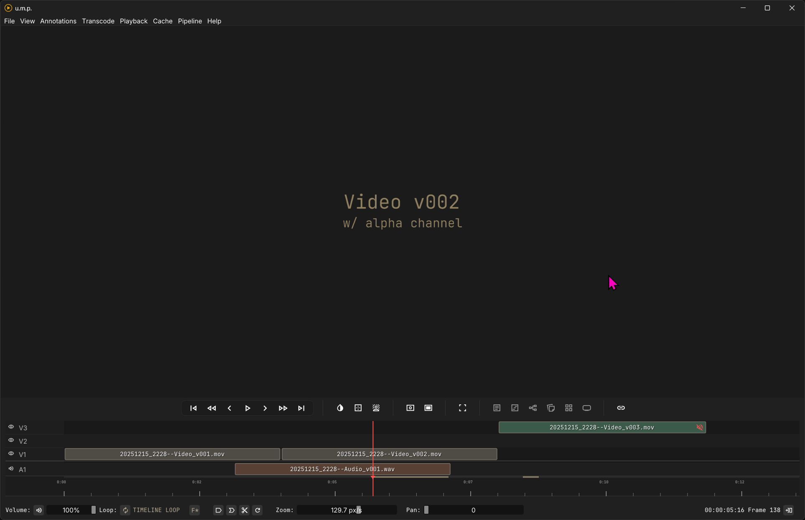

### The Layout

The layout should be somewhat familiar. Tracks are stacked, and clips can be dragged or rearranged on tracks. 

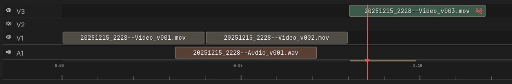

### Clips

Video clips without audio will use your app theme colors, and audio clips will use an automatic hue offset of those colors. Video clips with audio are hue-offsetting in the opposite direction from the audio, so they stand out. They also have a speaker icon you can toggle to use as an audio source if you wish. Right-clicking a clip brings up a context menu.

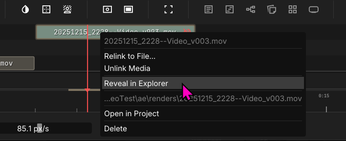

### Hide and Mute Tracks

Video tracks can be hidden and audio tracks can be muted by clicking on the eyeball or speaker icon to the left of the track names.

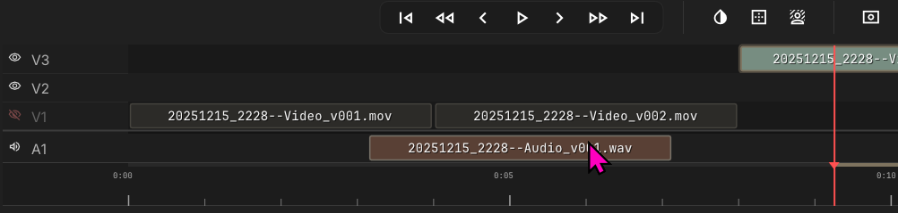

### Add Tracks

Tracks can be added by right clicking near the front of an existing track. Existing tracks can be deleted in the same menu.

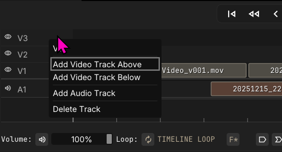

### Editing Clips

Basic clip editing functions available:

* X will split a selected clip at the playhead.
* Dragging the edges of a clip, on either end, will trim it. A thumbnail preview will pop up when trimming for more precision. 
* Clips can be dragged left and right on a track or up and down to new tracks.

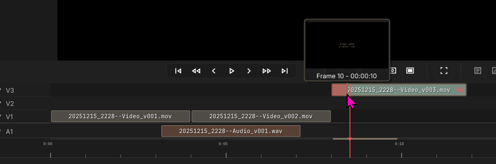

---

## Importing Timelines

### Importing Files

Avid AAF, Final Cut XML, and EDL files are supported for importing as new timelines. To import, select the `Import Timeline` function. 

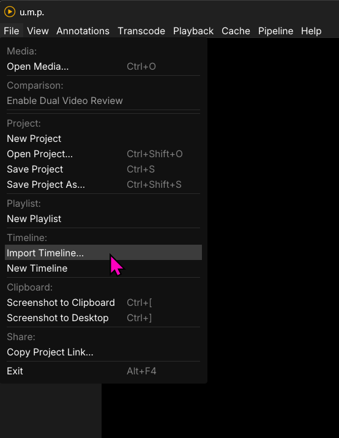

If an EDL is imported, a dialogue will appear asking for basic resolution and framerate. AAFs or XMLs won't, since they carry that information, and we can load from the file. 

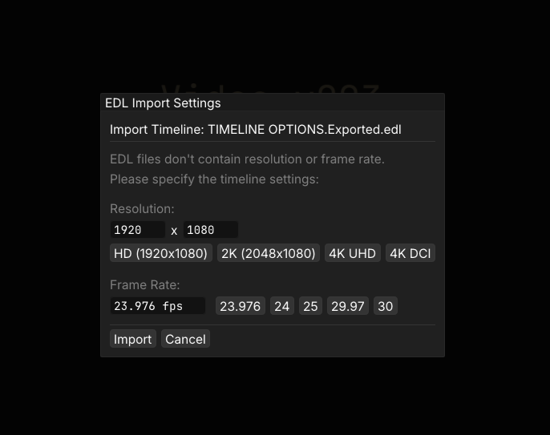

With all imports, once a file is selected, the app will recursively search for media in folders nested near the imported timeline file. If found, media will be linked, and this dialogue will appear.

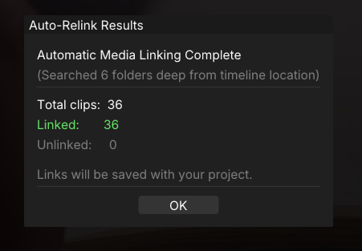

---

### Manually Linking Media

If the automatic linking fails, you can still manually link files. To search another folder for files, click on this `link` button and select the new folder...

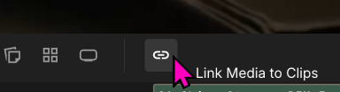

...or right-click on a file to link one at a time.

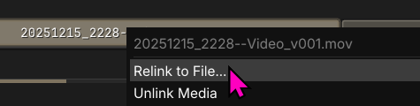

---

## Playback

For the most part, playback in timeline mode is similar to that of image sequences. We are generating a RAM cache for images, with slight read-behind and read-ahead logic to ensure smooth playback. This cache window is adjustable in our Pipeline & Cache Settings window. 

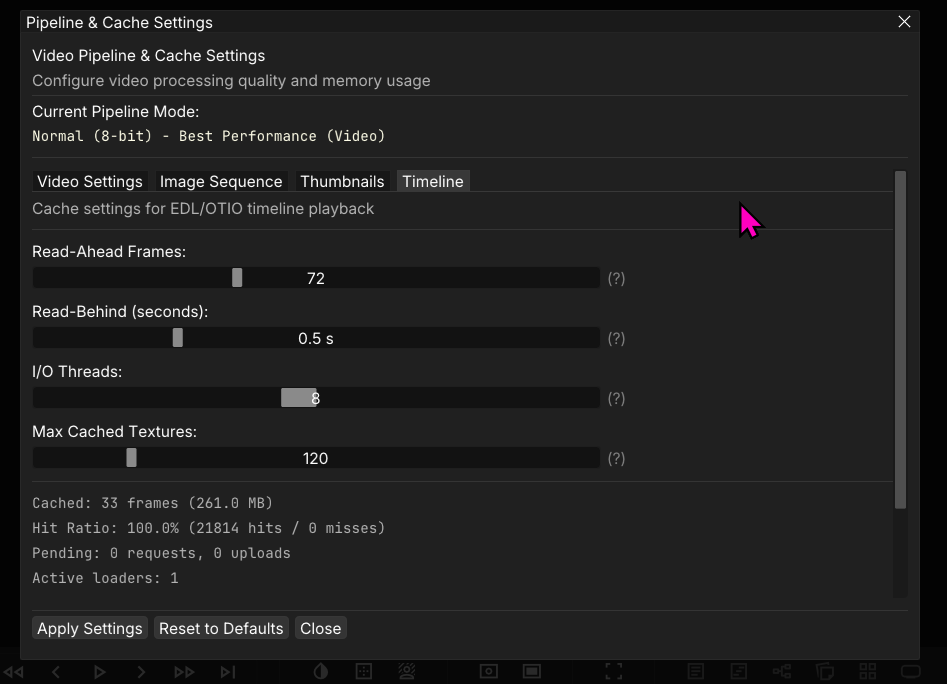

---

*Note: The timeline mode is still WIP and a bit fragile. I am still chasing down edge case bugs that crash the app. Currently on video sources are supported. Image sequences are not supported.*