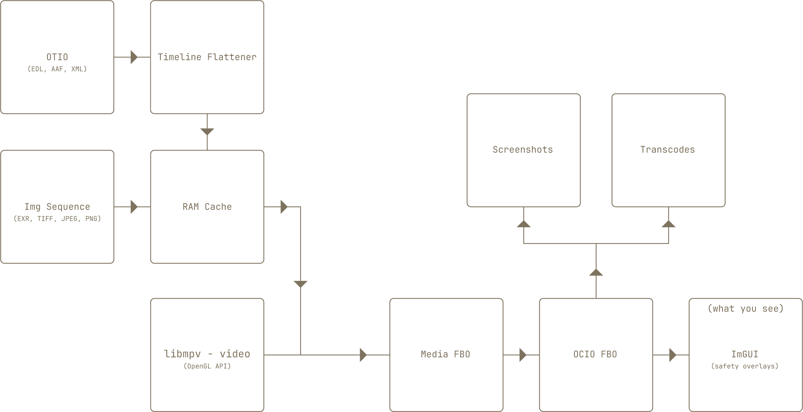
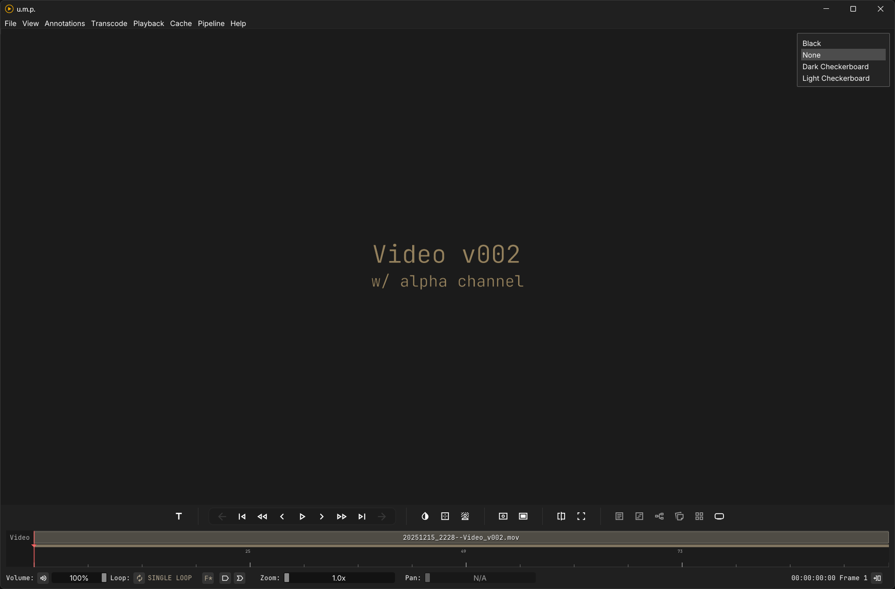
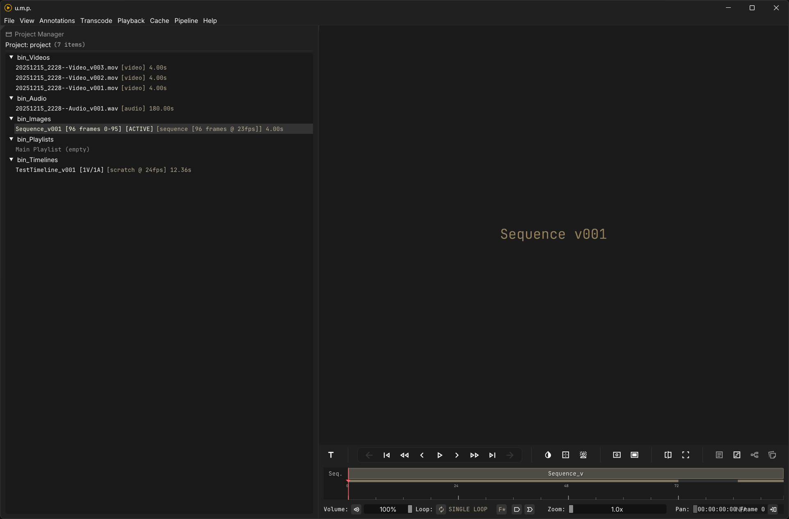
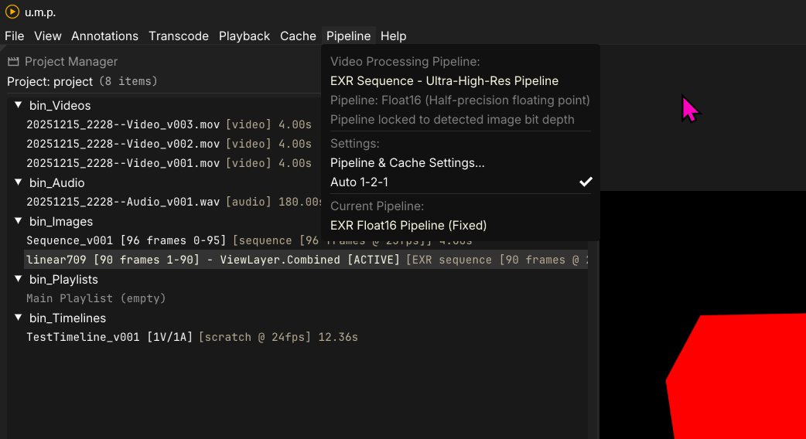

# Technical Overview

## Basic app flow

This diagram is a simplification, but it illustrates one of the main reasons for this app: everything flows through the OICO color correction FBO—either to the display or to files.

---

### Video

The basic app flow places a media FBO between the interface and a separate OCIO FBO. This flow allows real-time background color/pattern swapping (try toggling `B` on the keyboard) and real-time OCIO shader generation across all videos and image sequences. Videos are controlled by libmpv and use its OpenGL API to push frames to our media FBO.

---

### Image Sequences

Image sequences use OTIO for control in place of mpv. When loading an image sequence, u.m.p. creates a virtual timeline to contain the sequence and directly loads images into memory—straight to the OpenGL FBO. This process bypasses mpv for playback and provides a faster image sequence flipbook for review. It also allows for layer extraction from multi-layer EXRs. It includes the option to transcode larger (think 4k EXRs at DWAB and uncompressed TIFFs) to lower resolution/compression for smoother playback. See the Images page for more info on best practices and io/decompression limitations with these formats.

---

## Pipeline Modes

u.m.p. supports several pipeline modes with various media types. What this means in practice: When a particular pipeline mode is selected, mpv is configured for the appropriate bitrate during playback, and the cache settings are adjusted accordingly. Here is a breakdown:

- **Normal mode:** This allows for normal 8-bit mpv playback and is appropriate for most video formats and 8-bit TIFF, PNG, and JPEG sequences. Caches are adjusted to the RGBA8 format to match.
- **High-Res mode:** This allows for mpv to playback 12-bit video with full fidelity (think ProRes 4444) and adjusts the cache to RGBA16 (integer). I am keeping this as a user-selectible option for videos, but for the most part, 8-bit is fine for reviewing--even with ProRes. This mode will also be used automatically for 16-bit TIFFs and 16-bit PNGs. 
- **Ultra-High-Res mode:** is exclusively used for floating-point EXR image sequences. When an EXR is loaded, u.m.p will automatically switch to this mode, and the cache will be set to RGBA16F (half-float).

**Note:** *With all image sequences, the pipeline mode is automatically set based on the image format. Pipelines are only user-selectible with videos.* 