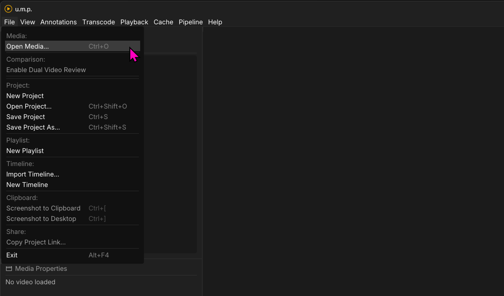
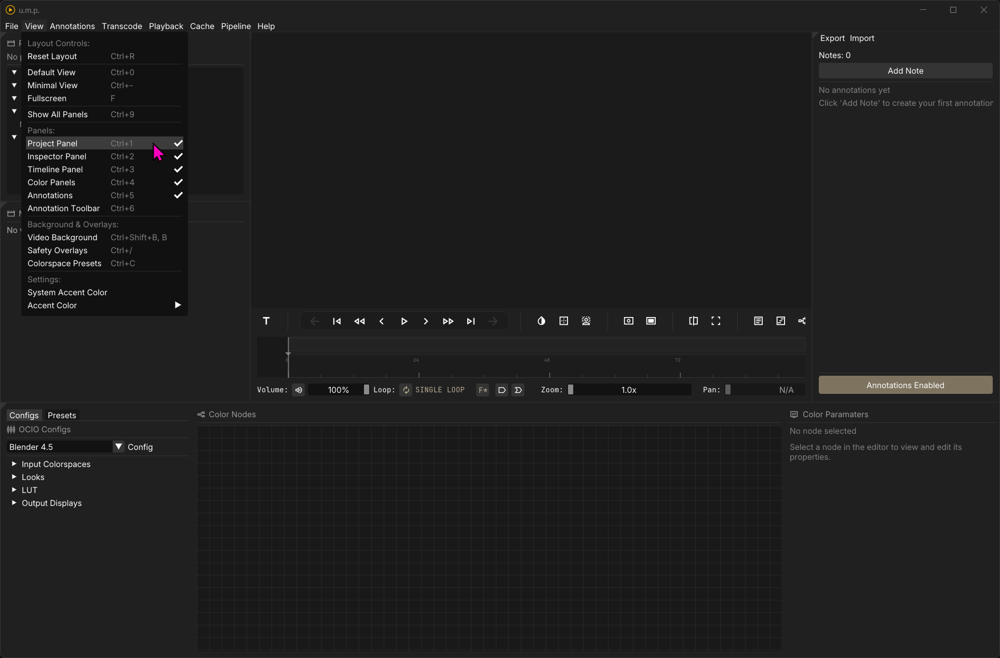
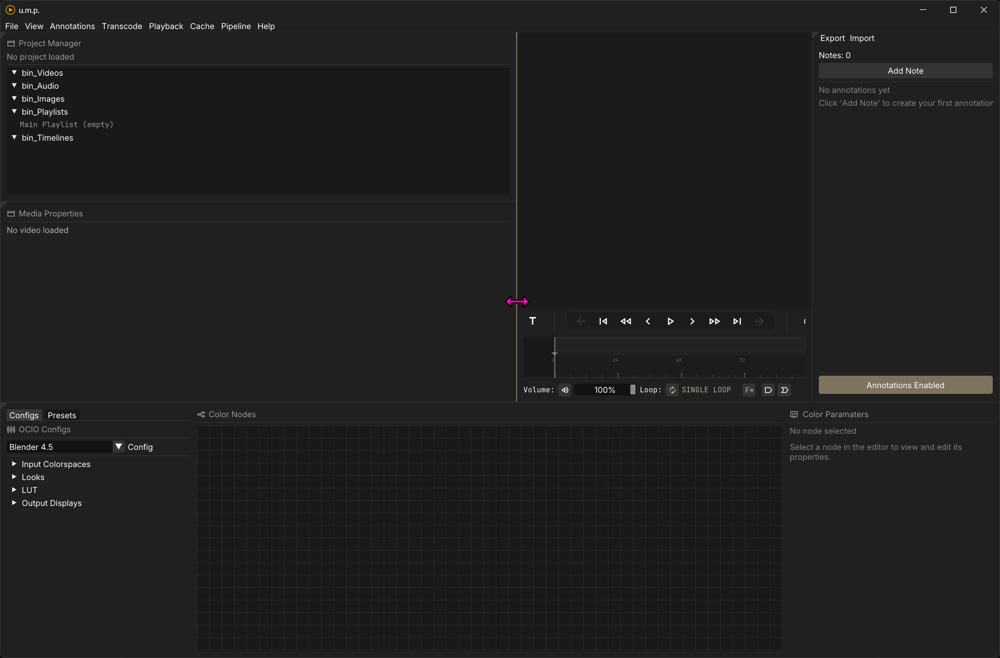
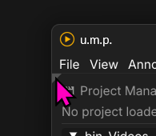
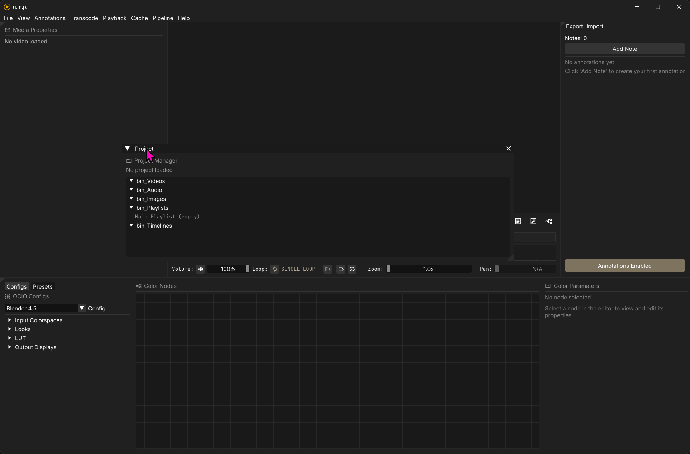
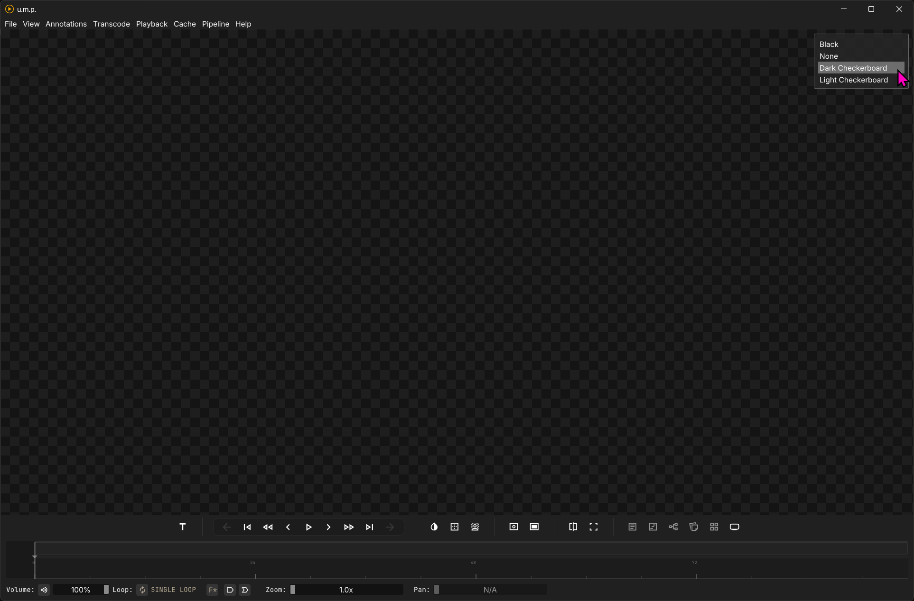
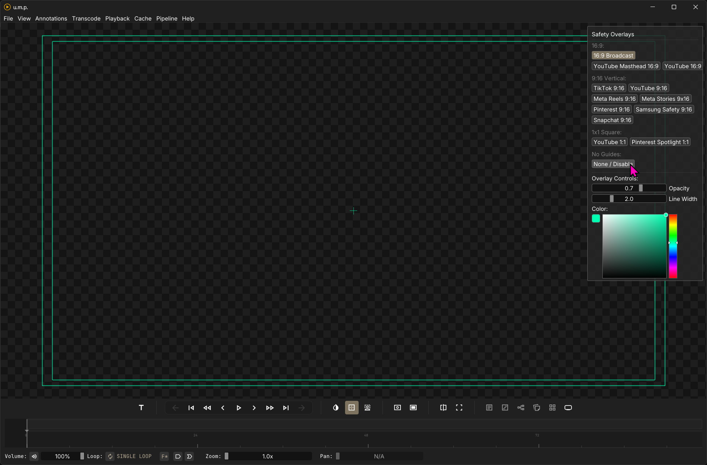
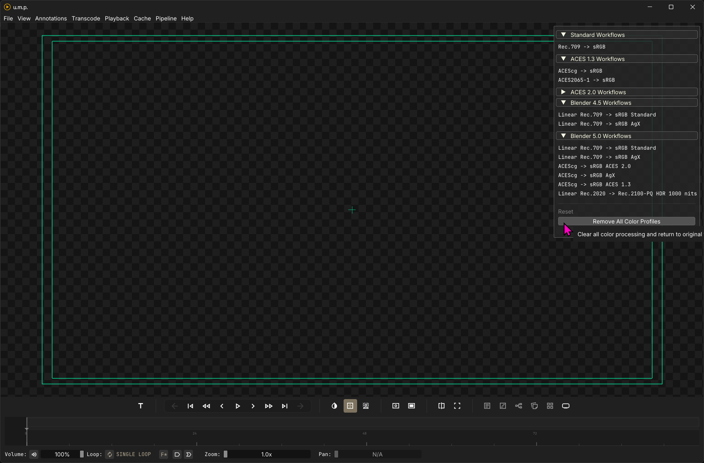

# Overview

## Technical Overview

### Basic app flow

This diagram is a simplification, but it illustrates one of the main reasons for this app: everything flows through the OICO color correction FBO—either to the display or to files.

---

### Video

The basic app flow places a media FBO between the interface and a separate OCIO FBO. This flow allows real-time background color/pattern swapping (try toggling `B` on the keyboard) and real-time OCIO shader generation across all videos and image sequences. Videos are controlled by libmpv and use its OpenGL API to push frames to our media FBO.

---

### Image Sequences

Image sequences use OTIO for control in place of mpv. When loading an image sequence, u.m.p. creates a virtual timeline to contain the sequence and directly loads images into memory—straight to the OpenGL FBO. This process bypasses mpv for playback and provides a faster image sequence flipbook for review. It also allows for layer extraction from multi-layer EXRs. It includes the option to transcode larger (think 4k EXRs at DWAB and uncompressed TIFFs) to lower resolution/compression for smoother playback. See the Images page for more info on best practices and io/decompression limitations with these formats.

---

## Pipeline Modes

u.m.p. supports several pipeline modes with various media types. What this means in practice: When a particular pipeline mode is selected, mpv is configured for the appropriate bitrate during playback, and the cache settings are adjusted accordingly. Here is a breakdown:

- **Normal mode:** This allows for normal 8-bit mpv playback and is appropriate for most video formats and 8-bit TIFF, PNG, and JPEG sequences. Caches are adjusted to the RGBA8 format to match.
- **High-Res mode:** This allows for mpv to playback 12-bit video with full fidelity (think ProRes 4444) and adjusts the cache to RGBA16 (integer). I am keeping this as a user-selectible option for videos, but for the most part, 8-bit is fine for reviewing--even with ProRes. This mode will also be used automatically for 16-bit TIFFs and 16-bit PNGs. 
- **Ultra-High-Res mode:** is exclusively used for floating-point EXR image sequences. When an EXR is loaded, u.m.p will automatically switch to this mode, and the cache will be set to RGBA16F (half-float).

**Note:** *With all image sequences, the pipeline mode is automatically set based on the image format. Pipelines are only user-selectible with videos.* 

---

## App Overview

### Opening files

There are a few ways to load files. You can simply drag one more file into the app. Or you can use the File menu to **Open Media** `Ctrl + O`,  **Open Project** `Ctrl + Shift + O`, or **Import a Timeline**. In this menu, you can also create a **New Project** (this will wipe out your current project), a **New Playlist**, or a **New Timeline**.

To load files you have already opened, you can double-click on them in the Project Manager or drag them into the Viewer. The Viewer's border will be highlighted with your theme’s accent color if a drop is detected.

---

### The Panels

In the View menu, you can toggle the different app panels:

* **The Project Panel** `Ctrl + 1`
* **The Inspector Panel** `Ctrl + 2`
* **The Timeline Panel** `Ctrl + 3`
* **The Color Panels** `Ctrl + 4`
* **Annotations** `Ctrl + 5`

You also have a few helpful shortcuts for layout management:

* **Default View** `Ctrl + 0` reverts the app to a three-panel layout: Viewer with Timeline, Project Panel, and Inspector Panel. It will also proportion them to the default settings.
* **Minimal View** `Ctrl + -` simplifies the layout to just the Viewport and timeline—-the more traditional video player layout. This is a toggle state. You can click it again to return to your previous layout. 
* **Full Screen** `F` will present the Viewer in full-screen mode without the timeline. You can escape by pressing `F` again or by clicking the close button in the top right of the screen.

You can resize panels by simply dragging the borders.

If you click the tiny triangle in the top-left corner, you can reveal the panel as a movable object. You can then drag and drop the panel elsewhere. This arrangement will be saved in your personal settings and remembered the next time you open the app. Reset Layiout `Ctrl + R` will reset the panels if you change your mind.

---

### Backgrounds and Overlays

`Ctrl + Shift + B` opens the **Video Background** panel and lets you select one of four background colors. Alpha channels in any media will pass through to the background, so you can use them for alpha review. Pressing `B` will cycle through the options without using the panel for selection.

`Ctrl + /` opens the **Title Safety** panel, where you can select various title safety options to overlay your Viewer with. You can select a color with the color picker, and this color will be saved in your personal settings. 

`Ctrl + C` opens the **OCIO Color Preset** panel. Enabling one of these options applies an OCIO node-tree preset to your **Viewer**, and everything in the **Viewer** will have this color correction applied. See the **OCIO Nodes** page for more details on how these presets work.

