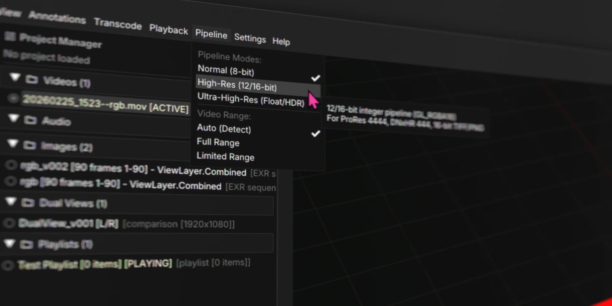

# Pipelines

## The Menu

For image sequences, QCView selects the appropriate pipeline automatically. For video, it doesn't — video metadata is too unreliable to infer from — so you choose manually.

- **Normal** — suitable for all SDR video.
- **High-Res** — enables 12-bit processing, useful for high-fidelity formats like ProRes 4444. Worth using if the source warrants it.
- **Ultra-High-Res** — required for HDR video. See the [HDR](https://qcview.app/hdr/) page for display setup.

