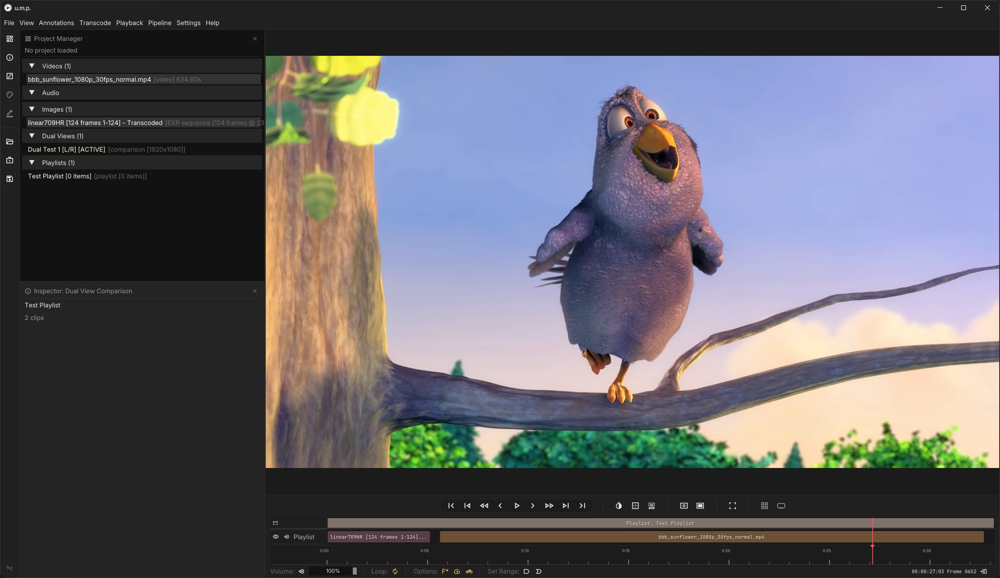
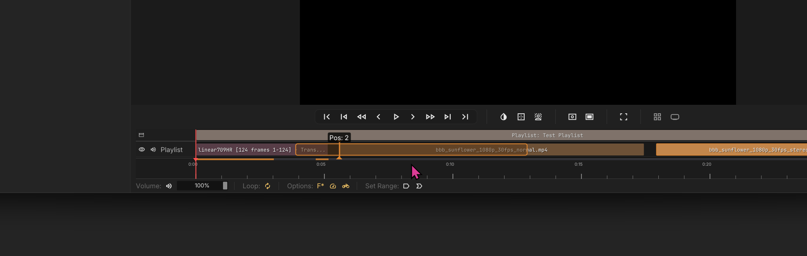
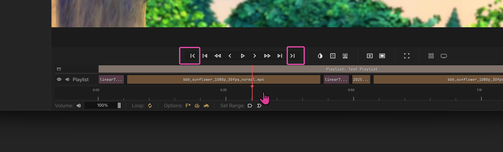

# Playlists

To create a playlist right-click on the playlist bin or navigate to `File > New Playlist`.

To build a playlist, drag in any video or image sequence sources from the `Project Manager`.

---

## Rearrange a Playlist

Drag to rearrange clip order.

---

## Playback

In addition to the usual transport controls, you also have buttons to skip to previous/next clips.

