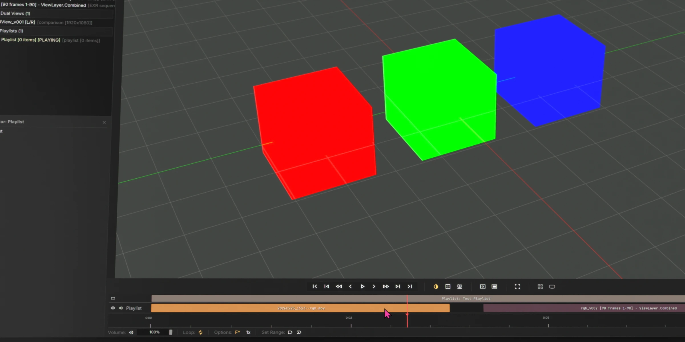
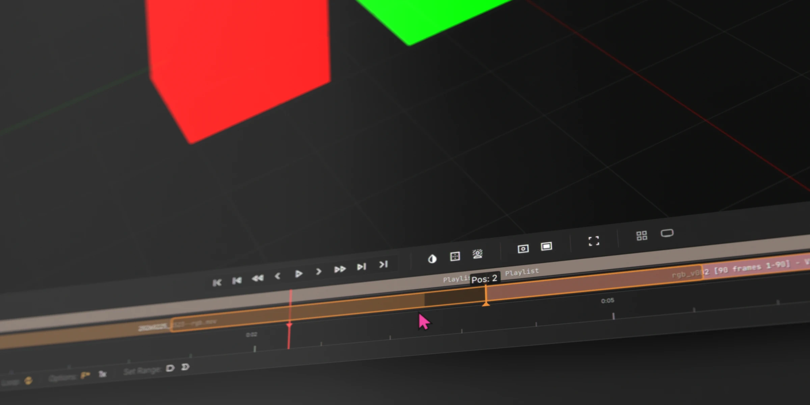
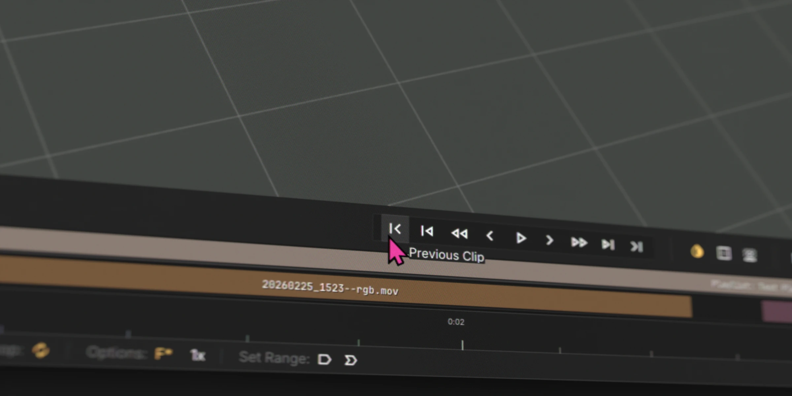

# Playlists

To create a playlist, right-click the playlist bin or select `File > New Playlist`.

To build a playlist, drag any video or image sequence sources from the `Project Manager` into the timeline.

---

## Rearrange a Playlist

Drag to rearrange clip order.

---

## Playback

In addition to the usual transport controls, you also have buttons to skip to previous/next clips.

